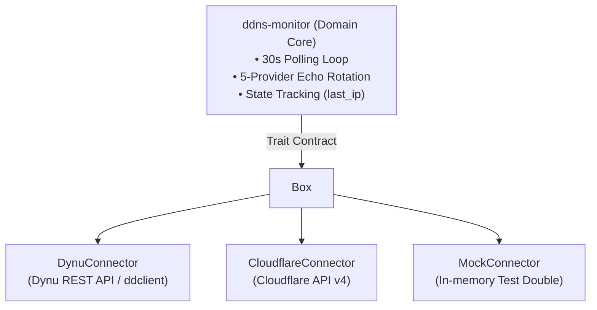

# 🔄 Discussion: Dynu DDNS Polling Frequency, Resolver Rotation, and Rust Migration

## 1. Problem Statement

The production Dynu dynamic DNS monitor on the server currently runs on a **30-minute systemd timer** (`OnUnitActiveSec = "30min"`) and queries a sequential fallback list of 4 external echo providers. When the residential ISP rotates the server's public WAN IPv4 address, external domains on `roadtotech.me` can remain unreachable for up to 30 minutes before the monitor detects the transition and triggers `ddclient.service`.

### Core Tension:
* **Speed of Recovery**: To minimize service downtime, the monitor should detect WAN rotations within **30 to 60 seconds**.
* **Provider Abuse & Rate Limits**: Polling a single public echo API (such as `api.ipify.org` or `icanhazip.com`) every 30 seconds yields 2,880 requests per day from a single IP, which risks temporary bans or API blocking.
* **Language & Runtime Overhead**: The current implementation is written in Python (`pkgs.writers.writePython3Bin`), invoking the full Python 3.14 interpreter and standard libraries on every execution of a headless server appliance.

---

## 2. Exploration: The 5-Provider Stateful Pool Prototype

On an experimental branch (`refactor/dynu-monitor`), an alternative Python prototype was designed:
* Increase systemd timer frequency to **30 seconds**.
* Distribute queries across an expanded pool of **5 external providers** (`api.ipify.org`, `icanhazip.com`, `ifconfig.me`, `checkip.dynu.com`, `wtfismyip.com`).
* Use a stateful round-robin pointer stored in `/var/lib/dynu/state.json`.

### Evaluation of the Prototype:
* **Pros**:
  - Each individual provider is queried at most once every 2.5 minutes (~24 requests/hour), well within public usage guidelines.
  - WAN rotations are detected in under 30 seconds.
* **Cons & Complications**:
  - Requires writing local state back and forth from disk on every 30s tick.
  - Python startup overhead running 2,880 times a day creates unnecessary CPU and I/O noise on a low-power home server.
  - The prototype remained unmerged because maintaining complex state machines in an embedded Nix Python script is brittle.

---

## 3. The Resolution: Direct Migration to a Native Rust Daemon

Rather than merging the intermediate Python rewrite into `Core`, the preferred architectural path is to migrate `dynu-monitor` directly to a lightweight, compiled **Rust daemon**.

### Why Rust?
1. **Zero Runtime Dependencies**: The compiled binary requires no Python interpreter, virtualenv, or dynamic store dependencies, aligning with the headless appliance philosophy.
2. **Minimal Footprint**: A native daemon can either run as a persistent background process with an internal async timer (`tokio`), or as an ultra-fast oneshot binary with zero startup penalty.
3. **Decoupled Architecture**: Domain logic (`IpMonitorService`) is separated from I/O mechanisms (`IpResolver`, `StateRepository`, `DdnsUpdater`) via traits, allowing comprehensive unit testing without real network or systemd calls.
4. **Hands-on Rust Engineering**: Serves as a practical project for idiomatic Rust patterns (traits, structs/enums, dependency injection, and Cargo packaging in Nix).

---

## 4. Architectural Invariants for the Rust Implementation

1. **Gatekeeper Pattern**: `ddns-monitor` only triggers the configured DDNS provider connector when a public IP change is verified.
2. **Update Confirmation**: `last_ip` in `state.json` is updated **only after** the provider update succeeds. A failed update preserves the previous IP so retries continue.
3. **Graceful Resolver Failover**: If the current provider in the round-robin sequence fails or times out (5s), the daemon falls back to the next provider immediately without failing the tick.

---

## 5. Provider Decoupling & Rebrand to `ddns-monitor`

### The Catalyst: Dynu Quota Constraints vs. Cloudflare
During the Homelab email server and DKIM setup, a fundamental upstream constraint was encountered: **Dynu limits free accounts to 4 custom CNAME/alias records**. While sufficient for minimal setups, scaling the homelab with service subdomains, transactional email relays (Brevo/SES), and verification tokens creates friction unless paying for Dynu Membership ($9.99/yr).

In contrast, **Cloudflare DNS** provides:
* 100% free, unlimited DNS records, CNAMEs, and TXT entries.
* Global anycast sub-second DNS propagation.
* Robust public REST API (native Traefik DNS-01 and DDNS automation).

### The Connector Pattern Architecture
Rather than hardcoding the daemon to Dynu, the project is renamed from `dynu-monitor` to **`ddns-monitor`** and implements a pluggable **Connector / Adapter pattern**:

### Benefits of the Decoupled Design
1. **Zero-Downtime Provider Migration**: Switching from Dynu to Cloudflare simply requires swapping the connector in configuration without altering IP detection, history tracking, or systemd daemon structure.
2. **Isolated Credentials**: Each connector manages its own authentication (e.g. `DynuCredentials` vs `CloudflareApiToken`), passed cleanly via SOPS templates.
3. **Multi-Provider Sync**: The core can support a `CompositeConnector` that simultaneously updates multiple DNS zones across providers if dual-routing is required.

