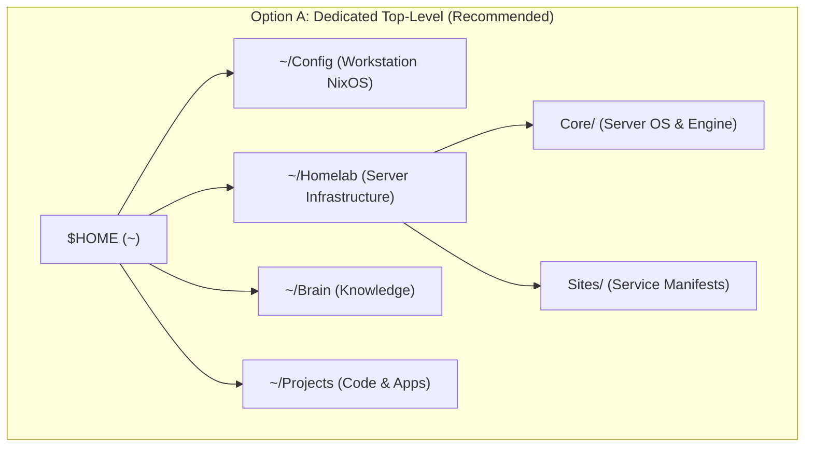
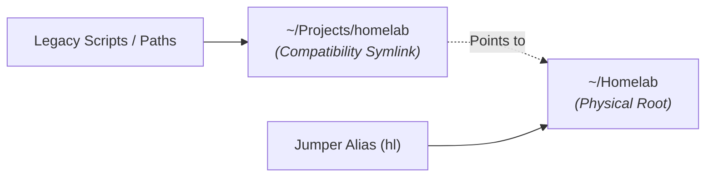

# 🏛️ Architecture Analysis: Optimal Placement for Homelab Repositories

## 1. Context & The Core Dilemma

Currently, your workstation separates code and system configurations across `$HOME`:
* **`~/Config`**: Declarative NixOS workstation configuration (Laptop).
* **`~/Brain`**: Obsidian second brain knowledge base.
* **`~/Projects/`**: Application development workspaces structured into lifecycle buckets:
  * `~/Projects/active/` (MagNetFlix, nekoweb, bitetrack-api, Shipwright, etc.)
  * `~/Projects/learning/` (curso-fastapi)
  * `~/Projects/archive/` (circulatelo, legacy-bitetrack, etc.)
  * **`~/Projects/homelab/`** (`Core` server NixOS/Docker/Traefik, `Sites/gitea`, `Sites/jellyfin`, etc.)

### The Friction Point
Homelab repositories are fundamentally **Infrastructure-as-Code (IaC), server daemons, and GitOps deployments**, rather than transient application development code. 

Placing them inside `~/Projects/homelab/` introduces a taxonomy clash: `Projects` organizes items by **lifecycle** (`active`, `learning`, `archive`), but `homelab` is a **functional domain**, not a lifecycle phase. This creates ambiguity:
1. Is server infrastructure a "project" that gets archived when completed, or permanent operational infrastructure?
2. Why is the workstation OS declared at top-level `~/Config`, while server OS infrastructure lives nested under `~/Projects/homelab/Core`?
3. If moved later, what breaks (scripts, search indexing, bookmarks, jumper muscle memory)?

---

## 2. Evaluation of Structural Alternatives



### Option A: Dedicated Top-Level Directory (`~/Homelab` or `~/Infra`)

Elevate homelab infrastructure to a peer of `~/Config` and `~/Projects`:
```text
~
├── Brain/
├── Config/         # Workstation system declaration
├── Homelab/        # Production server infrastructure & GitOps fleet
│   ├── Core/       # Server NixOS, Traefik, Docker engine, SOPS secrets
│   └── Sites/      # Self-hosted services (gitea, jellyfin, doc2site)
└── Projects/       # Software engineering projects
    ├── active/
    ├── learning/
    └── archive/
```

* **Pros**:
  * **Architectural Symmetry**: Perfect parity between `~/Config` (client machine) and `~/Homelab` (server fleet).
  * **Cognitive Clarity**: Zero ambiguity between "writing an application" and "managing live server infrastructure".
  * **Clean Taxonomic Integrity**: Restores `~/Projects/` to purely lifecycle-based categorization (`active`, `learning`, `archive`).
  * **Dedicated Navigation**: Direct, first-class jumper shortcuts (e.g. `hl` or `homelab` in `jump.sh`) rather than navigating through project depths.
  * **Scoped Security & Secrets**: Makes it easy to exclude or strictly restrict tools/LSPs/scanners over secrets-heavy server trees.
* **Cons**:
  * Adds one top-level directory in `~` (bringing total top-level custom folders to 4: `Brain`, `Config`, `Homelab`, `Projects`).

---

### Option B: Keep Under Projects (`~/Projects/homelab/`) — The Status Quo

Maintain `homelab` as a subcategory within `~/Projects/`.

* **Pros**:
  * Keeps `$HOME` minimal with fewer top-level directories.
  * Already indexed by DankSearch (`dsearch`) under `~/Projects`.
  * No path changes required today.
* **Cons**:
  * **Taxonomic Collision**: Mixes lifecycle buckets (`active/`, `archive/`) with a domain bucket (`homelab/`).
  * **Search & Tooling Clutter**: Project-wide search scripts (`rg`, `fd`) searching across active dev code also traverse production server docker configs and SOPS secrets.
  * **Longer Navigation Paths**: Requires typing deeper paths or searching through unrelated application projects.

---

### Option C: Lifecycle Placement (`~/Projects/active/homelab/`)

Move homelab into the active lifecycle directory (`~/Projects/active/homelab/Core`), as was originally referenced in earlier drafts of `architecture.md`.

* **Pros**:
  * Adheres strictly to the `active/` lifecycle hierarchy.
* **Cons**:
  * Worst conceptual fit: Homelab is long-lived production infrastructure, not an active dev task that moves to `archive/` upon completion.
  * Deep directory nesting (`~/Projects/active/homelab/Core`).

---

## 3. Comparison Matrix

| Criteria | Option A: `~/Homelab` | Option B: `~/Projects/homelab` | Option C: `~/Projects/active/homelab` |
| :--- | :--- | :--- | :--- |
| **Conceptual Purity** | **Very High** (Infra vs Code separation) | Medium (Mixed concern) | Low (Infra treated as temp project) |
| **Navigation Ergonomics** | **Fast** (`hl` directly to Core/Sites) | Moderate (`pj` with depth 3) | Slow (Deeper nesting) |
| **Symmetry with Workstation** | **High** (`~/Config` $\leftrightarrow$ `~/Homelab`) | Low (Asymmetric) | Low (Deeply nested) |
| **Search & Secret Isolation** | **Clean** (Independent scoping) | Shared with all dev code | Shared with all active apps |
| **Migration Overhead** | Very Low (1 `mv` + 1 symlink) | Zero | Low |

---

## 4. Friction-Free Strategy (Decoupled Transition)

If you are uncertain whether you will want to keep or change the structure in the future, the industry standard technique to prevent friction is the **Symlink Bridge Pattern**:



### Why this eliminates all friction:
1. **Zero Broken Paths**: Any script, documentation reference, or tool looking for `~/Projects/homelab` continues to work transparently via the filesystem symlink.
2. **First-Class Navigation**: You gain a dedicated `hl` (or `homelab`) jumper alias that goes straight to the infrastructure tree.
3. **Reversible in Seconds**: If you ever decide you prefer it back inside `~/Projects`, reversing it requires only removing the symlink and moving the folder back.
4. **Tooling Agnostic**: DankSearch, Neovim, terminal sessions, and Git operations resolve symlinks seamlessly.

---

## 5. Recommended Action Plan

If you decide to move to the dedicated `~/Homelab` structure:

1. **Migrate Folder & Establish Bridge**:
   ```bash
   mv ~/Projects/homelab ~/Homelab
   ln -s ~/Homelab ~/Projects/homelab
   ```
2. **Add Jumper Alias to `home/shell/jump.sh`**:
   ```bash
   hl()      { jump "$HOME/Homelab" "$1" 2; }
   homelab() { hl "$@"; }
   ```
3. **Update DankSearch Indexing in `home/desktop.nix`**:
   Add `~/Homelab` as an explicit indexed search root so full-text search covers server configs cleanly without traversing symlink loops.
