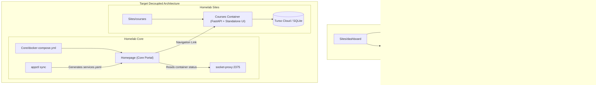

# Architecture Plan: Multirepo Refactor of Homepage & Learning Hub

## Executive Summary
This document analyzes and outlines the execution plan for disentangling **Homepage** from the **Learning Hub** (`courses` API & Kanban board).

### Verdict: Is this the right direction?
**Yes, strongly affirmative.**
- **Homepage** is an administrative and operational dashboard coupled to Core infrastructure (`socket-proxy`, `socket-net`, `traefik`, host system resource widgets). It belongs in `/home/kiskaadee/Homelab/Core`.
- **Courses** (the learning API & Kanban) is a discrete user-domain application with its own database (Turso/LibSQL), domain logic, and frontend requirements. It belongs in `/home/kiskaadee/Homelab/Sites/courses`.
- **Decoupling eliminates technical debt**: Injecting the learning Kanban into Homepage via `custom.js` and `custom.css` with DOM mutations (`MutationObserver`) was an architectural anti-pattern. Decoupling allows Homepage to remain fast and standard, while providing Courses with a dedicated standalone web UI.

---

## Architecture Overview

---

## Migration Phases

### Phase 1: Establish `Homelab/Sites/courses`
1. Move the backend code from `Sites/dashboard/learning/` to `Sites/courses/`:
   - `app/` (models, database, controllers, routes, main, config)
   - `tests/` (removing legacy `test_system_stats` and `test_bookmarks` tests that belonged to the old dashboard prototype)
   - `Dockerfile`, `pyproject.toml` (pinning Python 3.11 for `libsql-experimental` prebuilt wheels), `uv.lock`, `.dockerignore`, `.env-example`, `README.md`
2. Create a clean standalone frontend for the Kanban board in `app/static/`:
   - `index.html`, `style.css`, `app.js` (clean extraction from the battle-tested `custom.js` & `custom.css`).
   - Mount static directory at `/` in FastAPI (`app.mount("/", StaticFiles(directory="app/static", html=True))`) with `/api/courses` routes.
3. Add `app.yaml`:
   - Name: `courses`, domain: `courses.roadtotech.me`, group: `Knowledge & Notes`, container: `courses`.
4. Add `docker-compose.yml`:
   - Attached to `proxy-net`, Traefik labels for router, service port 8000, HTTPS redirect.
5. Add `UNLICENSE` and initialize commit in `homelab-courses` git repository.

### Phase 2: Reintegrate Homepage into `Homelab/Core`
1. Copy Homepage configuration into `Core/config/homepage/`:
   - `bookmarks.yaml`, `docker.yaml` (`host: socket-proxy`), `settings.yaml`, `widgets.yaml`, brand assets (`houston.png`, `houston.svg`).
   - Remove custom Kanban DOM-injection JS/CSS.
2. Add `homepage` service into `Core/docker-compose.yml`:
   - Networks: `socket-net`, `proxy-net`.
   - Host routing: `dashboard.${DOMAIN}` on port 3000.
3. Update `Core/scripts/appctl_engine.py`:
   - Target `Core/config/homepage/services.yaml` for `appctl sync`.
4. Update `Core/tests/structural/test_repository_structure.py` and run test suite.

### Phase 3: Service Synchronization & Verification
1. Run `appctl sync` to ensure `courses` from `Sites/courses/app.yaml` is discovered and compiled into Homepage.
2. Validate configurations: `appctl config courses` and `appctl config core`.
3. Run automated tests across both repositories.

### Phase 4: Retire `Sites/dashboard`
1. Stop running containers in `Sites/dashboard`.
2. Clean up or archive `homelab-dashboard` on Gitea.
