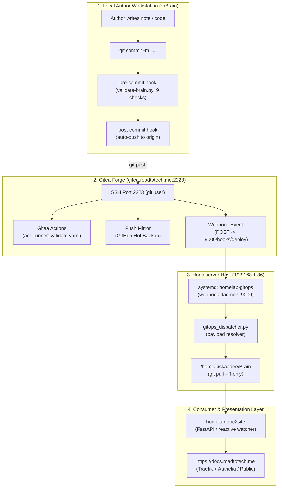

# 🧠 Brain GitOps & Auto-Sync Deployment Pipeline

## 🎯 Overview & Objectives
The **Brain** repository is the canonical data vault and knowledge graph for the homelab ecosystem. To achieve frictionless authoring with absolute data integrity and instantaneous live publishing, Brain employs a zero-delay GitOps synchronization pipeline.

Any change committed locally flows through a multi-stage pipeline:
1. **Local Pre-commit Gate**: 9-phase integrity check (`validate-brain.py`).
2. **Local Post-commit Trigger**: Automatic push over custom SSH port `2223`.
3. **Gitea CI & Hot Mirroring**: Server-side Actions validation (`act_runner`) and GitHub backup sync.
4. **Webhook Event Dispatch**: Internal HTTP POST to `homelab-gitops` on port `9000`.
5. **Host-Level GitOps Dispatcher**: Zero-delay fast-forward Git pull into the server's `/home/kiskaadee/Brain` instance.
6. **Live Consumer API & Presentation**: Instantaneous rendering via `homelab-doc2site` at `https://docs.roadtotech.me`.

---

## 🏛️ End-to-End Pipeline Architecture



---

## 🔍 Detailed Pipeline Stages

### 1. Local Workstation Hooks (`.githooks/`)

The repository uses native Git hooks located in `.githooks/` (configured via `git config core.hooksPath .githooks`):

- **`pre-commit`**: Executes [`scripts/validate-brain.py`](file:///home/kiskaadee/Brain/scripts/validate-brain.py) before finalizing any commit. It enforces:
  1. *No deprecated directories* (`notes/`, `scratch/`, etc.).
  2. *Required root files* (`README.md`, `AGENTS.md`, `flake.nix`, etc.).
  3. *Frontmatter schema* (`type`, `status`, `topics`, `tags`, `project`).
  4. *Relative link validation* (all markdown links resolve to real files).
  5. *Markdown code fence balance*.
  6. *Mermaid diagram validation* (syntax balance, node label quoting).
  7. *Ruff code linting* (Python solutions & scripts).
  8. *Pyright static type checking* (strict typing standards).
  9. *Inbox Curation Exemption* (`inbox/*` is intentionally skipped to preserve zero-friction drafting).

- **`post-commit`**: Synchronously pushes the current branch to `origin`:
  ```bash
  CURRENT_BRANCH=$(git rev-parse --abbrev-ref HEAD)
  git push origin "$CURRENT_BRANCH"
  ```
  It includes offline detection and detached HEAD guards so commits never fail if network connectivity is temporarily unavailable.

---

### 2. Gitea Actions CI (`act_runner`)

When commits reach Gitea, Gitea Actions triggers `.gitea/workflows/validate.yaml`:

```yaml
name: Brain Structural Validation

on:
  push:
    branches: ["**"]
  pull_request:

jobs:
  validate:
    name: Validate Markdown Structure & Links
    runs-on: ubuntu-latest
    steps:
      - name: Check out repository
        uses: actions/checkout@v4

      - name: Set up Python
        uses: actions/setup-python@v5
        with:
          python-version: "3.11"

      - name: Run Brain Validator
        run: python3 scripts/validate-brain.py
```

- **Execution Engine**: Handled by the `homelab-runner` container running `gitea/act_runner:latest` with the `ubuntu-latest:docker://node:18-bullseye` label.
- **Fail-Safe**: If a broken link or syntax defect ever bypassed local checks, the CI status immediately flags the commit in Gitea.

---

### 3. Gitea Webhook & Host Dispatcher

Upon push completion, Gitea delivers an HTTP POST event to the server's internal webhook daemon:
- **Endpoint**: `http://192.168.1.36:9000/hooks/deploy`
- **Payload**: Gitea JSON push payload detailing repository name (`second-brain`), branch (`refs/heads/main`), and commit SHAs.

The server's systemd unit (`homelab-gitops`) pipes this payload directly into [`homelab-core/scripts/gitops_dispatcher.py`](file:///home/kiskaadee/Projects/active/homelab/homelab-core/scripts/gitops_dispatcher.py):

1. `gitops_dispatcher.py` identifies `second-brain` as a core data vault.
2. It resolves the vault target directory to `/home/kiskaadee/Brain`.
3. It runs `git pull --ff-only origin main` in the background.
4. Total execution time from local `git commit` to server synchronization is typically **under 1.5 seconds**.

---

### 4. Consumer API & Live Presentation (`doc2site`)

- The documentation rendering service (`homelab-doc2site`) runs in Docker and mounts `/home/kiskaadee/Brain` directly into its container filesystem.
- Because `git pull` directly updates the underlying markdown files on the server host, `doc2site` serves the updated knowledge graph immediately upon HTTP request without needing a container rebuild, restart, or cache purge.
- The web portal is accessible at `https://docs.roadtotech.me`.

---

### 5. GitHub Hot Mirroring

Gitea maintains an automated push mirror to GitHub (`github.com/kiskaadee/second-brain`):
- **Trigger**: Every push event on Gitea immediately triggers an upstream mirror sync.
- **Purpose**: Provides an off-site, immutable disaster-recovery backup while keeping self-hosted Gitea as the primary source of truth.

---

## 🛠️ Verification & Diagnostic Runbook

| Step | Action | Expected Output |
| :--- | :--- | :--- |
| **1. Local Commit** | `git commit -m "docs: test update"` | Pre-commit passes 9 checks, post-commit auto-pushes to port 2223 |
| **2. Gitea Webhook** | Repository $\rightarrow$ Settings $\rightarrow$ Webhooks $\rightarrow$ Test Delivery | HTTP 200 `Deployment payload dispatched successfully.` |
| **3. Server Pull** | `ssh server-remote "cd ~/Brain && git status"` | `Your branch is up to date with 'origin/main'.` |
| **4. Live Web View** | Open `https://docs.roadtotech.me` | Edited content appears immediately |
| **5. CI Status** | Repository $\rightarrow$ Actions tab in Gitea | Pipeline `Brain Structural Validation` green (✓) |
