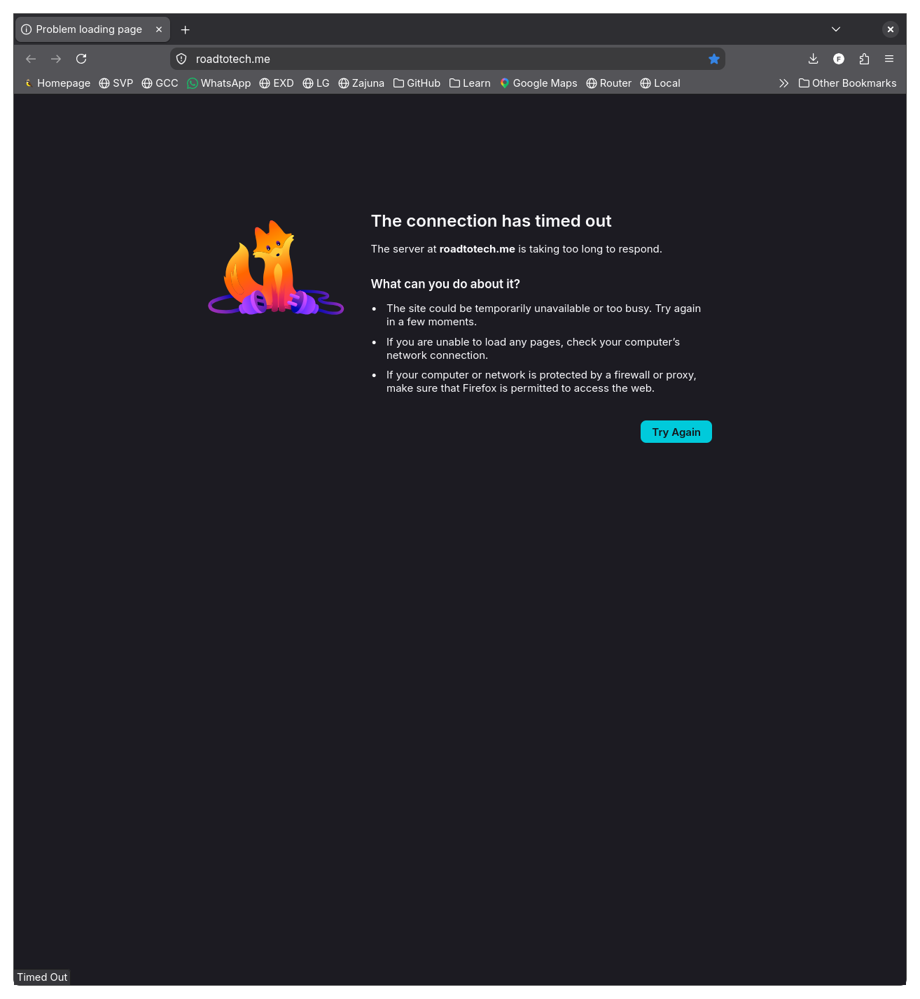

# Dynu DDNS Domain Configuration Troubleshooting

## Problem Statement

During an ISP WAN rotation the server turned unreachable.



First I checked whether the server was connected to the internet.

```shell
# Confirming the server can be reached locally
kiskaadee in 🌐 laptop in Config on  main
➜ ping 192.168.1.36 -c 3
PING 192.168.1.36 (192.168.1.36) 56(84) bytes of data.
64 bytes from 192.168.1.36: icmp_seq=1 ttl=64 time=3.13 ms
64 bytes from 192.168.1.36: icmp_seq=2 ttl=64 time=1.66 ms
64 bytes from 192.168.1.36: icmp_seq=3 ttl=64 time=1.55 ms

kiskaadee in 🌐 laptop in Config on  main
➜ ssh server-local "echo Server is Running"
Server is Running

# Confirming the server can reached to the internet
kiskaadee in 🌐 laptop in Config on  main
➜ ssh server-local "ping google.com -c 3"
PING google.com (142.251.132.174) 56(84) bytes of data.
64 bytes from ncboga-ak-in-f14.1e100.net (142.251.132.174): icmp_seq=1 ttl=118 time=12.5 ms
64 bytes from ncboga-ak-in-f14.1e100.net (142.251.132.174): icmp_seq=2 ttl=118 time=10.9 ms
64 bytes from ncboga-ak-in-f14.1e100.net (142.251.132.174): icmp_seq=3 ttl=118 time=11.4 ms

--- google.com ping statistics ---
3 packets transmitted, 3 received, 0% packet loss, time 2002ms
rtt min/avg/max/mdev = 10.937/11.593/12.478/0.649 ms

```

Once confirmed the server is running, and connected to the internet, the first suspicion pointed to a WAN mismatch.

```shell
# Testing server-ddns WAN mismatch

kiskaadee in 🌐 laptop in Config on  main
➜ curl -Iv roadtotech.me --max-time 10
*   Trying 190.253.250.211:80...
* Host roadtotech.me:80 was resolved.
* IPv6: (none)
* IPv4: 190.253.250.211
* Connection timed out after 10001 milliseconds
* closing connection #0
curl: (28) Connection timed out after 10001 milliseconds

kiskaadee in 🌐 laptop in Config on  main
➜ dig +short roadtotech.me @ns1.dynu.com
190.253.250.211

kiskaadee in 🌐 laptop in Config on  main
➜ ssh server-local "curl -s https://checkip.dynu.com"
Current IP Address: 186.168.137.93
```

Mismatch confirmed, the next step is to find out whether the problem was caused by a failure in the `dynu-monitor` or `ddclient` services. 

```shell
kiskaadee in 🌐 laptop in Config on  main
➜ ssh server-local "systemctl status dynu-monitor.service"
○ dynu-monitor.service - Dynu DDNS Smart IP Change Monitor
       Loaded: loaded (/etc/systemd/system/dynu-monitor.service; linked; preset: ignored)
       Active: inactive (dead) since Sun 2026-09-06 20:37:33 -05; 13min ago
   Invocation: 17600047a32242dd9e74e41a3ec7e5a7
  TriggeredBy: ● dynu-monitor.timer
      Process: 6717
  ExecStart=/nix/store/xpis1sf9rxwrwvrgg16mhz8adzkdpwb0-dynu-ip-monitor/bin/dynu-ip-monitor
  (code=exited, status=0/SUCCESS)
     Main PID: 6717 (code=exited, status=0/SUCCESS)
           IP: 4.9K in, 2.1K out
           IO: 28.4M read, 0B written
     Mem peak: 28.4M
          CPU: 98ms

  Sep 06 20:37:31 server systemd[1]: Starting Dynu DDNS Smart IP Change Monitor...
  Sep 06 20:37:33 server dynu-ip-monitor[6717]:
  /nix/store/xpis1sf9rxwrwvrgg16mhz8adzkdpwb0-dynu-ip-monitor/bin/dynu-ip-monitor:139:
  DeprecationWarning: datetime.datetime.utcnow() is deprecated and scheduled for removal in a future
  version. Use timezone-aware objects to represent datetimes in UTC:
  datetime.datetime.now(datetime.UTC).
  Sep 06 20:37:33 server dynu-ip-monitor[6717]:   "timestamp": datetime.utcnow().isoformat() + "Z",
  Sep 06 20:37:33 server dynu-ip-monitor[6717]: IP rotation detected! Old: 190.253.250.211, New:
  186.168.137.93
  Sep 06 20:37:33 server dynu-ip-monitor[6717]: Dynu DDNS update via ddclient triggered successfully.
  Sep 06 20:37:33 server systemd[1]: dynu-monitor.service: Deactivated successfully.
  Sep 06 20:37:33 server systemd[1]: Finished Dynu DDNS Smart IP Change Monitor.
  Sep 06 20:37:33 server systemd[1]: dynu-monitor.service: Consumed 98ms CPU time over 1.480s wall
  clock time, 28.4M memory peak, 28.4M read from disk, 4.9K incoming IP traffic, 2.1K outgoing IP
  traffic.

kiskaadee in 🌐 laptop in Config on  main
➜ ssh server-local "systemctl status ddclient.service"
○ ddclient.service - Dynamic DNS Client
     Loaded: loaded (/etc/systemd/system/ddclient.service; enabled; preset: ignored)
     Active: inactive (dead) since Sun 2026-09-06 20:37:33 -05; 2h 12min ago
 Invocation: 30d915ac234e41c0b11890660d4a1b19
    Process: 6720 ExecStartPre=/nix/store/7qqkmydcjx6993sq8fc3ir35vhmcxz0z-ddclient-prestart (code=exited, status=0/SUCCESS)
    Process: 6727 ExecStart=/nix/store/zpqihb48iddspmp5qnqy6yvgrw26q6ap-perl5.42.3-ddclient-4.0.0/bin/ddclient -file /run/ddclient/ddclient.conf (code=exited, status=0/SUCCESS)
   Main PID: 6727 (code=exited, status=0/SUCCESS)
         IP: 10.8K in, 5K out
         IO: 0B read, 8K written
   Mem peak: 15.9M
        CPU: 136ms

Sep 06 20:37:32 server systemd[1]: Starting Dynamic DNS Client...
Sep 06 20:37:33 server ddclient[6727]: SUCCESS: [dyndns2][arch-services.mywire.org]> IPv4 address set to 186.168.137.93
Sep 06 20:37:33 server systemd[1]: ddclient.service: Deactivated successfully.
Sep 06 20:37:33 server systemd[1]: Finished Dynamic DNS Client.
Sep 06 20:37:33 server systemd[1]: ddclient.service: Consumed 136ms CPU time over 1.066s wall clock time, 15.9M memory peak, 8K written to disk, 10.8K incoming IP traffic, 5K outgoing IP traffic.

```

## Root Cause Analysis

The WAN IP rotation from `190.253.250.211` to `186.168.137.93` is the first one since the domain update from `arch-services.mywire.org` to `roadtotech.me`:
1. `dynu-monitor.service` successfully detected the IP rotation and called `ddclient.service`.
2. `ddclient.service` uses a `@dynu_domain` decrypted from secrets.yaml at runtime.
3. `ddclient.service` updated `arch-services.mywire.org` to `186.168.137.93` because the SOPS secret `dynu_domain` in `secrets.yaml` was configured with the legacy domain `arch-services.mywire.org`.
4. `roadtotech.me` remained pointing to the old IP `190.253.250.211` on Dynu's nameservers.
5. Because `dynu-ip-monitor` logged `186.168.137.93` as a successful update in `/var/lib/dynu/ip_history.jsonl`, subsequent periodic checks exit without re-triggering `ddclient`.

## Resolution Steps

**1. Generate Age Key on the Laptop**:

Running `sops hosts/server/secrets.yaml` from `laptop` fails because the laptop currently lacks `~/.config/sops/age/keys.txt` matching the recipients in `.sops.yaml`. So we'll first authorize `laptop` as a new client in SOPS via Server Host Key.

```shell
# Generate a key on the laptop
mkdir -p ~/.config/sops/age
age-keygen -o ~/.config/sops/age/keys.txt
chmod 600 ~/.config/sops/age/keys.txt
age-keygen -y ~/.config/sops/age/keys.txt

```

**2. Update `.sops.yaml`:**
Register the laptop's new public age key and the server host key:

```yml
keys:
  - &laptop <new_laptop_age_public_key>
  - &server <renamed_desktop_age_public_key>

creation_rules:
  - path_regex: hosts/server|laptop/secrets\.yaml$
    key_groups:
      - pgp: []
        age:
          - *laptop
          - *server

```

**3. Re-key Secret Envelope from Laptop using Server's Host Key**

```shell
# Store the server's private age key (-t allows interactive sudo password prompt)
ssh -t server-local "sudo nix run nixpkgs#ssh-to-age -- -private-key -i /etc/ssh/ssh_host_ed25519_key"

SOPS_AGE_KEY=<previous output> sops updatekeys hosts/server/secrets.yaml
```

**4. Edit Encrypted Secrets**:
   ```shell
   sops hosts/server/secrets.yaml
   ```
   Set `dynu_domain` to:
   ```yaml
   dynu_domain: roadtotech.me
   ```

**5. Deploy and Rebuild to Server**: 
   
   A CI/CD pipeline has not been established yet. To apply the configuration, we'll trigger the upstream fetch via ssh and then rebuild the system.

```shell
# Review flake status
nix flake check

# Once local changes are synced with upstream
ssh -t server-local \
"cd Config && \
git fetch && \
git pull"

# rebuild the NixOS system
ssh -t server-local \
"cd Config && \
sudo nixos-rebuild switch --flake .#server"

```

**6. Force One-Off DDNS Update**:
   ```bash
   ssh server-local \
   "sudo systemctl restart ddclient.service && \
   systemctl status ddclient.service"
   ```

**7. Verify Propagation**:
   ```bash
   dig +short roadtotech.me @ns1.dynu.com
   ```
