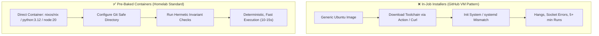

# 🛠️ Gitea Actions CI/CD Pipeline Standards & Container Paradigm

## 🎯 Overview & Scope

This guide establishes the architectural standards, security invariants, and design patterns for Continuous Integration and Delivery (CI/CD) pipelines across the `roadtotech.me` homelab appliance (both `Core/` and `Sites/<app>/`).

In this homelab, CI execution is performed on-premise by **Gitea Actions** (`gitea/act_runner`), executing jobs inside isolated Docker containers.

---

## 🏛️ The Core Paradigm: Pre-Baked Images vs. In-Job Installers



### 1. The Containerized Runner Context
* **Execution Engine**: `homelab-runner` (`gitea/act_runner:latest`) spawns ephemeral Docker containers via the host Docker daemon socket.
* **Lack of Systemd (PID 1)**: Standard container environments do not run `systemd`. Actions or scripts that attempt to start background daemons, configure system service managers, or create daemon sockets (e.g. `/nix/var/nix/daemon-socket/socket`) fail or hang indefinitely.
* **Forge API Isolation**: Marketplace actions often assume `${{ github.server_url }}` points to `https://github.com`. Under Gitea Actions, this resolves to `https://gitea.roadtotech.me`, leading to failed telemetry requests, broken release asset lookups, and timeouts.

### 2. Standard Container Registry Choices
Always declare `container: { image: <image> }` at the job level:

| Toolchain | Recommended Base Image | Flake / Hermetic Command |
| :--- | :--- | :--- |
| **Nix / NixOS** | `nixos/nix:latest` | `nix flake check` |
| **Python** | `python:3.12-slim` | `pytest && ruff check .` |
| **Node.js** | `node:20-alpine` | `npm ci && npm test` |
| **Rust** | `rust:1.80-slim` | `cargo check && cargo test` |
| **Go** | `golang:1.23-alpine` | `go test ./...` |

---

## 🔒 Mandatory Pipeline Invariants & Rules

When authoring workflow files (`.gitea/workflows/*.yaml` or `.github/workflows/*.yaml`), enforce these 4 invariants:

### 1. Git Safe Directory Invariant
When a job container runs as `root` (or a UID different from the runner's workspace UID), Git blocks operations on mounted workspace directories.
```yaml
      - name: Configure Git Safe Directory
        run: git config --global --add safe.directory "$GITHUB_WORKSPACE"
```
*Rule*: Always execute this configuration prior to any Git, Flake, or build step.

### 2. Self-Contained Flake & Dependency Verification
All checks must run hermetically using dependencies pinned in lockfiles (`flake.lock`, `package-lock.json`, `poetry.lock`).
*Rule*: In Nix repositories, enable flakes via configuration:
```yaml
      - name: Enable Nix Flakes
        run: |
          mkdir -p ~/.config/nix
          echo "experimental-features = nix-command flakes" >> ~/.config/nix/nix.conf
```

### 3. Avoid Third-Party Marketplace Action Dependencies
Avoid complex marketplace setup actions that make assumptions about GitHub APIs, authentication tokens, or VM host access.
*Rule*: Use direct container images and standard shell scripts.

### 4. Decoupling CI Gating from Host Deployments
* **CI Gating** (Pre-Merge): Validates correctness, linting, and security invariants in ephemeral containers.
* **CD Dispatcher** (Post-Merge): Operates out-of-band via `homelab-gitops.service` (`scripts/gitops_dispatcher.py`) and `appctl`, independent of CI runners.

---

## 📋 Standard Workflow Reference Templates

### A. NixOS / Flake Repository Template (`Core/.gitea/workflows/ci.yaml`)
```yaml
name: Core Architecture & Invariant CI

on:
  push:
    branches: [ main ]
  pull_request:
    branches: [ main ]

jobs:
  validate:
    runs-on: ubuntu-latest
    container:
      image: nixos/nix:latest
    steps:
      - name: Check out repository
        uses: actions/checkout@v4

      - name: Configure Git Safe Directory & Nix Flakes
        run: |
          git config --global --add safe.directory "$GITHUB_WORKSPACE"
          mkdir -p ~/.config/nix
          echo "experimental-features = nix-command flakes" >> ~/.config/nix/nix.conf

      - name: Run Architecture & Security Invariant Checks
        run: |
          nix flake check
```

### B. Python / FastAPI Application Template (`Sites/<app>/.gitea/workflows/ci.yaml`)
```yaml
name: Application CI

on:
  push:
    branches: [ main ]
  pull_request:
    branches: [ main ]

jobs:
  test:
    runs-on: ubuntu-latest
    container:
      image: python:3.12-slim
    steps:
      - name: Check out repository
        uses: actions/checkout@v4

      - name: Configure Git Safe Directory & Dependencies
        run: |
          git config --global --add safe.directory "$GITHUB_WORKSPACE"
          pip install --no-cache-dir ruff pytest
          if [ -f requirements.txt ]; then pip install -r requirements.txt; fi

      - name: Run Linting & Test Suite
        run: |
          ruff check .
          pytest
```
