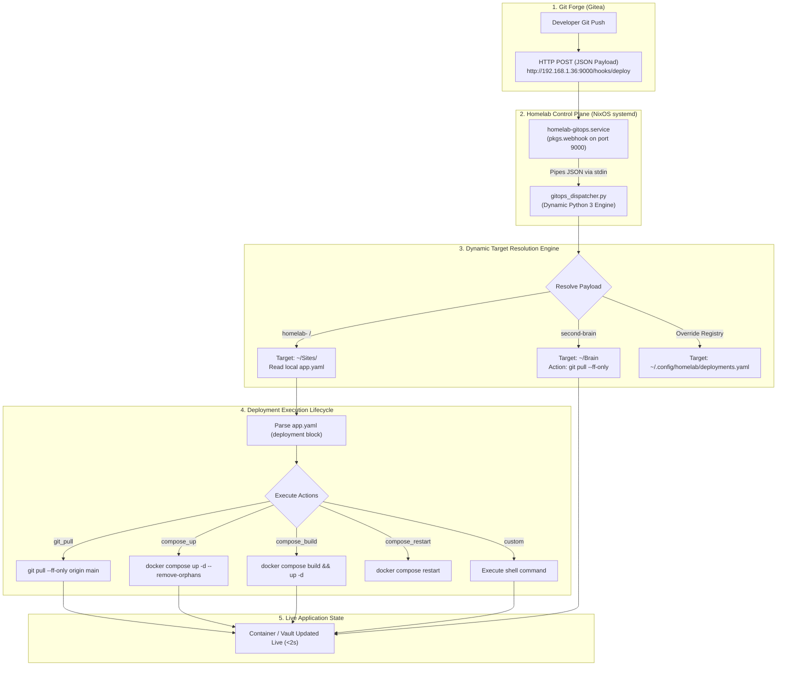

# 🚀 Dynamic Decentralized GitOps Dispatcher Architecture

## 🎯 Motivation & Core Invariants

In a modular homelab containing multiple containerized web applications (`~/Sites/*`), infrastructure control planes (`~/Core`), and data vaults (`~/Brain`), traditional centralized CI/CD configurations create unnecessary friction and blast radius.

The **Dynamic GitOps Dispatcher** is built around four fundamental architectural invariants:

1. **Zero Core Restarts (Decoupled Control Plane)**:
   Deploying a new application, onboarding a service, or updating deployment routines must **never require restarting or modifying Core infrastructure services** (Traefik, Authelia, Webhook daemon).
2. **Decentralized Manifests (`app.yaml`)**:
   Each application repository in `~/Sites` owns and declares its own deployment lifecycle directly within its local `app.yaml` manifest.
3. **Zero Schema Drift**:
   There are no centralized deployment tables or static hardcoded lists. The dispatcher discovers target directories and deployment strategies dynamically at runtime.
4. **Graceful Data Vault Fallbacks**:
   Repositories without Docker Compose stacks (e.g. `second-brain` data vault) automatically execute clean fast-forward Git pulls (`git pull --ff-only origin <branch>`).

---

## 🏛️ System Architecture & Components



---

## 🧩 Key System Components

### 1. The Declarative Webhook Daemon (`pkgs.webhook`)
The webhook listener is declared immutably via NixOS in [`Config/hosts/server/homeserver.nix`](file:///home/kiskaadee/Config/hosts/server/homeserver.nix):
- **Port**: `9000` (Internal LAN / Tailscale only).
- **Service Name**: `homelab-gitops.service`.
- **Payload Handling**: Configured with `pass-arguments-to-command = [ { source = "entire-payload"; } ]`, passing the complete Gitea JSON event payload directly into the Python dispatcher arguments.

### 2. The Dynamic Dispatcher Engine ([`gitops_dispatcher.py`](file:///home/kiskaadee/Projects/active/homelab/homelab-core/scripts/gitops_dispatcher.py))
A zero-dependency Python 3 engine executing on the server host:
- Parses the repository name and ref (`branch`) from standard input.
- Dynamically locates the target directory in `~/Sites` (matching `<repo>`, `homelab-<repo>`, or data vaults).
- Parses `app.yaml` using a built-in lightweight YAML parser.
- Sequentially executes declared deployment actions.

### 3. Application Manifest Standard (`app.yaml`)
Placed in the root of each application repository in `~/Sites/<app>/app.yaml`:

```yaml
name: "doc2site"
aliases:
  - "docs"
domain: "docs.roadtotech.me"
description: "Documentation portal"
visible: true
auth: false

# Deployment Lifecycle Specification
deployment:
  branch: "main"                 # Target branch to trigger on
  actions:
    - git_pull                   # 1. Pull latest commit via --ff-only
    - compose_up                 # 2. Run docker compose up -d --remove-orphans
```

#### Available Deployment Actions:
| Action | Execution Command | Use Case |
| :--- | :--- | :--- |
| `git_pull` | `git -C <dir> pull --ff-only origin <branch>` | Standard for code/content updates |
| `compose_up` | `docker compose -f <file> up -d --remove-orphans` | Recreate containers with new config/env |
| `compose_build` | `docker compose build && docker compose up -d` | Applications with local Dockerfiles |
| `compose_restart`| `docker compose restart` | Quick container restart without recreation |
| `custom: "<cmd>"`| `subprocess.run(cmd, shell=True)` | Custom database migrations or build scripts |

---

## 🛠️ End-to-End Onboarding Guide for New Services

To onboard any new service into the automated GitOps deployment pipeline:

### Step 1: Create the Application Repository
Create your repository on Gitea (e.g. `homelab-myapp` or `myapp`).

### Step 2: Add `app.yaml` Manifest
In the root of your application repository, create `app.yaml`:
```yaml
name: "myapp"
domain: "myapp.roadtotech.me"
description: "My new homelab application"
visible: true
auth: true

deployment:
  branch: "main"
  actions:
    - git_pull
    - compose_up
```

### Step 3: Clone to Server Host
Clone the repository into `~/Sites` on the server:
```bash
git clone ssh://git@gitea.roadtotech.me:2223/kiskaadee/homelab-myapp.git ~/Sites/homelab-myapp
```

### Step 4: Configure Webhook in Gitea
1. In Gitea, navigate to **Repository Settings** $\rightarrow$ **Webhooks** $\rightarrow$ **Add Webhook** $\rightarrow$ **Gitea**.
2. **Target URL**: `http://192.168.1.36:9000/hooks/deploy`
3. **HTTP Method**: `POST`
4. **Trigger On**: `Push Events`
5. Click **Add Webhook**.

### Step 5: Test & Verify
Push a commit from your workstation:
```bash
git commit -m "feat: initial feature release"
git push origin main
```
The Gitea webhook fires $\rightarrow$ `gitops_dispatcher.py` pulls the update $\rightarrow$ Docker recreates containers $\rightarrow$ Service is updated live with zero manual SSH commands required.
