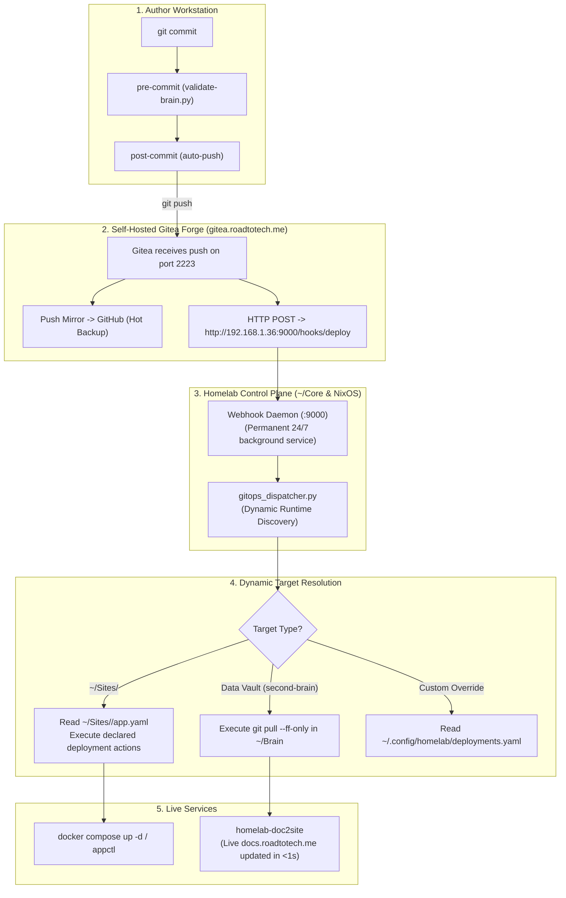

# 🚀 Dynamic Decentralized GitOps Dispatcher Architecture

## 🎯 Motivation & Design Principles
In a modular homelab containing multiple containerized web applications (`~/Sites/*`) and data vaults (such as `~/Brain`), deployments must be:
1. **Decoupled from Core Infrastructure**: Deploying a new application or modifying deployment scripts should **never require editing or restarting Core control-plane services** (Traefik, Authelia, Webhook daemon).
2. **Zero Delay & Event-Driven**: Pushing changes to Gitea immediately triggers automated deployment and synchronization over internal LAN endpoints.
3. **Decentralized Self-Describing Manifests**: Each application repository in `~/Sites` defines its own deployment lifecycle inside its local `app.yaml`.
4. **Graceful Defaults for Data Vaults**: Repositories without container stacks (e.g., `second-brain`) automatically default to fast-forward Git pulls (`git pull --ff-only origin main`).

---

## 🏛️ End-to-End System Topology



---

## ⚙️ Manifest Standard (`app.yaml`)

Applications in `~/Sites` can declare an optional `deployment:` block in their `app.yaml`:

```yaml
name: "doc2site"
domain: "docs.roadtotech.me"
description: "Reactive Markdown Viewer"

deployment:
  branch: "main"                 # Target branch to trigger on
  actions:
    - git_pull                   # Runs: git pull --ff-only origin <branch>
    - compose_up                 # Runs: docker compose up -d --remove-orphans
    # Optional alternative actions:
    # - compose_build            # Rebuilds and restarts containers
    # - compose_restart          # Restarts containers without rebuild
    # - custom: "make deploy"    # Custom shell command
```

If no `deployment:` section is specified, the dispatcher defaults to:
```yaml
deployment:
  branch: "main"
  actions:
    - git_pull
    - compose_up
```

---

## 🔧 NixOS Server Configuration

The receiver runs as a declarative systemd unit in `~/Config/hosts/server/homeserver.nix`:

```nix
# Declarative Dynamic GitOps Webhook Service (Internal Port 9000)
systemd.services.homelab-gitops = {
  description = "Dynamic Homelab GitOps Webhook Dispatcher";
  after = [ "network-online.target" "docker.service" ];
  wants = [ "network-online.target" ];
  wantedBy = [ "multi-user.target" ];

  path = with pkgs; [ git docker docker-compose python3 coreutils bash ];

  serviceConfig = {
    Type = "simple";
    User = "kiskaadee";
    WorkingDirectory = "/home/kiskaadee/Core";
    ExecStart = "${pkgs.webhook}/bin/webhook -hooks ${pkgs.writeText "hooks.json" (builtins.toJSON [
      {
        id = "deploy";
        execute-command = "${pkgs.python3}/bin/python3";
        pass-arguments-to-command = [
          { arg = "/home/kiskaadee/Core/scripts/gitops_dispatcher.py"; }
        ];
        pass-stdin-to-command = true;
        command-working-directory = "/home/kiskaadee/Core";
        response-message = "Deployment payload dispatched successfully.";
      }
    ])} -port 9000 -verbose";
    Restart = "on-failure";
    RestartSec = "5s";
  };
};

# Open port 9000 in the server firewall
networking.firewall.allowedTCPPorts = [ 80 443 2223 9000 ];
```

---

## 🌐 Configuring Gitea Webhook

To connect Gitea to the GitOps Dispatcher:

1. In Gitea, open repository **Settings** $\rightarrow$ **Webhooks** (or **Site Administration** $\rightarrow$ **System Webhooks** for all repositories).
2. Click **Add Webhook** $\rightarrow$ **Gitea**.
3. Set **Target URL**:
   ```text
   http://192.168.1.36:9000/hooks/deploy
   ```
4. **HTTP Method**: `POST`.
5. **Trigger On**: `Push Events` on `main`.
6. Click **Add Webhook**.
7. Test delivery: Click **Test Delivery** $\rightarrow$ Verify HTTP 200 with response `Deployment payload dispatched successfully.`.
