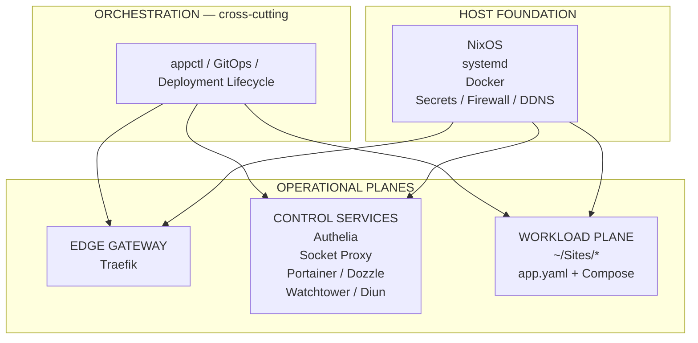

# Architecture Consolidation & Hardening Roadmap v2

> Supersedes the [original phased implementation plan](architecture-consolidation-roadmap.md).
> Integrates reviewer feedback across fourteen areas: trust model, manifest
> contracts, privilege separation, protocol versioning, invariant testing, and
> deployment observability.

---

## Executive Summary

The homelab infrastructure has evolved through four eras — from a Docker Compose
ingress stack, through decentralized `~/Sites` workloads coordinated by `appctl`,
to webhook-driven GitOps auto-deployments, and finally to a turnkey NixOS
appliance configuration embedded in `homelab-core`.

**The system works.** But the trust model and ownership model have not caught up
with the system's evolution. This plan formalizes the architectural boundaries,
closes the critical GitOps attack surface, and establishes machine-enforced
contracts — without adding unnecessary abstraction.

### Design Principle

> The goal is not to make the system more elaborate. The goal is to make
> the existing complexity **legible and bounded**.

A successful end state means that anyone can answer five questions by reading the
repository:

1. What does **NixOS** own?
2. What does **Core** own?
3. What does an **application repository** own?
4. What can **GitOps** execute?
5. What happens **when deployment fails**?

Right now those answers exist, but they're scattered across code, conventions,
comments, and historical documentation. This plan turns them into explicit
architectural contracts.

---

## Part 1: Architectural Model

### The Three-Layer Architecture with Orchestration Control Plane

The legacy docs in [`docs/legacy/architecture.html`](file:///home/kiskaadee/Projects/active/homelab/Core/docs/legacy/architecture.html) depict a two-tier "Control
Plane → Data Plane" model. In practice, the system operates across three
execution layers, with orchestration acting as a **cross-cutting control
mechanism** — not a fourth layer.



**Why orchestration is not a layer:** `appctl` and GitOps are controllers acting
on the execution layers. They do not run workloads and do not provide an
execution environment comparable to NixOS, Docker, or Traefik. This distinction
matters for documentation, security analysis, and ownership clarity.

### Layer Responsibilities & Strict Boundaries

| Layer | Owns | Must NOT Own |
| :--- | :--- | :--- |
| **Host Foundation (NixOS)** | OS, kernel, systemd services, firewall, secret decryption, host CLI tools | Workload-specific container logic or direct compose files |
| **Edge Gateway (Traefik)** | TLS termination, ingress routing, ACME certificate lifecycle | Application business logic or auth policy |
| **Control Services (Core Compose)** | Identity gateway (Authelia), socket isolation, container UI (Portainer, Dozzle), image monitoring (Watchtower, Diun) | Workload deployment policy or app-specific env vars |
| **Workload Plane (`~/Sites/*`)** | Application code, compose manifest, self-describing `app.yaml` | Host configuration, direct Docker socket, root/sudo |

| Control Mechanism | Owns | Must NOT Own |
| :--- | :--- | :--- |
| **Orchestration (`appctl` & GitOps)** | Deployment admission, sequencing, health checks, dashboard metadata sync | Arbitrary shell execution, workload-specific business logic |

---

## Part 2: Phased Roadmap

### Dependency Chain

```
P0  GitOps Trust Boundary
         ↓
P1  Manifest Contract ←──┐
P1  Architecture Tests ───┤ (parallel)
P1  Privilege Boundary ───┘
         ↓
P2  Architecture Documentation
         ↓
P3  Deployment Verification
         ↓
P4  Deployment State & Observability
```

---

### P0 — GitOps Trust Boundary

**Priority:** Urgent — addresses the highest-risk vulnerability in the system.

**Goal:** Transform the webhook dispatcher from an arbitrary command executor
into a proper **deployment admission pipeline**.

#### Threat Model

The current [`gitops_dispatcher.py`](file:///home/kiskaadee/Projects/active/homelab/Core/scripts/gitops_dispatcher.py) makes `app.yaml` effectively executable configuration via
the `custom` action path. The implementation feeds the configured command to
`subprocess.run(cmd, shell=True, cwd=str(target_dir), check=True)` (line ~170).
The GitOps service runs as `kiskaadee` (configured in [`homeserver.nix`](file:///home/kiskaadee/Projects/active/homelab/Core/nixos/modules/homeserver.nix)),
which belongs to `docker` and `wheel`. The full threat chain:

```
repo modification → app.yaml modification → webhook → dispatcher
    → shell execution → kiskaadee → docker / sudo → host
```

> [!CAUTION]
> The `homelab-gitops` service currently runs via
> [`adnanh/webhook`](https://github.com/adnanh/webhook) on port 9000, which is
> open in the firewall. The dispatcher receives the entire payload as CLI
> argument 1, with no HMAC verification, no repository allowlisting, and no
> branch policy enforcement. Any entity that can reach port 9000 can trigger
> arbitrary deployments.

#### Deliverables

##### 1. Abolish Custom Shell Execution

Remove the `custom` action path entirely from `gitops_dispatcher.py`.
Deployment actions become a closed, hardcoded set. No `app.yaml` should be able
to specify arbitrary commands.

> **Known consumer:** `homelab-magnetflix` uses
> `custom: "docker compose exec -T app python manage.py migrate --noinput"`.
> This must be handled via a dedicated `post_deploy` lifecycle hook or a
> `compose_exec` action with a strict command allowlist — not through arbitrary
> shell passthrough.

##### 2. Deployment Admission Pipeline

Replace the current "receive payload → parse → execute" model with a five-stage
admission pipeline that validates before acting:

```
                    webhook
                       │
           ┌───────────▼───────────┐
           │ cryptographic verify  │  HMAC-SHA256 via X-Gitea-Signature
           └───────────┬───────────┘  (secret stored in SOPS → /run/secrets/)
                       │
           ┌───────────▼───────────┐
           │ repository allowlist  │  payload identifies repo name →
           └───────────┬───────────┘  Core resolves against trusted mapping
                       │
           ┌───────────▼───────────┐
           │ branch policy         │  only deploy from declared branch
           └───────────┬───────────┘  (default: main, per app.yaml)
                       │
           ┌───────────▼───────────┐
           │ manifest validation   │  parse + validate app.yaml
           └───────────┬───────────┘  against schema v1
                       │
           ┌───────────▼───────────┐
           │ allowed action set    │  only closed deployment strategy
           └───────────────────────┘
```

> [!IMPORTANT]
> **Path resolution principle:** The webhook payload identifies a repository
> **by name**. Core resolves it against a trusted local registry/mapping.
> The payload must **never** select an arbitrary filesystem path.
>
> ```
> webhook payload:  repository = "homelab-docs"
>                        ↓
> Core:             trusted mapping
>                        ↓
>                   /home/kiskaadee/Sites/homelab-docs
> ```
>
> Canonical path validation (`realpath` under `~/Sites/<allowed-repo>`) remains
> valuable as defense in depth, but path containment must not be the primary
> trust mechanism.

##### 3. Webhook Verification

Require `X-Gitea-Signature` HMAC-SHA256 verification on every request. The
shared secret lives in `nixos/secrets.yaml` (SOPS-encrypted) and is projected to
the service at runtime via `/run/secrets/`.

**Implementation note:** The current architecture uses `adnanh/webhook` as a
shim that passes the payload to the dispatcher as a CLI argument. Signature
verification should be implemented either:
- Within the webhook shim configuration (preferred — reject before dispatch), or
- As the first gate in the dispatcher itself.

##### 4. Serialized Deployment with Superseding

Per-target serialization to prevent race conditions on rapid commits:

```
A arrives → deploy A
B arrives → queue
C arrives → replace queued B with C

A finishes → deploy C (latest valid state)
```

You generally don't care about deploying every intermediate commit — you care
about eventually deploying the latest valid state. A filesystem lock
(`flock`/`fcntl`) or systemd-based mechanism is perfectly adequate at this scale.
No message broker needed.

##### 5. Async Dispatch

Move deployment execution out of the HTTP request handler. The current
dispatcher executes actions synchronously within the webhook request, which means
a slow deployment blocks the HTTP response and subsequent webhook deliveries.

---

### P1 — Manifest Contract (`app.yaml` v1)

**Priority:** Core Foundation — parallel with Architecture Tests and Privilege
Boundary.

**Goal:** Turn `app.yaml` from an informal hint into a strict, versioned API
contract.

#### Current State

The current [`appctl_engine.py`](file:///home/kiskaadee/Projects/active/homelab/Core/scripts/appctl_engine.py) uses a zero-dependency custom YAML parser
(`parse_yaml_simple`) that is intentionally permissive. Fields like `auth`,
`networks`, `env`, and `deployment` are consumed via `.get()` with defaults.
There is no schema validation — any key is silently accepted, any missing key
gets a default.

Existing manifests (from production) look like:

```yaml
# ~/Sites/homelab-gitea/app.yaml
name: "gitea"
aliases: ["git"]
domain: "gitea.roadtotech.me"
description: "Self-Hosted Git Service"
visible: true
auth: false
networks: [proxy-net]
env:
  SSH_DOMAIN: "gitea.roadtotech.me"
  SSH_PORT: "2223"
deployment:
  branch: "main"
  actions: [git_pull, compose_up]
homepage:
  title: "Gitea"
  group: "Development & AI"
  icon: "gitea.png"
  container: "gitea"
  weight: 10
```

#### Design Decisions

##### Intent Over Imperative

The manifest should declare **intent**, not execution steps. Core decides how
to fulfill that intent:

```yaml
# v1 manifest — the app declares WHAT it is
schemaVersion: 1
name: docs
title: Documentation
domain: docs.roadtotech.me
auth: true

deployment:
  strategy: compose          # Core decides: git pull → config → pull → up
  branch: main
  verify: healthcheck        # Core decides how to verify

networks:
  - proxy-net

homepage:
  icon: mdi-book-open-page-variant
  group: Tools
  description: "Homelab documentation site"
```

This is architecturally cleaner because the application controls *what kind of
application it is*, but Core controls *how deployment works*. The trust boundary
is explicit: apps declare intent, Core decides execution.

##### Desired State vs. Observed State

The manifest describes **desired state only**. Observed state (container running,
git ahead/behind, certificate expiration, compose validity) is discovered by
Core at runtime. These concepts must never leak into each other:

```
app.yaml          →  desired state (what the app wants)
Docker/Git/TLS    →  observed state (what actually exists)
appctl            →  reconciliation / presentation
```

This transforms `appctl` from a convenience CLI into a reconciliation tool — a
much stronger architectural position.

##### Schema-First Design

1. **Define the specification first** — required fields, optional fields, types,
   defaults, allowed values, cross-field constraints, security constraints, and
   versioning rules.
2. **Then choose representation:**

```
schemas/app-v1.schema.json       ← normative contract
                                    (editor autocomplete, CI, external tooling)

appctl_engine.py Pydantic model  ← runtime enforcement
                                    (generated from or validated against schema)
```

JSON Schema has a significant advantage for consumption by editors, CI, external
tooling, and potentially other languages. Pydantic is convenient for internal
Python enforcement. Use both.

##### Protocol Versioning

Every `app.yaml` must declare `schemaVersion: 1`. Core rejects manifests without
a recognized version. This gives room to evolve the contract without silently
breaking existing repositories.

#### Deliverables

- [ ] Write the manifest specification (v1) — documenting all fields, types,
      defaults, constraints, and security rules.
- [ ] Create `schemas/app-v1.schema.json` — the normative JSON Schema contract.
- [ ] Implement Pydantic validator in `appctl_engine.py`.
- [ ] Add `schemaVersion` requirement to all manifests.
- [ ] Replace imperative action lists with `deployment.strategy` declarations.
- [ ] Add pre-flight schema validation to both `appctl` and the GitOps dispatcher.
- [ ] Migrate all existing `~/Sites/*/app.yaml` files to v1 schema.

---

### P1 — Architecture Tests (Machine-Enforced Invariants)

**Priority:** Continuous Verification — parallel with Manifest Contract and
Privilege Boundary.

**Goal:** Convert written architectural invariants from [`AGENTS.md`](file:///home/kiskaadee/Projects/active/homelab/Core/AGENTS.md) into
executable tests.

The current `AGENTS.md` already contains invariants (decentralized manifests,
read-only socket-proxy, no committed secrets, Unlicense preservation). The
[`docker-compose.yml`](file:///home/kiskaadee/Projects/active/homelab/Core/docker-compose.yml) correctly implements the socket-proxy policy
(`POST=0`, `DELETE=0`). But these are convention-dependent — nothing prevents
regression.

#### Five Categories of Invariants

##### 1. Structural Invariants

```
required directories exist (nixos/, scripts/, docs/)
required files exist (docker-compose.yml, flake.nix, AGENTS.md, UNLICENSE)
no deprecated paths (infra/core/, ./up.sh, ./down.sh)
```

##### 2. Security Invariants

```
no direct /var/run/docker.sock mounts in any compose file
socket-proxy POST=0, DELETE=0 in docker-compose.yml
no --privileged flags in workload containers
no forbidden host mount paths
no shell=True in dispatcher (post P0)
```

##### 3. Manifest Invariants

```
all app.yaml files pass schema validation (post P1 manifest)
unique app names across ~/Sites
unique domains across ~/Sites
only allowed networks referenced (proxy-net, socket-net, etc.)
only allowed deployment strategies
schemaVersion present and recognized
```

##### 4. Operational Invariants

```
docker compose config -q succeeds for Core stack
docker compose config -q succeeds for all ~/Sites stacks
NixOS flake evaluates (nix flake check)
```

##### 5. Documentation Invariants

```
commands mentioned in docs/ actually exist in scripts/
paths mentioned in docs/ actually exist in the repository
no references to deprecated paths (infra/core/, ./up.sh, ./down.sh)
```

> [!TIP]
> That last category is particularly valuable because the current repository
> demonstrates exactly why documentation drift happens — the legacy
> [`setup_guide.md`](file:///home/kiskaadee/Projects/active/homelab/Core/docs/setup_guide.md) and HTML docs reference patterns that no longer exist.

#### Deliverables

- [ ] Create `tests/` directory with test suites per category.
- [ ] Integrate into Gitea Actions CI workflow.
- [ ] Run structural + security + manifest invariants on every Core commit.
- [ ] Run operational invariants on deployment (or scheduled nightly).
- [ ] Run documentation invariants as part of doc changes.

---

### P1 — Privilege Boundary

**Priority:** Security hardening — parallel with Manifest Contract and
Architecture Tests.

**Goal:** Reduce the blast radius of the GitOps service by separating
privileges.

#### Current Problem

Even after removing `custom` execution, the GitOps service runs as `kiskaadee`
(configured in [`homeserver.nix`](file:///home/kiskaadee/Projects/active/homelab/Core/nixos/modules/homeserver.nix)) with `wheel` and `docker` group membership. A remotely
triggered service should not possess that level of authority.

The current systemd service has no hardening directives — no `ProtectSystem`, no
`PrivateTmp`, no `NoNewPrivileges`.

#### Target Architecture

```
                     webhook
                        │
                        ▼
                unprivileged receiver
                   (validates, queues)
                        │
                  validated request
                        │
                        ▼
                 controlled executor
                   (narrow privilege)
                        │
                        ▼
                     Docker
```

#### Deliverables

- [ ] Create a dedicated `gitops` Unix user with membership **only** in `docker`
      (not `wheel`).
- [ ] Apply systemd hardening to `homelab-gitops.service`:
  - `ProtectSystem=strict`
  - `ProtectHome=read-only` (with explicit `ReadWritePaths=` for `~/Sites`)
  - `PrivateTmp=yes`
  - `NoNewPrivileges=yes`
  - `CapabilityBoundingSet=`
- [ ] Remove `wheel` dependency from the GitOps execution path.
- [ ] Restrict filesystem access to `~/Sites/<allowed-repos>` only.
- [ ] Document the privilege boundary in the architecture docs.

> [!NOTE]
> This is not P0 because eliminating `shell=True` and `custom` is the immediate
> vulnerability reduction. But privilege separation should be implemented
> alongside P1, not deferred indefinitely.

---

### P2 — Architecture Documentation

**Priority:** Clarity — depends on P0 and P1 stabilization.

**Goal:** Align repository documentation with current reality and establish the
GitOps protocol as a documented architectural interface.

> [!IMPORTANT]
> The GitOps protocol should be documented **immediately after stabilization**,
> not deferred to a general documentation cleanup. It is an architectural
> interface — it deserves documentation alongside the implementation.

#### Documentation Structure

```
docs/
├── architecture/
│   ├── system-topology.md          # three-layer model + orchestration
│   ├── ownership-matrix.md         # what each layer owns / must not own
│   ├── gitops-protocol-v1.md       # webhook semantics, admission pipeline
│   └── manifest-specification.md   # app.yaml v1 contract reference
├── security/
│   ├── trust-model.md              # privilege boundaries, threat model
│   ├── secret-management.md        # SOPS lifecycle, projection
│   └── socket-proxy-policy.md      # read-only socket invariant
├── operations/
│   ├── nixos-management.md         # rebuild, update, garbage collection
│   └── disaster-recovery.md        # declarative vs. state recovery
├── adr/
│   ├── 001-remove-localhost-routers.md   (from legacy/)
│   ├── 002-migrate-dynu-to-nixos.md      (from legacy/)
│   └── ...                               (new ADRs as decisions are made)
└── archive/
    ├── architecture.html           # historical "Hardened Hub v2.0" docs
    ├── homeserver-architecture.md  # historical two-tier model
    └── ...                         # obsolete docs preserved for history
```

> [!NOTE]
> Don't delete historical documentation outright. The project explicitly
> preserves its evolution, and ADRs are useful historical evidence. The existing
> Dynu ADR records why DDNS moved into the NixOS layer. Archive rather than
> destroy: `docs/archive/` = historical truth, `docs/` = current truth.

#### Key Deliverables

- [ ] Write `system-topology.md` documenting the three-layer + orchestration
      model with the ownership matrix.
- [ ] Write `gitops-protocol-v1.md` documenting the admission pipeline,
      webhook format, repository mapping, and deployment semantics.
- [ ] Write `manifest-specification.md` as the human-readable companion to
      `schemas/app-v1.schema.json`.
- [ ] Write `trust-model.md` documenting the privilege boundary and threat model.
- [ ] Split disaster recovery into **Declarative Recovery** (NixOS, Flake,
      Compose, manifests) and **State Recovery** (Docker volumes, Authelia
      SQLite DB, ACME `acme.json`, dynamic IP history).
- [ ] Move legacy ADRs from `docs/legacy/` to `docs/adr/` with consistent naming.
- [ ] Archive obsolete documentation to `docs/archive/`.
- [ ] Correct active documentation claims: Watchtower scope, firewall port
      inventory, wildcard TLS scope.

---

### P3 — Deployment Verification

**Priority:** Reliability — depends on P0 + P1 completion.

**Goal:** Replace best-effort execution with validated deployment transactions.

#### Deployment Lifecycle

```
pre-flight
    │
    ├── docker compose config -q     (syntax valid?)
    ├── schema validation            (app.yaml valid?)
    └── branch policy check          (correct ref?)
         │
         ▼
deploy
    │
    ├── git pull origin <branch>
    ├── docker compose pull
    └── docker compose up -d --remove-orphans
         │
         ▼
verify
    │
    ├── healthcheck (container health status)
    └── HTTP probe (if domain declared)
         │
         ▼
result
    │
    ├── SUCCESS → log + continue
    └── FAILURE → log + alert (no auto-rollback in v1)
```

#### Failure Semantics

Define what happens on failure **explicitly** rather than leaving it implicit:

| Stage | Failure Behavior |
| :--- | :--- |
| **Pre-flight** | Reject deployment, log reason, return error to webhook |
| **Git pull** | Log error, mark deployment FAILED, do not proceed |
| **Compose pull/up** | Log error with stderr, mark deployment FAILED |
| **Health check** | Log warning, mark deployment DEGRADED |

**No automatic rollback in v1.** Rollback is a manual `appctl` operation.
Automatic rollback introduces complexity not justified at current scale.

#### Deliverables

- [ ] Implement pre-flight checks in the dispatcher before any deployment action.
- [ ] Add post-deployment health verification (container status + optional HTTP).
- [ ] Define and implement explicit failure semantics for each stage.
- [ ] Surface deployment result in dispatcher logs (structured JSON).

---

### P4 — Deployment State & Observability

**Priority:** Platform maturity — depends on P3.

**Goal:** Give the system deployment memory so that `appctl` can answer questions
about what happened, not just what currently exists.

#### Deployment Record

Each deployment produces a structured record:

```json
{
  "id": "deploy-docs-20260912-001422",
  "repository": "homelab-docs",
  "commit": "9ac3f7b2",
  "previous_commit": "87b2e1a4",
  "branch": "main",
  "timestamp": "2026-09-12T00:14:22-05:00",
  "duration_seconds": 22,
  "result": "SUCCESS",
  "failure_reason": null,
  "triggered_by": "webhook"
}
```

#### `appctl` Integration

```
$ appctl deployment docs

Last deployment
    commit: 9ac3f7b2
    time:   2026-09-12 00:14
    duration: 22s
    result: SUCCESS

Previous deployment
    commit: 87b2e1a4
    result: SUCCESS
```

This makes the system feel like a deployment platform rather than a collection
of shell scripts.

#### Deliverables

- [ ] Define deployment record schema.
- [ ] Implement append-only deployment log (JSON Lines file per repository,
      or single consolidated log — decide during implementation).
- [ ] Add `appctl deployment <app>` subcommand.
- [ ] Track deployment IDs, commit SHAs, timestamps, durations, and results.
- [ ] Preserve rollback information (previous commit SHA) for future use.

---

## Part 3: Secrets Architecture Clarification

### Principle

> **Secrets belong to the subsystem that semantically owns them.**

The current [`traefik-deployments.nix`](file:///home/kiskaadee/Projects/active/homelab/Core/nixos/modules/traefik-deployments.nix) acts as the Host Secret Projection Layer,
injecting credentials into `/run/secrets/rendered/traefik-deployments.env`. This
role should be formally documented.

The `system.pdf_decrypt_password` key currently lives in [`secrets.yaml`](file:///home/kiskaadee/Projects/active/homelab/Core/nixos/secrets.yaml) but is
consumed via `dynu.nix` or `shell.nix`. Secrets should not live in modules based
on which utility happens to consume them. The correct ownership model:

```
nixos/modules/
    security.nix              # secret declarations and SOPS references
                              # (or a dedicated secrets.nix)
    traefik-deployments.nix   # projection of app secrets to containers
    dynu.nix                  # DDNS updater (references secrets, doesn't own them)
    shell.nix                 # shell environment (references secrets, doesn't own them)
```

`security.nix` owns the secret **declaration**. Each consuming module references
the projected secret path without owning the declaration. Otherwise the same
category of architectural coupling just moves somewhere else.

> [!NOTE]
> This is a documentation/ownership clarification, not a code restructure.
> `secrets.yaml` already centralizes the actual encrypted values. The change is
> to ensure that the NixOS module structure reflects semantic ownership rather
> than consumer convenience.

---

## Part 4: Protocol Versioning

Two APIs are being created by this plan. Both must be treated as versioned
contracts:

### `app.yaml` — Manifest Contract v1

```yaml
schemaVersion: 1
```

Required in every manifest. Core rejects unrecognized versions.

### GitOps Protocol v1

The webhook semantics, admission pipeline, repository mapping, and deployment
lifecycle constitute a protocol. Document it as:

```
GitOps Protocol v1
    Webhook format:         Gitea push event
    Authentication:         HMAC-SHA256 (X-Gitea-Signature)
    Repository resolution:  trusted name → local path mapping
    Branch policy:          configurable per-manifest (default: main)
    Deployment strategy:    intent-based (compose)
    Serialization:          per-target with superseding
    Failure semantics:      explicit per-stage (no auto-rollback in v1)
```

Versioning both contracts gives room to evolve without silently breaking
existing repositories.

---

## Part 5: Scope Boundaries — What This Plan Does NOT Do

To keep the system bounded rather than increasingly elaborate:

- **Does not introduce a message broker or queue service.** Serialization uses
  filesystem locks or systemd mechanisms.
- **Does not add automatic rollback in v1.** Rollback remains a manual
  `appctl` operation until deployment records prove stable.
- **Does not redesign the NixOS module tree.** Only secrets ownership is
  clarified; the module structure remains intact.
- **Does not introduce new runtime dependencies.** The dispatcher remains a
  single Python process behind systemd (via `adnanh/webhook` or direct HTTP).
- **Does not add container orchestration beyond Docker Compose.** Kubernetes,
  Nomad, and similar platforms are explicitly out of scope.
- **Does not resolve the `~/Sites` vs `~/Projects/active/homelab/` path
  discrepancy.** That is a separate operational concern to address independently.

The system already has NixOS, Docker, Compose, Traefik, Authelia, SOPS, `appctl`,
`app.yaml`, GitOps, and Gitea Actions. That's a lot of machinery for a homelab.
The refactoring makes that complexity legible — it does not add more.

---

## Consolidated Task Checklist

### P0 — GitOps Trust Boundary

- [ ] Remove `custom` action execution from [`gitops_dispatcher.py`](file:///home/kiskaadee/Projects/active/homelab/Core/scripts/gitops_dispatcher.py)
- [ ] Migrate `homelab-magnetflix` away from `custom` action
- [ ] Implement HMAC-SHA256 webhook signature verification
- [ ] Implement trusted repository name → local path mapping (not path from payload)
- [ ] Implement branch policy validation
- [ ] Implement manifest validation in admission pipeline
- [ ] Implement per-target deployment serialization with superseding
- [ ] Move deployment execution out of the HTTP request handler (async dispatch)

### P1 — Manifest Contract

- [ ] Write manifest specification v1 (fields, types, defaults, constraints)
- [ ] Create `schemas/app-v1.schema.json`
- [ ] Implement Pydantic validator in [`appctl_engine.py`](file:///home/kiskaadee/Projects/active/homelab/Core/scripts/appctl_engine.py)
- [ ] Add `schemaVersion` requirement to all manifests
- [ ] Replace imperative action lists with `deployment.strategy` declarations
- [ ] Migrate all `~/Sites/*/app.yaml` to v1 schema
- [ ] Add pre-flight validation to `appctl` and dispatcher

### P1 — Architecture Tests

- [ ] Structural invariant tests
- [ ] Security invariant tests
- [ ] Manifest invariant tests
- [ ] Operational invariant tests
- [ ] Documentation invariant tests
- [ ] Gitea Actions CI integration

### P1 — Privilege Boundary

- [ ] Create dedicated `gitops` Unix user
- [ ] Apply systemd hardening directives to [`homeserver.nix`](file:///home/kiskaadee/Projects/active/homelab/Core/nixos/modules/homeserver.nix)
- [ ] Restrict filesystem access scope
- [ ] Document privilege model

### P2 — Architecture Documentation

- [ ] System topology document (three-layer + orchestration model)
- [ ] GitOps protocol v1 specification
- [ ] Manifest specification (human-readable companion to JSON Schema)
- [ ] Trust model and privilege boundary documentation
- [ ] Disaster recovery split (declarative vs. state)
- [ ] Migrate legacy ADRs to `docs/adr/`
- [ ] Archive obsolete documentation to `docs/archive/`
- [ ] Correct active doc inaccuracies

### P3 — Deployment Verification

- [ ] Pre-flight checks (compose config, schema, branch)
- [ ] Post-deployment health verification
- [ ] Explicit failure semantics per stage
- [ ] Structured deployment logging (JSON)

### P4 — Deployment State & Observability

- [ ] Deployment record schema
- [ ] Append-only deployment log
- [ ] `appctl deployment <app>` subcommand
- [ ] Commit tracking and duration recording
- [ ] Previous-revision preservation for rollback context
