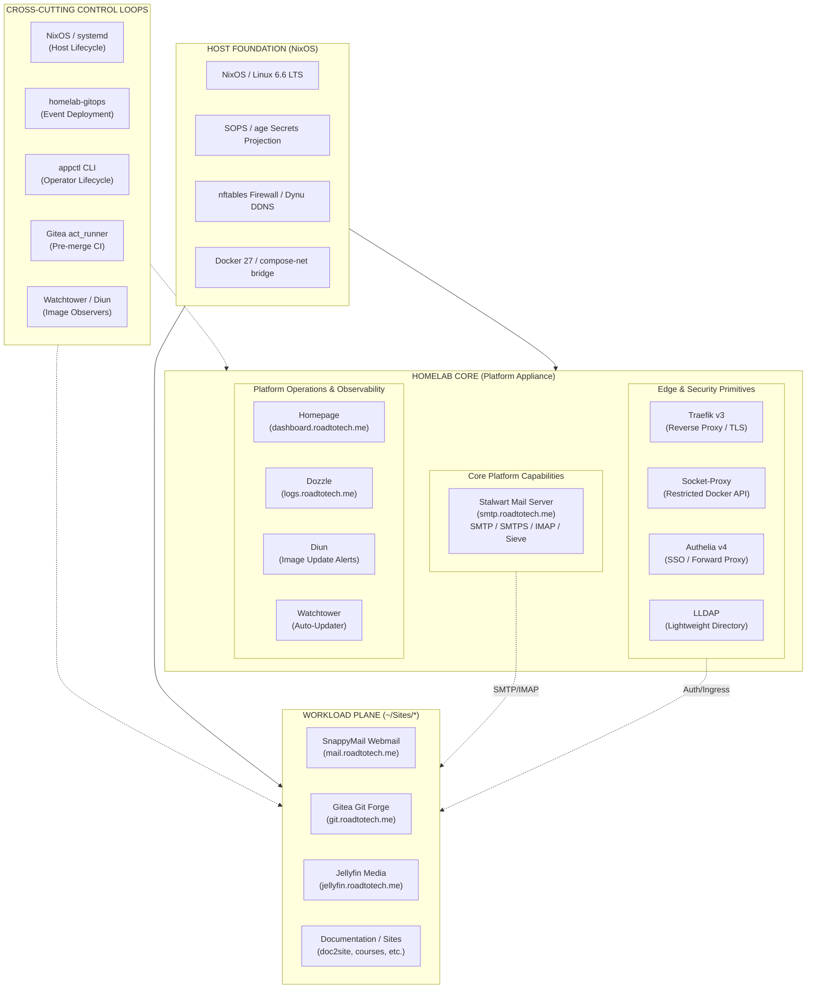
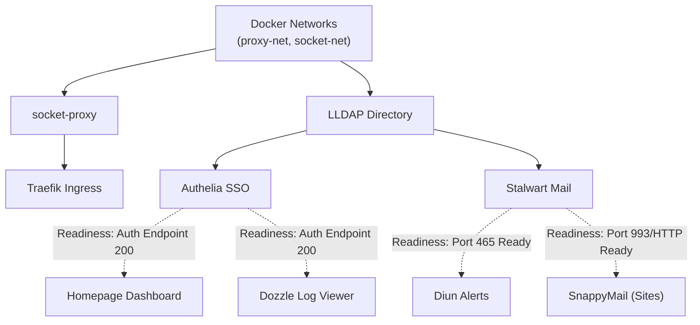

# Architecture Consolidation & Hardening Roadmap v3

> **Supersedes**: [Architecture Consolidation & Hardening Roadmap v2](../archive/architecture-consolidation-roadmap-v2.md)
>
> **Current Platform Baseline**: Commit `246b587` (NixOS standalone appliance, consolidated docs, Portainer deprecated, Stalwart mail & SMTPS submission, Dozzle auth, Diun jitter/worker pool, Gitea Actions CI).
>
> 📋 **Companion Execution Guide**: [`architecture-consolidation-implementation-guide-v3.md`](architecture-consolidation-implementation-guide-v3.md)

---

## Executive Summary

The homelab appliance (`roadtotech.me`) has crossed a defining evolutionary threshold. When Roadmap v2 was drafted, the primary challenge was securing a rudimentary GitOps webhook receiver and recovering architectural legibility after migrating to NixOS. 

Between commit `4c9e7a4` and commit `246b587`, the platform rapidly matured:
- **P0 GitOps hardening was sealed and frozen**: HMAC authentication, branch and event admission, closed execution vectors, serialization locks, and revision-consistent manifest validation were fully implemented.
- **Platform capabilities expanded dramatically**: Stalwart mail server (SMTP, SMTPS, IMAPS, ManageSieve), SnappyMail webmail client, LLDAP user directory, Dozzle container log viewer with Authelia forward proxy, Diun automated image notification with authenticated SMTP delivery, and Gitea Actions containerized CI runners were brought into production.
- **Portainer was cleanly deprecated and excised**, eliminating an uncontrolled administrative attack surface and Docker socket client.
- **Automated architectural invariant testing was established**, running 35 automated security/structural checks in pure Nix `flake check` and pre-commit hooks.

The system is no longer simply "a GitOps receiver with a few containers." It is now **a platform with multiple concurrent control loops, shared platform capabilities, and independently deployed application workloads**.

Consequently, **Roadmap v2 cannot simply be resumed at milestone P1**. Mechanically executing v2's remaining checklist would apply obsolete assumptions to a system that has already outgrown them. 

Roadmap v3 establishes a fresh architectural re-baseline, clarifies service taxonomy and controller authority, realigns mail infrastructure between Core and Sites without data loss, establishes an authoritative repository registry, converges the manifest contract into a single typed model, and formalizes platform lifecycle and deployment truth.

---

## Core Architectural Principles

1. **Platform Legibility Over Elaboration**: The architectural hardening does not introduce new dependencies, or unjustified complexity layers (microservices, external message queues, or distributed databases). It defines exact boundaries, contracts, and failure semantics for the components already running.
2. **Platform Capabilities vs. Client Workloads**: Shared infrastructure consumed by multiple services (e.g., directory services, ingress, mail delivery) belongs to Core. Applications presenting user interfaces or single-purpose tools consuming those capabilities belong to Sites.
3. **Core Registry Authority**: The repository being admitted must never define its own admission trust boundary. Repository identities, aliases, and paths are authoritatively owned by Core, not derived from unvetted workload manifests.
4. **Single Manifest Contract**: There is exactly one schema and typed parser for workload manifests (`app.yaml`). `appctl`, `gitops_dispatcher`, and dashboard generators must consume the same verified contract.
5. **Deployment Truth**: The deployment engine must record true runtime facts: requested revision, actual checked-out revision, prior revision, execution duration, and failure stage.
6. **Zero-Data-Loss Migration**: State-bearing components are relocated across architectural boundaries through staged, reversible migrations with verified pre-flight snapshots, non-destructive file staging, and validated cutover windows.

---

## Part 1: Architecture Re-Baseline & System Taxonomy

The legacy "Control Plane vs. Data Plane" and v2's "Three-Layer Architecture" are insufficient to capture the modern platform. Core is not a single homogeneous container stack; it spans host primitives, ingress routing, identity, core capabilities, and operational observers.



### The 5-Tier Service Taxonomy

| Tier                              | Scope                                      | Components                                                                                                                            | Architectural Invariant                                                                                                     |
| :-------------------------------- | :----------------------------------------- | :------------------------------------------------------------------------------------------------------------------------------------ | :-------------------------------------------------------------------------------------------------------------------------- |
| **1. Host Foundation**            | Machine runtime & security boundary        | NixOS, systemd, Docker daemon, nftables, SOPS secrets, Dynu DDNS                                                                      | Declarative in `Core/nixos`. No manual host modifications over SSH.                                                         |
| **2. Edge & Security Primitives** | Shared ingress, identity, socket isolation | Traefik, socket-proxy, Authelia, LLDAP                                                                                                | Mandatory security baseline. All internet traffic enters through Traefik. Docker socket access restricted via socket-proxy. |
| **3. Core Platform Capabilities** | Shared multi-consumer services             | Stalwart Mail Server (`smtp.roadtotech.me`)                                                                                           | Provides an authoritative protocol service consumed by other platform and workload components.                              |
| **4. Platform Operations**        | Management, observability, telemetry       | Homepage, Dozzle, Diun, Watchtower                                                                                                    | Observes and administers the appliance. Homepage derives dashboard state from manifests.                                    |
| **5. Workloads (Sites)**          | Independent applications & UI frontends    | SnappyMail (`mail.`), Gitea, Jellyfin, Stirling, Courses. New applications can be added without breaking with the Core functionality. | Reside in `~/Sites/<app>`. Independently versioned, deployed via GitOps or `appctl`, isolated lifecycle.                    |

---

## Part 2: Controller Authority Matrix

With multiple control loops interacting on the host, ambiguous ownership causes silent configuration drift or race conditions. Roadmap v3 defines the authoritative controller for every system resource.

| Resource / Layer | Authoritative Controller | Permitted Secondary Actors | Prohibited Actors | Conflict Resolution Policy |
| :--- | :--- | :--- | :--- | :--- |
| **Host System Configuration** | NixOS (`configuration.nix`) | Manual `nixos-rebuild` by operator | `appctl`, GitOps, containers | Git repository is desired state; local rebuild applies. Direct editing of `/etc` prohibited. |
| **Host Secrets** | SOPS (`secrets.yaml`) | `sops` CLI with host age key | Unprivileged users, CI runners | Secrets decrypted directly to `/run/secrets/` via `sops-nix`. |
| **Core Compose Stack** | Core Git (`main` branch) | Operator via `appctl --core` / `docker compose` | GitOps webhook (auto-deploy disabled for Core) | Core updates require human operator validation. |
| **Workload Definition** | Workload Git (`main` branch) | GitOps worker (pulls `origin/main`) | Direct container modification | Workload repository owns Compose file and `app.yaml`. |
| **Workload Runtime Lifecycle** | `homelab-gitops` & `appctl` | Docker daemon (auto-restart) | Watchtower (for pinned workloads) | Per-target filesystem lock (`.gitops.lock`) serializes `appctl` and GitOps execution. |
| **Container Image Versions** | Workload Manifest / Git | Watchtower (auto-pull for tagged), Diun (alerts) | Unverified registry pulls | Manifest tag pins desired release; Watchtower updates minor/patch if unpinned. |
| **Mailbox Data & Routing** | Stalwart (`/var/lib/stalwart`) | Backup automation | SnappyMail, Diun | Stalwart owns storage and protocol ports (25, 465, 587, 993, 4190). |
| **Webmail Client State** | SnappyMail (`_data_` volume) | Backup automation | Stalwart | SnappyMail owns user settings, contacts, session caches. Does NOT own mailboxes. |
| **Dashboard Catalog** | `appctl sync` / engine | Homepage container (consumes config) | Direct edits to Homepage YAML | Generated deterministically from Core service list + discovered workload manifests. |

### Resource & State Ownership Matrix

The controller matrix defines who may *change* resources. This complementary matrix defines who *owns* persistent state, where the desired state lives, and how runtime state is derived:

| Resource | Owner | Location | Desired State Source | Runtime State |
| :--- | :--- | :--- | :--- | :--- |
| **NixOS host config** | Core | `Core/nixos/` | Git | Applied via `nixos-rebuild` |
| **Core Compose definition** | Core | `Core/docker-compose.yml` | Git | Docker daemon |
| **Stalwart config** | Core | `Core/config/stalwart/etc` | Git (seed) + runtime | Filesystem |
| **Stalwart mail store** | Stalwart | `Core/config/stalwart/data` | — (runtime-generated) | Filesystem |
| **SnappyMail app state** | SnappyMail | `Sites/snappymail/data` | — (runtime-generated) | Workload filesystem |
| **Traefik dynamic config** | Core | Compose labels + file providers | Git | Container runtime |
| **LLDAP user directory** | LLDAP | `Core/config/lldap` | — (runtime-generated) | Filesystem |
| **Authelia config** | Core | `Core/config/authelia` | Git | Container runtime |
| **Homepage catalog** | `appctl` | `Core/config/homepage/services.yaml` | Generated by `appctl sync` | Filesystem |
| **GitOps queue/status** | GitOps | `~/.local/state/homelab/gitops` | — (runtime-generated) | Runtime state files |
| **Workload Compose** | Sites | `Sites/<app>/docker-compose.yml` | Git | Container runtime |
| **Workload manifest** | Sites | `Sites/<app>/app.yaml` | Git | Parsed at deployment |
| **SOPS secrets** | Core | `Core/nixos/secrets.yaml` | Git (encrypted) | `/run/secrets/` (decrypted) |

---

## Part 3: Mail Architecture Rework & Zero-Data-Loss Relocation

### The Stalwart vs. SnappyMail Separation

In the current repository (`Core/docker-compose.yml`), both Stalwart and SnappyMail run side-by-side:
- Stalwart is mounted at `mail.${DOMAIN}`, exposing ports 25, 465, 587, 993, 4190, with mail storage at `./config/stalwart/data`.
- SnappyMail is mounted at `webmail.${DOMAIN}`, routing internally to Stalwart, with state at `./config/snappymail/data`.

This arrangement violates clean capability-vs-workload boundaries:
1. **Stalwart is an infrastructure capability**: It handles inbound/outbound mail flow, DKIM/SPF/DMARC, authenticated submission for platform alerts (Diun), and user directories (LLDAP).
2. **SnappyMail is a presentation client**: It is an IMAP/SMTP webmail client. It stores user UI preferences, address books, and session tokens. If SnappyMail is swapped for Roundcube, Thunderbird, or a mobile client, the homelab mail platform remains completely functional.

### Target Topology

```text
                     HOMELAB CORE
                          │
                  ┌───────▼────────┐
                  │    Stalwart    │
                  │  Mail Platform │
                  │ smtp.roadtotech.me
                  └───────┬────────┘
                          │
         ┌────────────────┴────────────────┐
         │ (SMTP 465 / SMTPS)              │ (IMAP 993 / TLS)
         ▼                                 ▼
   HOMELAB CORE                      SITES WORKLOAD
┌─────────────────┐               ┌─────────────────┐
│      Diun       │               │   SnappyMail    │
│ Platform Alerts │               │  Webmail Client │
│                 │               │ mail.roadtotech.me
└─────────────────┘               └─────────────────┘
```

### Public Domain Realignment

- **Stalwart WebAdmin & Protocol Services**: Moves to `smtp.roadtotech.me` (or `https://smtp.roadtotech.me` for admin UI/JMAP).
  - Update `STALWART_PUBLIC_URL=https://smtp.${DOMAIN}`.
  - Update Traefik routing rule: `Host(\`smtp.${DOMAIN}\`)`.
  - DNS / Reverse Proxy: Traefik handles ACME certificate generation for `smtp.roadtotech.me`.
- **SnappyMail Webmail Portal**: Moves to `mail.roadtotech.me` (replacing the legacy `webmail.roadtotech.me`).
  - Public webmail entrypoint becomes clean and professional: `https://mail.roadtotech.me`.
  - Traefik routing rule in workload Compose: `Host(\`mail.${DOMAIN}\`)`.

### Zero-Data-Loss Migration Contract

Persistent data integrity is an absolute prerequisite:
1. **Mailbox and Identity Isolation**: Stalwart data in `./config/stalwart/` is untouched by the SnappyMail relocation. All user emails, folders, sieve filters, and cryptographic keys remain safe in Stalwart.
2. **SnappyMail Application State**: SnappyMail stores configurations, cached address books, and custom settings in `/var/lib/snappymail/_data_` (currently mapped to `Core/config/snappymail/data`).
3. **Execution Protocol**:
   - **Freeze**: Stop SnappyMail in Core to prevent concurrent SQLite/file writes.
   - **Verified Rollback Archive**: Create a compressed archive with permissions and timestamps preserved (`tar -czpf`), generate a checksum (`sha256sum`), and perform a test extraction into a temporary directory to verify archive integrity before proceeding.
   - **Sites Scaffolding**: Provision `~/Sites/snappymail` with dedicated `app.yaml`, `docker-compose.yml`, and local persistent `data/` volume.
   - **State Copy & Verification**: Replicate preserved state to the new location without removing Core's original data. Verify source/destination parity: file count, total byte count, recursive checksum or `diff -r` comparison, and ownership/permissions match.
   - **Cutover & Parallel Rollback**: Launch the new Sites workload, verify authentication and address book integrity against Stalwart, switch Traefik routing, and retain Core's original data and rollback archive for a 14-day rollback window.

---

## Part 4: GitOps Trust Boundary & Authority Redesign

### The Inverted Trust Boundary Flaw in v2

In `Core/scripts/gitops_dispatcher.py` (`get_trusted_repository_mapping()`), the resolver registers:
1. Hardcoded data vaults (`~/Brain`).
2. Directory names in `~/Sites`.
3. `name` and `aliases` extracted dynamically from each workload's `app.yaml`.
4. Overrides in `Core/config/deployments.yaml`.

This creates a serious architectural flaw: **the admitted workload's manifest influences the trusted registry that admits workloads.** 
A malicious or buggy commit to an existing repository's `app.yaml` could claim `aliases: ["gitea", "dashboard"]`, hijacking webhooks intended for other critical services or causing non-deterministic resolution.

### The Authoritative Registry Model

In Roadmap v3, the trust flow is strictly inverted:

```text
1. Gitea Webhook Event (repo: "my-app")
            │
            ▼
2. Core Authoritative Registry (Core/config/deployments.yaml or declarative map)
            │
            ├── Check: Is "my-app" registered in Core?
            ├── Check: What is its canonical local path? (~/Sites/my-app)
            └── Check: Reject any alias collisions or path escapes
            │
            ▼
3. Local Filesystem Lock & Git Pull (~/Sites/my-app)
            │
            ▼
4. Read app.yaml for Execution Policy ONLY
            │
            └── Deployment strategy, branch restrictions, healthchecks
```

- Workload `app.yaml` manifests may define metadata for display (e.g. `displayName`, `description`, `icon`) and deployment configuration (`strategy: compose`, `branch: main`).
- Manifests **cannot** define trusted identities, forge aliases, or target filesystem paths.
- Repository identity resolution is 100% authoritative and owned by Core.

### Data Vaults: The Second Brain Question

`gitops_dispatcher.py` currently hardcodes special execution for `~/Brain` with alias mapping `["second-brain", "Brain", "brain"]` and deployment action `git_pull`.

**Architectural Decision for v3**:
- `~/Brain` is a personal knowledge vault, not an application workload running containerized services.
- Including data repositories in the workload deployment engine creates unnecessary privilege overlap.
- **Resolution**: Formalize `Brain` as a **designated read-only data vault** within the authoritative registry with a restricted sync strategy (`strategy: pull-only`). It is isolated from Docker socket interactions, has no Compose lifecycle, and cannot execute container commands.

### Privilege Separation & Systemd Confinement

Currently, `homelab-gitops.service` runs as user `kiskaadee` with unrestricted read/write access across `/home/kiskaadee`.

Roadmap v3 introduces a dedicated, least-privilege systemd execution profile:
- Dedicated system service user or sandboxed credentials.
- `ProtectSystem=strict` with read-only root filesystem.
- `ReadWritePaths` restricted strictly to `~/Sites`, `/run/homelab-gitops`, and `~/.local/state/homelab/gitops`.
- `NoNewPrivileges=true`, `ProtectHome=read-only` (except explicit state dirs).
- Docker API access granted via explicit docker group membership (required for `docker compose up` execution; the read-only socket-proxy is insufficient for deployment commands).

### Workload Compose as Part of the Trust Boundary

Closing the shell execution vector (P0) solved one class of arbitrary execution. But the GitOps executor still processes **workload-authored `docker-compose.yml` files** via `docker compose up`. A workload Compose file is itself a capability declaration.

The architectural question is therefore not merely:

> "Can GitOps execute arbitrary shell?"

It is:

> **"What Docker capabilities can an admitted workload repository cause GitOps to exercise?"**

A workload Compose file can currently declare capabilities that violate Core security invariants: `privileged: true`, `devices`, `network_mode: host`, `pid: host`, Docker socket bind mounts, `cap_add`, `security_opt`, or arbitrary host path mounts.

The existing Core security tests enforce these invariants for `Core/docker-compose.yml`, but they do not yet extend to workload Compose files deployed by GitOps.

Roadmap v3 requires:
1. **Pre-deployment Compose policy validation**: Before executing `docker compose up`, the GitOps worker must validate the workload's `docker-compose.yml` against the same security invariants enforced for Core (no privileged containers, no direct socket mounts, no host network/PID, restricted capabilities).
2. **Denied capability list**: Explicitly enumerate the Docker Compose directives that workload repositories are prohibited from using.
3. **CI-enforced invariants**: Extend the existing test suite to validate workload Compose files against these constraints, not just Core.

---

## Part 5: Manifest Contract Convergence

### The Problem: Fragmented Manifest Consumers

Today, `app.yaml` is parsed inconsistently across the platform:
1. `appctl_engine.py` implements a bespoke regex/indentation parser (`parse_yaml_simple`) and ignores deployment policies.
2. `gitops_dispatcher.py` implements its own copy of `parse_yaml_simple` and parses procedural action lists (`git_pull`, `compose_up`, `compose_build`).
3. Core service inventory is hardcoded directly into `appctl_engine.py` (30+ lines of Python dictionaries).
4. Automated tests implement partial validation checks.

### Target: Unified Typed Model & Single Engine

```text
               Workload app.yaml
                      │
                      ▼
┌──────────────────────────────────────────────┐
│           core_manifest Engine               │
│  - PyYAML / Strict Parser                    │
│  - Typed Dataclass / Pydantic Model          │
│  - schemaVersion: "1.0"                      │
│  - Schema Validation & Invariant Checking    │
└──────────────────────┬───────────────────────┘
                       │
         ┌─────────────┼─────────────┐
         ▼             ▼             ▼
      appctl        GitOps        Homepage
    Lifecycle     Deployment        Sync
```

### Manifest v1 Contract Specification

Workloads declare **declarative intent**, not procedural bash/docker commands:

```yaml
schemaVersion: "1.0"
name: "snappymail"
displayName: "SnappyMail"
description: "Modern Lightweight Webmail Client"
category: "Communication"

network:
  ingress: true
  domain: "mail.roadtotech.me"
  publishedPort: 8888
  internalOnly: false

deployment:
  strategy: compose
  branch: main
  preflight:
    filesRequired:
      - docker-compose.yml
      - data
  healthcheck:
    type: http
    path: "/"
    expectedStatus: 200
    timeoutSeconds: 30
```

- Unknown top-level fields are rejected.
- Procedural `actions: ["git_pull", "compose_up"]` are deprecated and replaced with declarative `strategy: compose`.
- Dynamic alias declarations are disallowed.

---

## Part 6: Platform Lifecycle, Startup Dependencies & Readiness

The Diun SMTP debugging incident exposed a fundamental operational truth: **Compose container startup order is not service readiness**.

A container whose process has started may still fail to accept network connections for 15–45 seconds while initializing databases, generating cryptographic keypairs, or binding sockets.

Roadmap v3 establishes explicit dependency and readiness contracts for Homelab Core:



### Core Lifecycle Invariants

1. **Readiness Requirement**: Every Core service that is a dependency of another service must expose a deterministic readiness signal. The specific probe mechanism (HTTP endpoint, TCP socket, CLI healthcheck command) is chosen during implementation based on the image and version, not prescribed architecturally.
2. **Gated Dependency**: Dependent services must use `condition: service_healthy` in `depends_on`, ensuring they do not initiate client transactions against half-initialized platforms.
3. **Decoupled Platform Recovery**: Core services must restart independently without cascading failures if an upstream capability is temporarily restarting.

---

## Part 7: Roadmap Execution Phases

```text
┌─────────────────────────────────────────────────────────────┐
│ P0: Architecture Re-Baseline & Structural Catalog           │
│     - Service Taxonomy & Ownership Baseline                 │
│     - Controller Authority Matrix                           │
│     - Dependency Graph & Readiness Contracts                │
└──────────────────────────────┬──────────────────────────────┘
                               │
┌──────────────────────────────▼──────────────────────────────┐
│ P1: Mail Topology Realignment & Zero-Data-Loss Migration    │
│     - Stalwart to smtp.roadtotech.me                        │
│     - SnappyMail State Backup & Transfer to ~/Sites         │
│     - Workload Scaffolding & mail.roadtotech.me Cutover     │
└──────────────────────────────┬──────────────────────────────┘
                               │
┌──────────────────────────────▼──────────────────────────────┐
│ P2: GitOps Privilege & Authority Hardening                  │
│     - Authoritative Repository Registry (Core-owned)        │
│     - Inverted Trust Boundary & Collision Rejection         │
│     - Second Brain Read-Only Data-Vault Policy              │
│     - Workload Compose Security Policy Enforcement          │
│     - Systemd Service Confinement & Sandboxing              │
└──────────────────────────────┬──────────────────────────────┘
                               │
┌──────────────────────────────▼──────────────────────────────┐
│ P3: Manifest Contract Convergence                           │
│     - Schema v1.0 & Single Typed Parser Engine              │
│     - Declarative Deployment Intent (strategy: compose)     │
│     - Elimination of Procedural Action Strings              │
│     - Core Service Inventory Normalization                  │
└──────────────────────────────┬──────────────────────────────┘
                               │
┌──────────────────────────────▼──────────────────────────────┐
│ P4: Platform Lifecycle & Readiness Contracts                │
│     - Service Healthchecks & condition: service_healthy     │
│     - Diun / Stalwart / LLDAP Startup Serialization         │
│     - Watchtower / Image Update Governance                  │
└──────────────────────────────┬──────────────────────────────┘
                               │
┌──────────────────────────────▼──────────────────────────────┐
│ P5: Deployment Truth & Historical Ledger                    │
│     - Requested vs. Actual vs. Prior Revision Tracking      │
│     - Atomic Status Ledger (duration, phase, failure cause) │
│     - appctl deployment status & history views              │
└─────────────────────────────────────────────────────────────┘
```

---

## Part 8: Definition of Done

The Roadmap v3 architectural consolidation is complete when:

1. **Legibility**: Any engineer or AI agent reading the repository can immediately identify what component owns each port, domain, secret, and filesystem path.
2. **Mail Separation**:
   - `smtp.roadtotech.me` serves Stalwart administration, JMAP, and protocol routing.
   - `mail.roadtotech.me` serves SnappyMail from `~/Sites/snappymail`.
   - 100% of SnappyMail user settings, contacts, and sessions survive cutover with zero data loss.
   - Stalwart mailbox databases and SMTPS submission operate without interruption.
3. **Trust & Authority**:
   - Workload manifests cannot expand admission trust boundaries or register arbitrary aliases.
   - Webhook admission decisions rely exclusively on Core's authoritative registry.
   - `homelab-gitops` runs under dedicated systemd sandboxing with restricted filesystem access.
4. **Contract Unification**:
   - Exactly one parser library validates `app.yaml` across `appctl`, GitOps, and test suites.
   - All workloads declare declarative deployment intent (`strategy: compose`).
5. **Operational Verification**:
   - All 35 existing architecture invariant tests pass, plus new tests enforcing Stalwart/SnappyMail separation and manifest schema invariants.
   - Pure Nix `flake check` and Gitea Actions CI pass with zero warnings.
