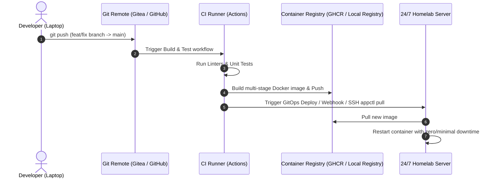

# 🚀 Deployment & CI/CD Strategy

## 🎯 Objective
Automate the build, test, containerization, and deployment lifecycle for services hosted in the homelab.

---

## 🔄 CI/CD Pipelines Overview

---

## 🛠️ Realized Architecture: Dynamic Webhook GitOps & Gitea Runner

Rather than relying on continuous image polling via Watchtower, the homelab adopted a **push-driven, event-based GitOps architecture**:

1. **Self-Hosted CI Runner (`act_runner`)**:
   - Runs as a container inside `homelab-gitea` using `catthehacker/ubuntu:act-latest`.
   - Executes linting, type-checking, and test validation in 15 seconds.
2. **Decentralized Host Dispatcher (`homelab-gitops.service`)**:
   - Lightweight webhook daemon running on the server host at port 9000.
   - Dispatches payloads dynamically to `~/Core/scripts/gitops_dispatcher.py`.
   - Inspects `app.yaml` deployment declarations (`git_pull`, `compose_up`, `appctl_sync`) and applies updates with zero delay.
3. **Knowledge Base Pilot**:
   - Successfully deployed on `~/Brain` with pre-commit gates, Gitea Actions CI, and instant `doc2site` reflection on `docs.roadtotech.me`.

---

## 🔗 Production Guides & Specifications
* [Dynamic Decentralized GitOps Dispatcher Architecture](../../guides/homelab-gitops-dispatcher-architecture.md)
* [Brain GitOps & Auto-Sync Deployment Pipeline](../../guides/brain-gitops-deployment-pipeline.md)
* [GitHub to Gitea Automated Batch Migration Plan](github-to-gitea-migration-plan.md)
