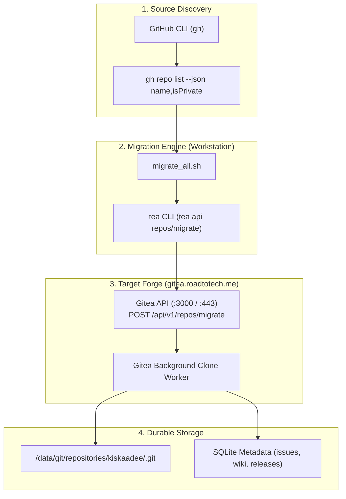

# 📦 GitHub to Gitea Automated Batch Migration Plan

## 🎯 Objective
Migrate approximately 35 existing personal repositories from GitHub to the self-hosted Gitea forge (`gitea.roadtotech.me`), establishing self-hosted sovereignty while preserving repository metadata, commit histories, visibility (public vs. private), and issues/releases.

---

## 🏛️ Migration Architecture & Flow



---

## ⚙️ Migration Endpoint Specifications

The Gitea migration endpoint (`POST /api/v1/repos/migrate`) accepts:

| Parameter | Type | Required | Description |
| :--- | :--- | :--- | :--- |
| `clone_addr` | `string` | **Yes** | Full git clone URL: `https://github.com/<owner>/<repo>.git` |
| `repo_owner` | `string` | **Yes** | Gitea target username or organization (`kiskaadee`) |
| `repo_name` | `string` | **Yes** | Target repository name |
| `private` | `boolean` | No | Retain repository private status |
| `auth_token` | `string` | Conditional | GitHub Personal Access Token (required for private repos) |
| `mirror` | `boolean` | No | `false` for standalone copy, `true` for continuous pull mirror |
| `wiki` | `boolean` | No | Migrate GitHub repository wiki (`true`) |
| `issues` | `boolean` | No | Migrate GitHub issues and labels (`true`) |
| `releases` | `boolean` | No | Migrate GitHub release tags and assets (`true`) |

---

## 🚀 The Batch Migration Script (`migrate_to_gitea.sh`)

Save and run this script from your workstation:

```bash
#!/usr/bin/env bash
set -euo pipefail

GITHUB_USER="kiskaadee"
GITEA_OWNER="kiskaadee"

# 1. Verify dependencies
command -v gh >/dev/null 2>&1 || { echo "❌ Error: gh CLI not installed"; exit 1; }
command -v tea >/dev/null 2>&1 || { echo "❌ Error: tea CLI not installed"; exit 1; }
command -v jq >/dev/null 2>&1 || { echo "❌ Error: jq not installed"; exit 1; }

# 2. Extract GitHub Auth Token for private repository access
GH_TOKEN="$(gh auth token)"
if [ -z "$GH_TOKEN" ]; then
  echo "❌ Error: Not logged in to GitHub. Run 'gh auth login' first."
  exit 1
fi

echo "🔍 Fetching repository list from GitHub for user: $GITHUB_USER..."
repos=$(gh repo list "$GITHUB_USER" --limit 100 --json name,isPrivate --jq '.[] | @base64')

echo "📦 Found $(echo "$repos" | wc -w) repositories to process."
echo "--------------------------------------------------------"

for r in $repos; do
  _jq() {
    echo "$r" | base64 --decode | jq -r "$1"
  }

  REPO_NAME=$(_jq '.name')
  IS_PRIVATE=$(_jq '.isPrivate')
  CLONE_URL="https://github.com/${GITHUB_USER}/${REPO_NAME}.git"

  echo "🚀 Migrating: $REPO_NAME (private: $IS_PRIVATE)..."

  # Trigger Gitea migration API
  tea api repos/migrate -X POST \
    -f clone_addr="$CLONE_URL" \
    -f repo_owner="$GITEA_OWNER" \
    -f repo_name="$REPO_NAME" \
    -f private="$IS_PRIVATE" \
    -f auth_token="$GH_TOKEN" \
    -f mirror=false \
    -f wiki=true \
    -f issues=true \
    -f releases=true 2>&1 || {
      echo "⚠️ Migration call skipped or failed for $REPO_NAME (may already exist)."
    }

  # Small sleep to prevent hammering Gitea background workers
  sleep 1
done

echo "--------------------------------------------------------"
echo "✨ Batch migration loop completed!"
```

---

## 🛠️ Incident Runbook: Stuck "Migrating from..." State

### Root Cause Analysis
If an invalid clone address (e.g. `clone_addr=https://github.com`) or authentication error occurs:
1. Gitea attempts to clone, encounters an error (`exit status 128`), and terminates the background migration worker task.
2. When the task terminates, Gitea leaves the repository record in the database with `is_migrating = true`.
3. The frontend JavaScript periodically polls `GET /<owner>/<repo>/-/migrate/status`. Because the task is gone, Gitea returns **`404 Not Found`**.
4. The web UI teapot animation spins indefinitely because it expects a `200 OK` completion event.

### Resolution Steps

#### Method A: Web UI
1. Navigate to the stuck repository: `https://gitea.roadtotech.me/<owner>/<repo>`.
2. Click the red button directly under the teapot: **[ Delete This Repository ]**.

#### Method B: CLI via `tea`
Delete the stuck placeholder repository directly from terminal:
```bash
tea repo delete <owner>/<repo> --confirm
```

Once deleted, re-issue the migration with the full repository URL:
```bash
tea api repos/migrate -X POST \
  -f clone_addr="https://github.com/<owner>/<repo>.git" \
  -f repo_owner="<owner>" \
  -f repo_name="<repo>"
```

---

## ✅ Post-Migration Verification Checklist

- [ ] Run `tea repo list` to confirm all ~35 repositories appear in Gitea.
- [ ] Verify private repositories retained their private lock badge.
- [ ] For repos intended to have a GitHub hot backup, configure Gitea push mirroring (**Settings** $\rightarrow$ **Repository** $\rightarrow$ **Push Mirrors**).
- [ ] For active local projects, update git remotes to point to Gitea:
  ```bash
  git remote set-url origin ssh://git@gitea.roadtotech.me:2223/<owner>/<repo>.git
  ```
