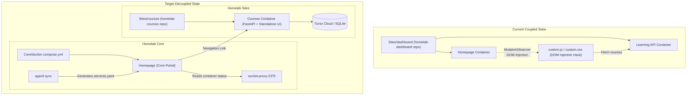

# Implementation Plan: Multirepo Refactor of Homepage & Learning Hub

## Goal Description
Restructure the homelab services by disentangling the **Homepage** dashboard from the **Learning Hub** (courses API & Kanban board):
1. **Reintegrate Homepage into Homelab Core** (`~/Homelab/Core`): Return Homepage to its natural role as the central infrastructure portal and container status monitor in the Core stack, removing custom DOM-injection scripts (`custom.js`, `custom.css`).
2. **Establish Standalone Courses App** (`~/Homelab/Sites/courses`): Promote the learning API and its Kanban board into an independent application under `Sites/courses`, equipped with its own `app.yaml`, standalone frontend UI, Turso database connection, and isolated lifecycle.
3. **Update Orchestrator (`appctl`)**: Direct `appctl sync` to output Homepage configuration to `Core/config/homepage/services.yaml`, ensuring dynamic discovery of all `Sites/*/app.yaml` manifests including the new `courses` site.
4. **Decommission `Sites/dashboard`**: Safely transition and retire the deprecated `Sites/dashboard` repository.

---

## Architectural Evaluation: Is This the Right Direction?

**Yes, this refactoring is strongly recommended.**



### Key Rationale
1. **Separation of Infrastructure vs. Domain Application**:
   - **Homepage** is an operational monitoring tool tightly coupled to `socket-net` (via `socket-proxy:2375`) and the host's container lifecycle. It lists containers, inspects CPU/RAM/Disk, and aggregates links. It belongs squarely inside `Core`.
   - **Learning Hub / Courses** is a personal domain application with its own database (Turso/LibSQL), schemas, business logic, and UI. It does not need socket access or cluster privileges.
2. **Elimination of Frontend Anti-Patterns**:
   - Injecting a Kanban board into Homepage via `custom.js` with `MutationObserver` polling and arbitrary HTML string templates was a fragile workaround.
   - Giving `courses` a dedicated frontend (served directly alongside the API) creates a clean, testable user interface without cross-origin hacks or layout collisions.
3. **Consistency with the Homelab Specification**:
   - Every application in `Sites/` must be self-describing via `app.yaml` and discoverable by `appctl`. In the current setup, `dashboard` was an anomaly (`visible: false`, dual containers, special-cased in `appctl_engine.py`).
   - Moving Homepage into Core allows `appctl sync` to treat all `Sites/*` uniformly.

---

## User Review Required

> [!IMPORTANT]
> **Domain Names & Routing**:
> - Currently, `Sites/dashboard` used `dashboard.roadtotech.me` for Homepage and `learning.roadtotech.me` for the learning API.
> - In the new layout:
>   - Homepage in Core will serve `dashboard.roadtotech.me`.
>   - Courses in `Sites/courses` can serve `courses.roadtotech.me` (with an alias for `learning.roadtotech.me` if desired).
> - Please confirm if you prefer `courses.roadtotech.me` or `learning.roadtotech.me` as the primary domain for the courses app.

> [!NOTE]
> **Frontend Implementation for Courses**:
> We propose serving a clean, responsive standalone Kanban board (extracted and modernized from `custom.js` / `custom.css`) directly from FastAPI via `StaticFiles` at `/` while the API lives at `/api/courses`. This avoids needing a separate Node.js build step or container, maintaining zero-overhead single-container deployment.

---

## Proposed Changes

### Component 1: `Homelab/Sites/courses` (New Application Repository)

#### [NEW] `Sites/courses/app.yaml`
Declare metadata for the courses service:
```yaml
name: "courses"
aliases:
  - "learning"
domain: "courses.roadtotech.me"
description: "Learning Path & Course Tracking Kanban Hub"
visible: true
auth: false
networks:
  - proxy-net
homepage:
  title: "Courses"
  group: "Knowledge & Notes"
  icon: "school.png"
  container: "courses"
  weight: 20
```

#### [NEW] `Sites/courses/docker-compose.yml`
Standard container stack adhering to Homelab Sites conventions:
```yaml
services:
  courses:
    build: .
    container_name: ${CONTAINER_NAME:-courses}
    restart: unless-stopped
    volumes:
      - ./data:/app/data
    environment:
      - TURSO_DATABASE_URL=${TURSO_DATABASE_URL}
      - TURSO_AUTH_TOKEN=${TURSO_AUTH_TOKEN}
      - PORT=8000
    networks:
      - proxy
    labels:
      - "traefik.enable=true"
      # HTTPS Router
      - "traefik.http.routers.${CONTAINER_NAME:-courses}.rule=Host(`${SERVICE_DOMAIN:-courses.roadtotech.me}`)"
      - "traefik.http.routers.${CONTAINER_NAME:-courses}.entrypoints=websecure"
      - "traefik.http.routers.${CONTAINER_NAME:-courses}.tls=true"
      - "traefik.http.routers.${CONTAINER_NAME:-courses}.service=${CONTAINER_NAME:-courses}-svc"
      # HTTP to HTTPS Redirect
      - "traefik.http.routers.${CONTAINER_NAME:-courses}-red.rule=Host(`${SERVICE_DOMAIN:-courses.roadtotech.me}`)"
      - "traefik.http.routers.${CONTAINER_NAME:-courses}-red.entrypoints=web"
      - "traefik.http.routers.${CONTAINER_NAME:-courses}-red.middlewares=https-redirect@docker"
      # Service Port
      - "traefik.http.services.${CONTAINER_NAME:-courses}-svc.loadbalancer.server.port=8000"

networks:
  proxy:
    name: ${PROXY_NETWORK:-proxy-net}
    external: true
```

#### [NEW] Migrate Application Code & Static Frontend
- Copy `app/`, `tests/`, `docs/`, `Dockerfile`, `pyproject.toml`, `uv.lock`, `.dockerignore`, and `.env-example` from `Sites/dashboard/learning/` to `Sites/courses/`.
- Add `app/static/` containing standalone `index.html`, `style.css`, and `app.js` derived from the existing Kanban UI logic.
- Update `app/main.py` to mount `app/static` at `/` while serving `/api/courses`.
- Add `UNLICENSE` (maintaining Homelab license invariant) and `README.md`.

---

### Component 2: `Homelab/Core` (Reintegration of Homepage)

#### [NEW] `Core/config/homepage/`
- Transfer configuration files from `Sites/dashboard/config/`:
  - `bookmarks.yaml`
  - `docker.yaml` (configured to connect to `host: socket-proxy`, `port: 2375`)
  - `settings.yaml`
  - `widgets.yaml`
  - Icons and brand assets (`houston.png`, `houston.svg`)
- Do **not** include `custom.js` or `custom.css` (or leave them empty), keeping Homepage clean.

#### [MODIFY] `Core/docker-compose.yml`
Add the `homepage` service to the core stack:
```yaml
  homepage:
    image: ghcr.io/gethomepage/homepage:latest
    container_name: homepage
    restart: always
    volumes:
      - ./config/homepage:/app/config
    environment:
      - HOMEPAGE_ALLOWED_HOSTS=dashboard.${DOMAIN}
    networks:
      - proxy-net
      - socket-net
    labels:
      - "traefik.enable=true"
      # HTTPS Router
      - "traefik.http.routers.homepage.rule=Host(`dashboard.${DOMAIN}`)"
      - "traefik.http.routers.homepage.entrypoints=websecure"
      - "traefik.http.routers.homepage.tls=true"
      - "traefik.http.routers.homepage.tls.certresolver=myresolver"
      - "traefik.http.routers.homepage.service=homepage-svc"
      # Public HTTP Redirect
      - "traefik.http.routers.homepage-red.rule=Host(`dashboard.${DOMAIN}`)"
      - "traefik.http.routers.homepage-red.entrypoints=web"
      - "traefik.http.routers.homepage-red.middlewares=https-redirect@docker"
      # Service Port
      - "traefik.http.services.homepage-svc.loadbalancer.server.port=3000"
```

#### [MODIFY] `Core/scripts/appctl_engine.py`
Update `cmd_sync_homepage()` to target `Core/config/homepage/services.yaml`:
```python
def cmd_sync_homepage(args):
    """Compile Sites/*/app.yaml into Core/config/homepage/services.yaml."""
    homepage_dir = os.path.join(CORE_DIR, "config", "homepage")
    for a in args:
        if a.startswith("--dashboard-dir=") or a.startswith("--homepage-dir="):
            homepage_dir = a.split("=", 1)[1]

    services_yaml_path = os.path.join(homepage_dir, "services.yaml")
    ...
```

#### [MODIFY] `Core/tests/structural/test_repository_structure.py`
Ensure `config/homepage` is validated as part of the core repository structure tests.

---

### Component 3: Decommissioning `Homelab/Sites/dashboard`

1. Once the changes in Core and Courses are verified, tear down any old containers in `Sites/dashboard`.
2. Commit and push the initial commit in `Homelab/Sites/courses` (`origin main`).
3. Commit and push the Core changes in `Homelab/Core` (`origin main`).
4. Archive or remove the local `Sites/dashboard` directory and clean up its Gitea remote repository.

---

## Verification Plan

### Automated Tests
1. **Core Structural & Security Invariants**:
   ```bash
   cd ~/Homelab/Core
   uv run --with pytest --with pyyaml pytest tests
   ```
2. **Courses Service Unit Tests & Type Check**:
   ```bash
   cd ~/Homelab/Sites/courses
   uv run python -m unittest discover tests
   uv run pyright
   ```
3. **Orchestrator Validation**:
   ```bash
   appctl sync
   appctl list
   appctl config courses
   appctl config core
   ```

### Manual Verification
1. **Homepage Verification**:
   - Access `https://dashboard.roadtotech.me`
   - Verify that Homepage displays system resource widgets and all registered services from `Sites/` (including the new Courses card).
   - Ensure the previous custom JS injection is removed and Homepage loads cleanly without DOM console warnings.
2. **Courses App Verification**:
   - Access `https://courses.roadtotech.me`
   - Test adding a course, dragging between WIP / Planning / Archive columns, editing, and deleting.
   - Verify API status at `https://courses.roadtotech.me/api/courses`.
