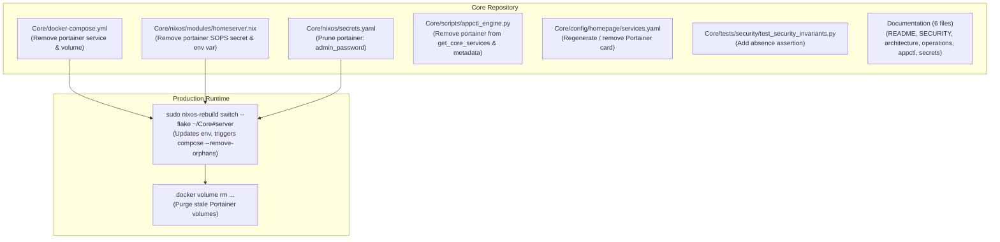

# Plan: Clean Deprecation of Portainer from Core

## Goal Description

Portainer was inherited during early Core consolidation, but its responsibility (GUI-based Docker container management) conflicts with the Homelab's architectural invariants:
1. **Infrastructure as Code & GitOps**: All workloads and core services are declaratively defined in NixOS, `docker-compose.yml`, and `app.yaml`, with deployment managed via `appctl` and automated webhooks. Manual GUI container mutations bypass repository state.
2. **Hardened Docker Socket**: The security architecture enforces a strict read-only Docker socket proxy (`socket-proxy` with `POST=0`, `DELETE=0`, `BUILD=0`, `EXEC=0`). Portainer is unable to manage, deploy, or modify containers without weakening this boundary.
3. **Overlapping Tools**: Read-only log observation is handled by Dozzle, routing by Traefik, host lifecycle by NixOS, and service cataloging by Homepage. Portainer holds no unique responsibilities.

This plan details the complete, clean removal of Portainer across all layers of Homelab Core: Docker Compose, `appctl`, Homepage, NixOS SOPS secrets, structural/security tests, documentation, and production runtime cleanup.

---

## Decisions Reached

1. **Volume Cleanup**: Purge `core_portainer_data`, `homeserver_portainer_data`, and `portainer_portainer_data` on the server during the post-deployment cleanup phase.
2. **SOPS Secret Removal**: Remove `portainer.admin_password` completely from `Core/nixos/secrets.yaml` and `Core/nixos/modules/homeserver.nix`.
3. **Gitea & Runner Decoupling**: Retain Gitea and `act_runner` standalone in `Sites/gitea` to maintain platform trust boundaries and unprivileged runner execution.

---

## Architecture & Affected Components



---

## Component Changes

### Component 1: Docker Compose & Host Orchestration
* `Core/docker-compose.yml`:
  - Removed `portainer` service declaration.
  - Removed `portainer_data:` from top-level `volumes:`.

```yaml
# Removed from Core/docker-compose.yml
  portainer:
    image: portainer/portainer-ce:latest
    container_name: portainer
    restart: always
    command: >
      -H tcp://socket-proxy:2375
      --admin-password=${PORTAINER_ADMIN_PASSWORD}
      --no-analytics
    volumes:
      - portainer_data:/data
    networks:
      - socket-net
      - proxy-net
    labels:
      - "traefik.enable=true"
      - "traefik.http.routers.portainer.rule=Host(`portainer.${DOMAIN}`)"
      - "traefik.http.routers.portainer.entrypoints=websecure"
      - "traefik.http.routers.portainer.tls=true"
      - "traefik.http.routers.portainer.tls.certresolver=myresolver"
      - "traefik.http.routers.portainer.middlewares=authelia-auth@docker"
      - "traefik.http.routers.portainer.service=portainer-svc"
      - "traefik.http.routers.portainer-red.rule=Host(`portainer.${DOMAIN}`)"
      - "traefik.http.routers.portainer-red.entrypoints=web"
      - "traefik.http.routers.portainer-red.middlewares=https-redirect@docker"
      - "traefik.http.services.portainer-svc.loadbalancer.server.port=9000"
```

### Component 2: NixOS Module & SOPS Secrets
* `Core/nixos/modules/homeserver.nix`:
  - Removed `"portainer/admin_password"` from `sops.secrets`.
  - Removed `PORTAINER_ADMIN_PASSWORD = config.sops.placeholder."portainer/admin_password";` from `sops.templates."homeserver.env".content`.
* `Core/nixos/secrets.yaml`:
  - Decrypted via SOPS CLI and removed `portainer: admin_password` key block.

### Component 3: CLI Orchestrator (`appctl`) & Homepage Dashboard
* `Core/scripts/appctl_engine.py`:
  - Removed `"portainer"` service map from `get_core_services()`.
  - Removed `"portainer"` from Homepage card weight metadata.
* `Core/config/homepage/services.yaml`:
  - Removed `Portainer` card from `Core Infrastructure` dashboard category.

### Component 4: Architecture & Security Invariant Tests
* `Core/tests/security/test_security_invariants.py`:
  - Added regression assertion `test_portainer_is_deprecated_and_absent()` verifying that neither the service nor volume exists in `docker-compose.yml`:

```python
def test_portainer_is_deprecated_and_absent():
    """Ensure portainer service and volume are completely absent from core docker-compose."""
    compose_path = CORE_ROOT / "docker-compose.yml"
    with open(compose_path, encoding="utf-8") as f:
        compose = yaml.safe_load(f)

    services = compose.get("services", {})
    assert "portainer" not in services, "Deprecated service 'portainer' must not exist in docker-compose.yml"

    volumes = compose.get("volumes", {})
    assert "portainer_data" not in volumes, "Deprecated volume 'portainer_data' must not exist in docker-compose.yml"
```

### Component 5: Documentation Synchronization
* `Core/SECURITY.md`: Removed Portainer from protected proxy services.
* `Core/README.md`: Removed Portainer from platform overview, topology ASCII diagram, and routing table.
* `Core/docs/secrets-and-state.md`: Removed `portainer_data` from state table.
* `Core/docs/appctl.md`: Removed `portainer` from core service enumeration.
* `Core/docs/operations.md`: Removed Portainer from systemd and troubleshooting notes.
* `Core/docs/architecture.md`: Removed Portainer from topology and service mesh documentation.

---

## Action Items & Milestones

- [x] **Branch Isolation**: Create local git branch `fix/deprecate-portainer` in `Core`.
- [x] **Docker Compose**: Remove `portainer` service block and `portainer_data` volume from `Core/docker-compose.yml`.
- [x] **NixOS Configuration**: Remove `portainer/admin_password` from `Core/nixos/modules/homeserver.nix`.
- [x] **SOPS Secrets**: Decrypt and prune `portainer` key from `Core/nixos/secrets.yaml`.
- [x] **Appctl Engine**: Remove `portainer` from `get_core_services()` and Homepage metadata in `Core/scripts/appctl_engine.py`.
- [x] **Homepage Config**: Update `Core/config/homepage/services.yaml` to remove Portainer.
- [x] **Invariants & Tests**: Add `test_portainer_is_deprecated_and_absent` to `Core/tests/security/test_security_invariants.py`.
- [x] **Documentation**: Clean up references in `Core/SECURITY.md`, `Core/README.md`, `Core/docs/secrets-and-state.md`, `Core/docs/appctl.md`, `Core/docs/operations.md`, and `Core/docs/architecture.md`.
- [x] **Local Validation**: Run `ruff check .`, `pytest`, `nix flake check`, and `./scripts/test`.
- [x] **Commit Proposal**: Propose atomic commit for user review and integration into `main`.
- [x] **Production Deployment**: User rebuilds NixOS (`sudo nixos-rebuild switch --flake ~/Core#server`), runs `appctl sync`, and prunes leftover volumes.
- [x] **Post-Deployment Verification**: Verify portainer is uninstalled, routing 404s, and Dozzle/Core remain healthy.
- [x] **Daily Journal**: Log completed work in `records/journal/2026-09-23.md`.

---

## Deployment & Production Teardown Runbook

### Phase 1: User-Controlled Commit & Integration
```bash
# On local workstation (/home/kiskaadee/Homelab/Core):
git checkout -b fix/deprecate-portainer
git add docker-compose.yml nixos/ scripts/ config/ tests/ docs/ README.md SECURITY.md
git commit -m "refactor(core): cleanly deprecate and remove portainer"
git checkout main
git merge fix/deprecate-portainer
git push origin main
```

### Phase 2: Production Deployment on Server
```bash
# SSH into production server
ssh server-local

# Pull latest Core updates
cd ~/Core
git pull origin main

# Rebuild NixOS configuration (regenerates /run/secrets/homeserver.env and restarts homeserver-core with --remove-orphans)
sudo nixos-rebuild switch --flake ~/Core#server

# Sync homepage to remove Portainer card
appctl sync
```

### Phase 3: Post-Deployment Verification
```bash
# Verify portainer container has been stopped and removed
docker ps -a --filter name=portainer
# Expected: empty table

# Verify Traefik has unregistered the portainer router
curl -kI https://portainer.roadtotech.me
# Expected: 404 Not Found (Traefik default)

# Verify Dozzle and other core services remain operational
appctl list --core
```

### Phase 4: Stale Volume Cleanup
```bash
# Remove leftover Portainer data volumes
docker volume rm core_portainer_data homeserver_portainer_data portainer_portainer_data
```

### Rollback Plan
If an unexpected regression occurs in the Core compose stack:
1. On local workstation: `git revert HEAD` and push to `main`.
2. On server: `cd ~/Core && git pull origin main && sudo nixos-rebuild switch --flake ~/Core#server`.

---

## Related Documentation & Cross-References

* Discussion: [Core Service Qualification & Portainer Deprecation](../discussions/core-service-qualification-and-portainer-deprecation.md)
* Daily Journal: [Daily Journal: 2026-09-23](../../../records/journal/2026-09-23.md)
