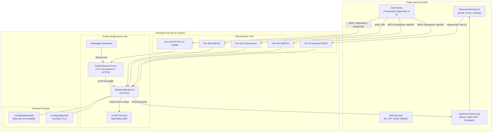

# Stalwart Mail Server Implementation Plan (Homelab Core)

## 1. Executive Architecture

The email infrastructure will be integrated into the **Homelab Core** stack (`~/Homelab/Core`). It leverages **Stalwart Mail Server** (`stalwartlabs/stalwart:v0.16.22`) as an all-in-one mail server (SMTP, IMAP, JMAP, Sieve, and WebAdmin) integrated with the live **LLDAP** directory for unified user authentication.



---

## 2. Docker Compose Service Definition

Add the `stalwart` service to [`Core/docker-compose.yml`](file:///home/kiskaadee/Homelab/Core/docker-compose.yml):

```yaml
  stalwart:
    image: stalwartlabs/stalwart:v0.16.22
    container_name: stalwart
    restart: always
    depends_on:
      - lldap
    environment:
      - DOMAIN=${DOMAIN}
      - STALWART_PUBLIC_URL=https://mail.${DOMAIN}
      - STALWART_RECOVERY_ADMIN=admin:${LLDAP_LDAP_USER_PASS}
    ports:
      - "25:25"       # Inbound SMTP (Mail exchange)
      - "465:465"     # SMTPS (Implicit TLS Submission)
      - "587:587"     # SMTP Submission (STARTTLS)
      - "993:993"     # IMAPS (Implicit TLS)
      - "4190:4190"   # ManageSieve (Server-side filtering)
    volumes:
      - ./config/stalwart/etc:/etc/stalwart
      - ./config/stalwart/data:/var/lib/stalwart
    networks:
      - proxy-net
    labels:
      - "traefik.enable=true"
      # WebAdmin & JMAP Router (HTTPS)
      - "traefik.http.routers.stalwart.rule=Host(`mail.${DOMAIN}`)"
      - "traefik.http.routers.stalwart.entrypoints=websecure"
      - "traefik.http.routers.stalwart.tls=true"
      - "traefik.http.routers.stalwart.tls.certresolver=myresolver"
      - "traefik.http.routers.stalwart.service=stalwart-svc"
      # WebAdmin & JMAP (Redirect HTTP -> HTTPS)
      - "traefik.http.routers.stalwart-red.rule=Host(`mail.${DOMAIN}`)"
      - "traefik.http.routers.stalwart-red.entrypoints=web"
      - "traefik.http.routers.stalwart-red.middlewares=https-redirect@docker"
      # Target Port: Stalwart internal HTTP listener (8080)
      - "traefik.http.services.stalwart-svc.loadbalancer.server.port=8080"
```

> [!IMPORTANT]
> `mail.${DOMAIN}` handles both the Stalwart WebAdmin interface and standard client API endpoints (`/.well-known/jmap`, `/jmap`, autodiscover). Therefore, it should authenticate natively via Stalwart and LLDAP rather than using Traefik's `authelia-auth` forward-auth middleware (which would break API access for mail clients).

---

## 3. LLDAP Directory Connector

Stalwart queries the existing LLDAP container over `proxy-net` (`ldap://lldap:3890`).

### LLDAP Mapping Configuration
- **Server URL:** `ldap://lldap:3890`
- **Bind DN:** `uid=admin,ou=people,dc=roadtotech,dc=me`
- **Bind Password:** `${LLDAP_LDAP_USER_PASS}`
- **Base DN:** `ou=people,dc=roadtotech,dc=me`
- **User Filter:** `(&(objectClass=person)(mail=%s))` or `(&(objectClass=person)(uid=%s))`
- **Address Mapping:** Primary address is mapped from `mail` (`<user_id>@roadtotech.me`).
- **Recovery / Forwarding:** LLDAP `recovery-email` can be used for account recovery notifications.

Stalwart provisions mailboxes just-in-time when the LLDAP user first logs in or receives an inbound email.

---

## 4. Deliverability & Smart Host Relay

Residential ISPs and dynamic/semi-static residential IP ranges are universally listed on anti-spam blocklists (Spamhaus PBL) and often restrict outbound port 25.

To guarantee that outgoing emails reach recipient inboxes (Gmail, Yahoo, Outlook):
1. **Inbound:** Handled directly by Stalwart on port 25.
2. **Outbound:** Routed via an authenticated SMTP relay (Smart Host):
   - **Brevo (formerly Sendinblue):** Free 300 emails/day, turnkey SMTP credentials.
   - **Amazon SES:** $0.10 per 10,000 emails, enterprise-grade deliverability.
   - **SendGrid / Mailgun / Postmark:** Alternative reputable relays.

---

## 5. Required DNS Records (`roadtotech.me`)

| Type | Host / Name | Value | Purpose |
|---|---|---|---|
| **A / CNAME** | `mail` | Dynamic IP / `roadtotech.me` | Mail server public endpoint |
| **MX** | `@` | `10 mail.roadtotech.me.` | Inbound mail routing |
| **TXT (SPF)** | `@` | `v=spf1 mx include:<relay-provider-domain> ~all` | Authorizes Stalwart and the outbound relay |
| **TXT (DKIM)** | `<selector>._domainkey` | `v=DKIM1; k=rsa; p=<stalwart-public-key>` | Cryptographic signature of outgoing emails |
| **TXT (DMARC)** | `_dmarc` | `v=DMARC1; p=quarantine; rua=mailto:admin@roadtotech.me` | Anti-spoofing policy and delivery reporting |

---

## 6. Phased Implementation Roadmap

1. **Phase 1: Compose & Storage Scaffold:**
   - Create directories `./config/stalwart/etc` and `./config/stalwart/data`.
   - Update `docker-compose.yml` with the Stalwart service and Traefik routing.
   - Deploy container and verify initial startup and WebAdmin reachability at `https://mail.roadtotech.me`.
2. **Phase 2: LLDAP Directory Binding:**
   - Connect Stalwart to `ldap://lldap:3890` using the internal LLDAP credentials.
   - Test user lookup and authentication with existing directory accounts (`kiskaadee@roadtotech.me`, etc.).
3. **Phase 3: Outbound Relay & DNS Records:**
   - Configure outbound smart host credentials.
   - Export Stalwart DKIM public keys and generate the complete set of DNS records for `roadtotech.me`.
4. **Phase 4: Dashboard Integration & Verification:**
   - Add Stalwart Mail widget/tile to Homepage dashboard (`dashboard.roadtotech.me`).
   - Run end-to-end inbound and outbound email delivery tests.
