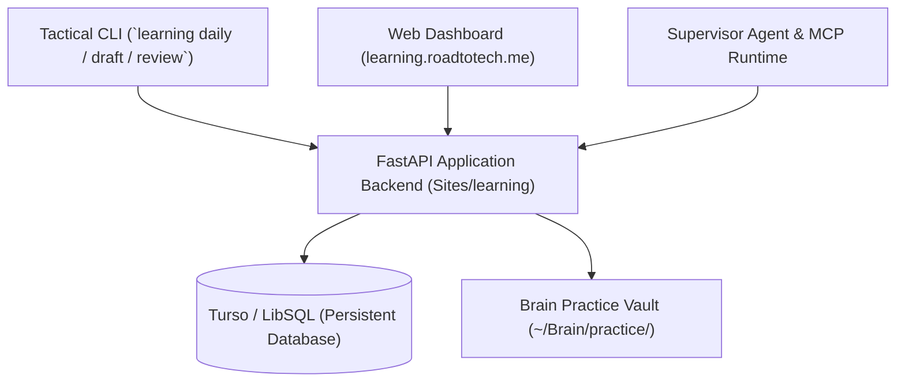

# 📚 Personal Engineering Learning Platform (`learning`)

The **Learning Platform** is an integrated personal engineering development environment designed to accelerate computer science mastery, deliberate Data Structures & Algorithms (DSA) practice, and structured software curriculum progress.

It pairs a FastAPI REST backend with a tactical CLI tool (`learning`) and an ambient MCP service consumed by the [Supervisor System](../supervisor/README.md) to track milestones and automate study routines.

---

## 🏛️ System Topology & Architecture

The learning ecosystem operates across three decoupled interfaces:

1. **Web Dashboard**: Visualizing active course progressions, study streaks, and the DSA pattern mastery matrix.
2. **Tactical CLI Tool**: High-velocity terminal commands for scaffolding daily LeetCode problems directly into `~/Brain/practice/LeetCode/` and launching isolated dev environments.
3. **MCP Service Layer**: Providing structured endpoints for AI assistant oversight, daily accountability pings, and study session tracking.

---

## 📍 Source Code & Locations

| Target | Location / URL | Description |
| :--- | :--- | :--- |
| **Site Repository** | `/home/kiskaadee/Homelab/Sites/learning` | Standalone application stack (FastAPI backend + frontend + CLI) |
| **Production Target** | `server-remote:~/Sites/learning` | Deployed containerized site at `learning.roadtotech.me` |
| **Practice Vault** | `/home/kiskaadee/Brain/practice` | LeetCode writeups and Python solution playground with Nix flake devShell |

---

## 💬 Open Discussions

*None currently open.*

---

## 🚧 Work in Progress (Active Plans)

1. 🟡 [**Specification & Roadmap: Personal Engineering Learning Platform**](plans/learning-platform-specification-and-roadmap.md) `[Active]`
   - Full system architecture, repo transition from legacy `Sites/dashboard`, 4 core pillars (DSA gym, curriculum engine, SRS flashcards, supervisor integration), and phased rollout roadmap.

---

## 🛠️ Canonical Guides & Runbooks

*Operational runbooks will be established upon platform initial deployment.*

---

## 🏛️ Completed Milestones & Resolved Discussions

*Initial project bootstrap.*
