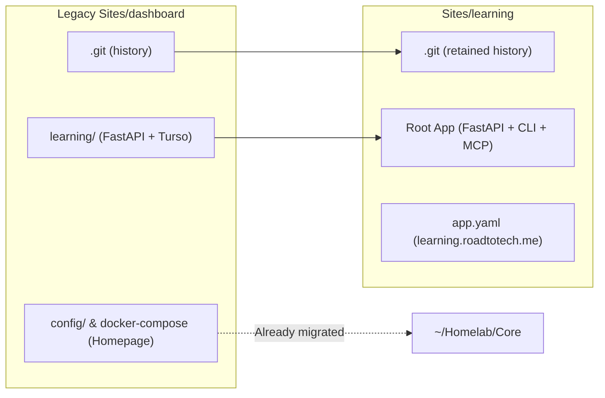
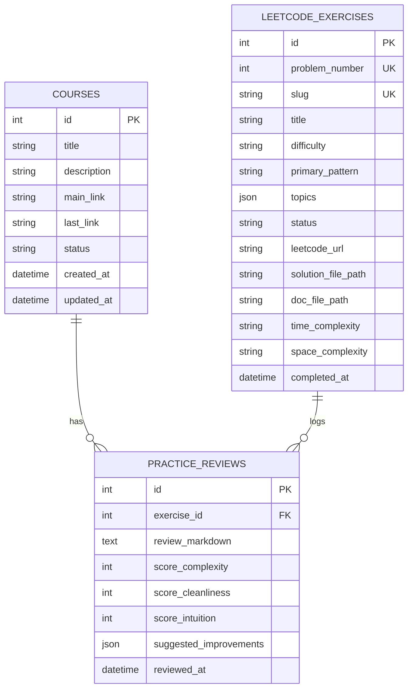
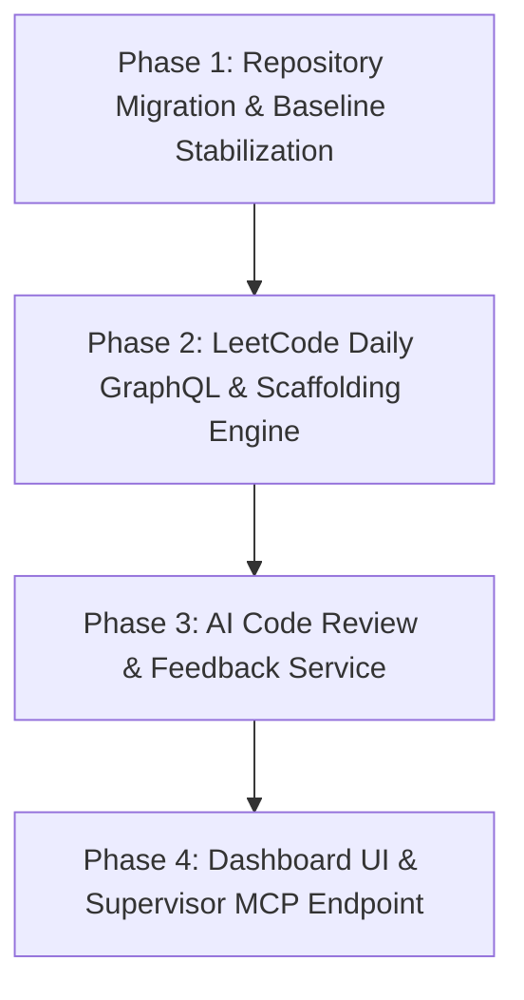

# Specification & Roadmap: Personal Engineering Learning Platform (`learning`)

## 1. Executive Summary & Vision

The **Learning Platform** (`Sites/learning`) is an integrated personal development environment for an aspiring software engineer. It bridges structured course learning with high-intensity technical interview preparation and deliberate practice.

Rather than being just a static web UI, it is designed as a **hybrid system**:
1. **A Web Dashboard**: Visualizing active courses, study streaks, and a DSA pattern mastery matrix.
2. **A Tactical CLI Tool**: Zero-friction terminal commands (`learning daily`, `learning draft`, `learning review`) for local problem-solving sessions.
3. **An MCP & REST Service**: Acting as the stateful backend consumed by the [Supervisor System](../../supervisor/plans/supervisor-system-specification.md) to ambiently monitor learning objectives, active study sessions, and milestone verification.

---

## 2. Repository Transition & Git History Preservation

To reuse the full commit history without losing provenance:
- Elevate `Sites/dashboard/learning/` to the root of the repository.
- Retire migrated Homepage configuration files (now living permanently in `Core/config/homepage/`).
- Rename directory from `Sites/dashboard` to `Sites/learning` (and clean up the empty placeholder `Sites/courses`).
- Update `app.yaml`:
  - Name: `learning`
  - Domain: `learning.roadtotech.me` (or `courses.roadtotech.me`)
  - Aliases: `['learn', 'courses', 'dsa']`
  - Group: `Media & Productivity` or `Knowledge & Notes`

---

## 3. Brainstorming: Features for an Aspiring Software Engineer

Beyond raw course links and basic problem lists, a top-tier learning companion for modern software engineering should reinforce **retention, intuition, and architectural thinking**:

### Pillar 1: Deliberate DSA Practice (The "Gym")
1. **Daily Challenge Scaffolder**:
   - Fetches today's LeetCode problem via official LeetCode GraphQL API.
   - Generates documentation file at `~/Brain/practice/LeetCode/00##-problem-slug.md` adhering strictly to your established structure:
     - Frontmatter (`type: practice`, `status: in-progress`, `topics: [...]`).
     - Problem Statement, Constraints, and Examples.
     - Starter Markdown headings: `## Intuition`, `### The Algorithm` (with starter Mermaid flowchart), `### Implementation`, `### Complexity Analysis`, `### Takeaways`.
   - Generates Python solution stub at `~/Brain/practice/LeetCode/Solutions/00##-problem-slug.py` with type hints and test execution harnesses.
2. **AI Mock Interviewer & Code Reviewer (Gemini)**:
   - Given your solution `.py` and documentation `.md`, the AI evaluates your submission across 5 dimensions:
     - **Time & Space Complexity**: Verification of Big-O analysis vs actual code.
     - **Edge Cases**: Empty input, integer boundaries, duplicate elements.
     - **Code Cleanliness & Idioms**: Pythonic practices, readability, type annotations.
     - **Communication Clarity**: Did you articulate *why* the algorithm works in the Intuition section as you would to an interviewer?
     - **Alternative Approaches**: Socratic hints toward optimal trade-offs (e.g. hashmap vs two-pointer).
3. **Pattern Exposure & Blind-Spot Radar**:
   - Tracking exposure across the 16 core patterns identified in [`00-practiced-patterns.md`](../../../practice/LeetCode/00-practiced-patterns.md) (Two Pointers, Sliding Window, Monotonic Stack, Backtracking, DP, Graphs, etc.).
   - Visualizing coverage: *"You have solved 6 HashMap problems, but 0 Sliding Window or Graph problems this month."*
4. **Spaced Repetition & Weakness Queue**:
   - Problems tagged as `struggled` or `need-review` automatically resurface on a Leitner-style schedule (e.g. 3 days, 10 days, 30 days).

---

### Pillar 2: Structured Course & Concept Tracker
1. **Curriculum Kanban**:
   - Stages: `Planning`, `In-Progress`, `Completed`, `Archived`.
   - Track active chapters, completion percentage, and deep link to the exact timestamp/URL (`last_link`).
2. **System Design & Core CS Flashpoints**:
   - Micro-exercises on systems fundamentals: e.g. SQL indexing mechanics, distributed locking, cache eviction policies, CAP theorem tradeoffs.
   - Linked to your Obsidian notes in `~/Brain/learning/`.

---

### Pillar 3: Supervisor & MCP Integration (Autonomous Navigation)
Following the [Supervisor System Specification](../../supervisor/plans/supervisor-system-specification.md):
- Expose an **MCP Server (Model Context Protocol)** directly from the Learning application so AI tools (like Antigravity or Supervisor) can:
  - `get_daily_challenge()`: Inspect today's problem.
  - `get_active_curriculum()`: Check what courses or chapters are currently on deck.
  - `submit_solution_review(problem_id)`: Trigger an objective critique on uncommitted code/notes.
  - `record_practice_session(minutes, topic, notes)`: Log deliberate practice time.

---

## 4. Database Schema (Turso / LibSQL)

Expanding the existing database schema to maintain backwards compatibility with existing course records while introducing LeetCode and session entities:

---

## 5. Execution Roadmap

### Phase 1: Repository Migration & Baseline Stabilization
- [ ] Rename `Sites/dashboard` to `Sites/learning`, elevating `learning/*` to the repository root.
- [ ] Remove legacy Homepage config files and placeholder `Sites/courses`.
- [ ] Update `app.yaml`, `docker-compose.yml`, and `pyproject.toml` with `learning` metadata.
- [ ] Verify `appctl status learning` and database connectivity against Turso.

### Phase 2: LeetCode Daily GraphQL & Scaffolding Engine
- [ ] Implement `leetcode_client.py`:
  - GraphQL query to fetch `activeDailyCodingChallengeQuestion` (title, number, slug, difficulty, description, topics, code snippets).
  - Method to fetch any arbitrary question by title slug or number.
- [ ] Implement `scaffolder.py`:
  - Generate `~/Brain/practice/LeetCode/00##-problem-slug.md` matching your exact formatting.
  - Generate `~/Brain/practice/LeetCode/Solutions/00##-problem-slug.py` with class skeleton and doctests.
- [ ] Expose CLI commands via Click / Typer:
  - `learning daily`: Fetch and draft today's challenge.
  - `learning new <slug|number>`: Scaffold any specific problem.

### Phase 3: AI Code Review & Feedback Service
- [ ] Implement `evaluator.py`:
  - Read solution Python code and Markdown documentation.
  - Prompt Gemini API with a structured prompt evaluating time/space complexity, edge cases, intuition clarity, and test thoroughness.
  - Output formatted terminal feedback with actionable takeaways.
- [ ] Persist review outcomes to `practice_reviews` in Turso.

### Phase 4: Dashboard UI & Supervisor MCP Integration
- [ ] Enhance web UI with:
  - Courses Kanban Board (Planning / WIP / Completed).
  - LeetCode Exercise Table with pattern filter.
  - Daily challenge action card.
- [ ] Add lightweight MCP server module exposing tools to the Supervisor system.

---

## 6. Open Questions for User Alignment

> [!NOTE]
> Since you are tired right now, take your time to review these points whenever you are rested.

1. **Domain Preference**: Should the service be hosted on `https://learning.roadtotech.me` or remain on `https://courses.roadtotech.me` (or have one redirect to the other)?
2. **AI Reviewer Model**: Do you prefer using Google's `gemini-2.5-flash` (fast, free tier available via Google AI Studio API key) or another model for the review loop?
3. **Repository Scope**: Would you prefer the CLI (`learning daily`, `learning review`) to be installable globally on your machine (e.g. via `uv tool install`) so you can run it from any terminal directory?
