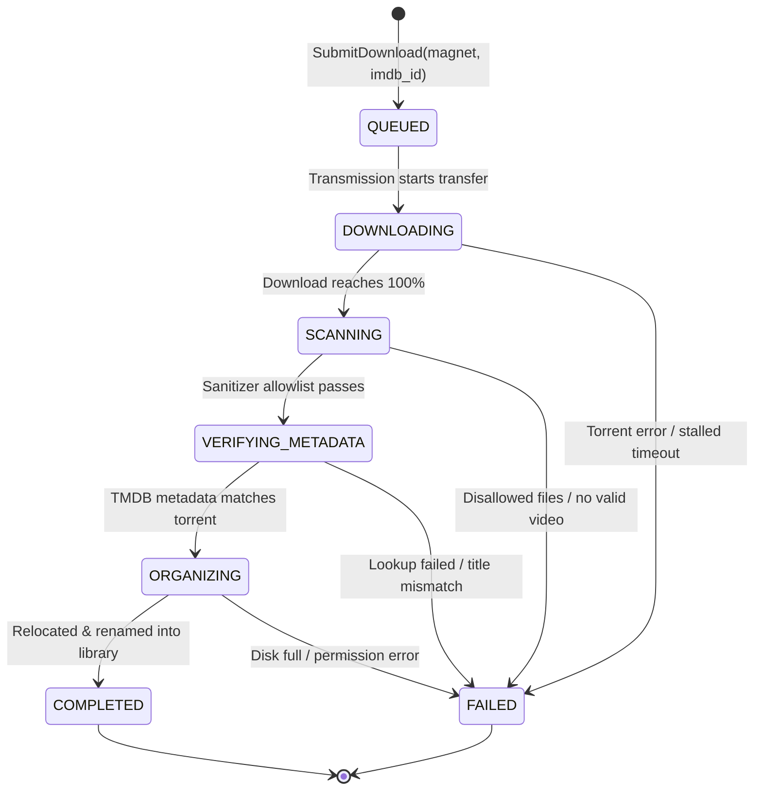
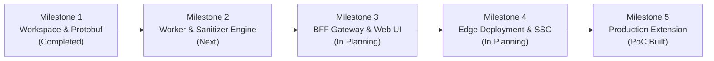

# 🎬 MagNetFlix — System Architecture & Media Pipeline

MagNetFlix is an automated, self-hosted media acquisition, verification, and library organization platform. It bridges the gap between web-browsed movie requests (magnet URIs) and structured, verified Jellyfin/Plex media storage through an audited gRPC pipeline behind Authelia SSO.

---

## 🏛️ System Topology & Architecture

When managing a self-hosted media library, manual acquisition requires downloading torrents, monitoring progress, manually weeding out garbage/malicious scripts (`.exe`, `.bat`), and renaming folders to match IMDb/TMDB conventions. In multi-user setups, tracking who requested what and auditing download states is chaotic without a unified log.

MagNetFlix resolves this with an automated end-to-end pipeline:
- **Client Ingestion**: Captures magnet links via a cross-browser extension or web dashboard.
- **FastAPI BFF Gateway**: Manages authentication via Authelia SSO headers, exposes REST/SSE endpoints, and coordinates requests.
- **gRPC Worker Pipeline**: Sandboxed download coordinator utilizing Transmission RPC in an isolated staging scratch disk.
- **Security Sanitizer**: Enforces path traversal checks, file extension whitelists, and largest-file feature film selection while purging malicious scripts.
- **TMDB Metadata Verification**: Validates the IMDb ID against TMDB metadata and matches token similarity with the downloaded torrent payload.
- **Library Relocator**: Formats and places verified video and subtitle files into the canonical Jellyfin/Plex structure.

```mermaid
flowchart TB
    subgraph ClientLayer ["Client & Ingestion Layer"]
        Ext["MagNetFlix Browser Extension\n(Firefox / Chromium)"]
        WebUI["Web Pairing Dashboard\n(FastAPI / Jinja / Tailwind)"]
    end

    subgraph Edge ["Public Edge (Reverse Proxy & SSO)"]
        Traefik["Traefik Reverse Proxy\n(magnetflix.roadtotech.me)"]
        Authelia["Authelia SSO\n(Forward Auth)"]
        Traefik <-->|Forward Auth| Authelia
    end

    subgraph CoreServices ["Core Internal Services (Docker Monorepo)"]
        BFF["FastAPI BFF Gateway\n(services/bff)"]
        Worker["gRPC Pipeline Worker\n(services/worker)"]
        DB[("SQLite 3 (WAL Mode)\nAudit & Job State Store")]
        Torrent["Transmission Daemon\n(RPC Engine)"]
    end

    subgraph ProcessingPipeline ["Worker Pipeline Stages"]
        Sanitizer["Media Sanitizer\n(Allowlist & Anti-Traversal)"]
        TMDB["TMDB Metadata Client\n(Token Overlap Check)"]
        StorageMgr["Library Relocator\n(Canonical Renamer)"]
    end

    subgraph Storage ["Persistent Storage Mounts"]
        Staging[("/data/staging/<job_id>\nScratch Disk")]
        Library[("/media/movies\nJellyfin / Plex Media Root")]
    end

    Ext -->|"Redirect / Pair"| Traefik
    WebUI -->|HTTP POST| Traefik
    Traefik -->|HTTP + Remote-User| BFF
    BFF -->|gRPC SubmitDownload| Worker
    BFF <-->|gRPC Event Stream (SSE)| Worker
    Worker --> DB
    Worker -->|RPC| Torrent
    Torrent --> Staging
    Worker --> Sanitizer
    Sanitizer --> Staging
    Worker --> TMDB
    Worker --> StorageMgr
    StorageMgr --> Library
```

### Job State Machine & Lifecycle Rules

The pipeline worker enforces a linear, finite state machine with terminal failure handling and startup crash recovery:



#### Key Invariants
1. **Crash & Restart Recovery**: Upon worker startup, all orphaned non-terminal jobs in the SQLite database automatically transition to `FAILED` (`"Worker restarted during execution"`).
2. **Strict Idempotency**: Submissions are rejected if a non-terminal job for the same `imdb_id` is currently in-flight, or if `/media/movies/*[imdbid-{imdb_id}]` already exists in the media library.
3. **Sandbox Scrubbing**: Staging directories (`/data/staging/<job_id>/`) are purged immediately upon reaching `COMPLETED` or `FAILED`.

### Security & Media Sanitizer Specification

The sanitizer strictly guards the file-system boundary before any file is moved to the permanent library:

- **Anti-Traversal**: Blocks symlinks, hardlinks, or relative paths escaping the staging root (`..`).
- **File Allowlist**:
  - *Allowed Video*: `.mkv`, `.mp4`, `.avi`, `.webm`
  - *Allowed Subtitles*: `.srt`, `.vtt`, `.sub`, `.ass`
  - *Forbidden / Immediate Quarantine*: `.exe`, `.bat`, `.cmd`, `.sh`, `.scr`, `.vbs`, `.lnk`, `.iso`, `.zip`, `.rar`.
- **Largest File Rule**:
  - Files containing `sample` in the filename or under 100 MB are discarded.
  - The single largest valid video file is chosen as the primary feature film.

---

## 📍 Source Code & Locations

| Component | Location / URL | Description |
| :--- | :--- | :--- |
| **Main Monorepo (Forge)** | [MagNetFlix](https://gitea.roadtotech.me/kiskaadee/MagNetFlix) | Canonical Git repository housing `services/bff`, `services/worker`, and `proto/` |
| **Workstation Path** | `~/Projects/active/MagNetFlix` | Active local monorepo development checkout |
| **Extension PoC (Local)** | `~/Projects/learning/extensions/magnetflix-extension` | Working Firefox/Chromium WebExtension prototype |
| **Production Ingress** | [magnetflix.roadtotech.me](https://magnetflix.roadtotech.me) | Traefik entrypoint with Authelia forward authentication |

---

## 💬 Open Discussions

No open architectural discussions at this time.

---

## 🚧 Work in Progress (Active Plans)

Implementation roadmaps currently in progress (`status: active`) that are actively being executed or scheduled for deployment:

1. 🟡 [**MagNetFlix Cross-Browser Extension Integration**](plans/browser-extension-integration.md) `[Active]`
   - Actionable implementation plan for evolving the working proof-of-concept into a production-grade cross-browser extension with web dashboard handoff and Traefik/Authelia SSO integration.

### Phased Roadmap Overview



- **Milestone 2: Worker Engine & Pipeline Modules** *(Next Priority)*: SQLAlchemy 2.0 + SQLite (WAL mode) schema, Transmission RPC client, Media Sanitizer, TMDB token-overlap validation, and media library relocator.
- **Milestone 3: BFF Gateway & Live Dashboard**: FastAPI gateway, Authelia SSO header middleware, Server-Sent Events (SSE) `/api/v1/movies/events`, and pairing dashboard `/pair?magnet=...`.
- **Milestone 4: Edge Deployment & Production Packaging**: Multi-stage Dockerfiles, Docker Compose production stack with Traefik labels and healthchecks.
- **Milestone 5: Production Cross-Browser Extension Rollout**: Extension packaging for Firefox AMO / Chrome Web Store, magnet link redirection, and context menus.

---

## 🛠️ Canonical Guides & Runbooks

No canonical operational runbooks written yet.

---

## 🏛️ Completed Milestones & Resolved Discussions

Archived and foundational documentation for completed milestones:

### Completed Milestones
* 🟢 **Milestone 1: Workspace & Protobuf Contracts** — Hermetic `nix develop` environment, `uv` workspace, `pipeline.proto` definitions with gRPC service contracts, and automated stub generation via `buf.yaml`.
