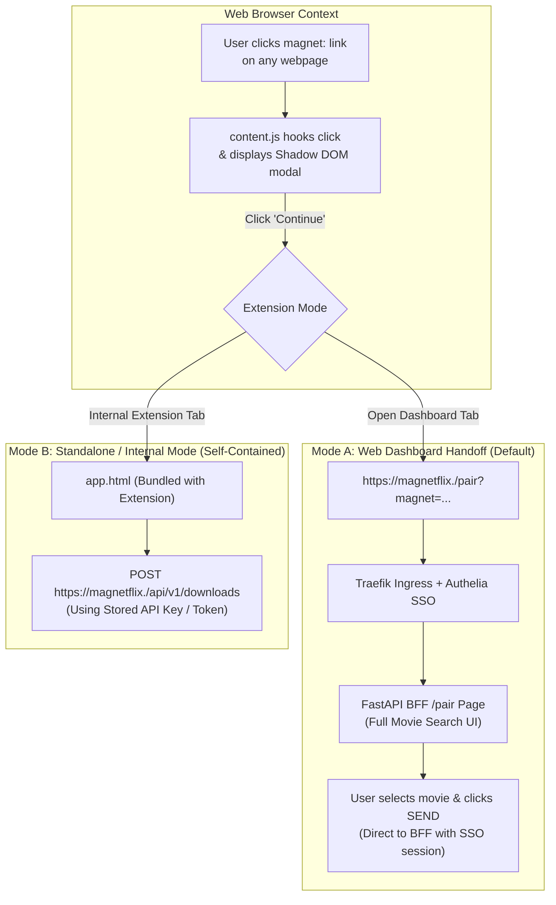

# 🧲 Plan: MagNetFlix Cross-Browser Extension Integration

An actionable implementation plan for evolving the working proof-of-concept (PoC) into a production-grade cross-browser extension that intercepts magnet links and routes them directly to the self-hosted MagNetFlix platform.

---

## 🎯 Context & Objective

The primary entry point for acquiring media is web browsing (torrent trackers, indexers, public domain archives). Without an extension, the user must copy the magnet link, open the media server dashboard, paste the link, and manually search for the movie ID.

The **MagNetFlix Browser Extension** automates this flow:
1. Intercepts any `magnet:` URI clicked on the web before the browser hands it off to an OS client.
2. Injects a non-blocking confirmation dialog (**"Magnet link captured!"**).
3. Handoffs the captured magnet link to the self-hosted dashboard at `https://magnetflix.<DOMAIN>/pair?magnet=<url>`.

---

## 🔬 Proof of Concept (PoC) Baseline

A fully functional proof of concept has been implemented and tested:

- **Local Repository**: `~/Projects/learning/extensions/magnetflix-extension`
- **Main Forge**: `https://gitea.roadtotech.me/kiskaadee/MagNetFlix`
- **Target Browser**: Firefox (Manifest V2) with full Chromium compatibility.

### What the PoC Achieved
- **Capture-Phase Hooking**: `content.js` captures click events on `a[href^="magnet:"]` via `document.addEventListener('click', ..., true)` and suppresses native protocol hijacking with `e.preventDefault()`.
- **CSS Isolation via Shadow DOM**: The confirmation modal is injected into an isolated Shadow DOM root to prevent host page style bleeding.
- **Dynamic IMDb Search**: `app.js` executes debounced (250ms) character-by-character queries against the IMDb suggestion API, retrieving top 5 matches with posters, titles, years, IMDb IDs, and cast.
- **Fixed State Transition**: Selecting a movie locks both the magnet input and movie selection, rendering the **SEND** button.
- **FastAPI Dispatch**: Dispatches `POST http://localhost:8000/download` with `{ "magnet": "...", "imdbid": "..." }`.

---

## 🚀 Production Evolution Strategy

While the PoC embeds the pairing UI inside an internal extension page (`app.html`), the production architecture will transition to a **hybrid model**:

### Key Production Changes
1. **Redirect to Centralized Web Dashboard (`magnetflix.<DOMAIN>`)**:
   - Clicking "Continue" opens `https://magnetflix.<DOMAIN>/pair?magnet=${encodeURIComponent(magnet)}`.
   - Leverage Authelia SSO session cookies already present in the browser — no need to store sensitive API credentials in extension storage.
2. **Configurable Server URL in Options**:
   - Allow user to configure their MagNetFlix base URL (e.g., `https://magnetflix.roadtotech.me` or `http://localhost:8000`).
3. **Manifest V3 / Cross-Browser Packaging**:
   - Provide a dual build setup: Manifest V2 for Firefox (or MV3 with event pages) and Manifest V3 for Chromium/Edge.

---

## 📋 Phased Execution Roadmap

### Phase 1: Settings & Configurable Domain
- [ ] Add `options.html` / `options.js` for setting custom server URL:
  - Default: `https://magnetflix.roadtotech.me`
  - Fallback/Dev: `http://localhost:8000`
- [ ] Store preferences in `browser.storage.sync`.
- [ ] Update `popup.html` to link to settings.

### Phase 2: Web Dashboard Handoff Integration
- [ ] Implement the `/pair` route in `services/bff`:
  - Renders the pairing UI currently prototyped in `app.html`.
  - Populates magnet field from URL query parameter `?magnet=...`.
  - Integrates Authelia authenticated user context directly from `Remote-User` header.
- [ ] Update extension `content.js` to redirect to configured server URL `/pair?magnet=...` instead of internal `app.html`.

### Phase 3: Manifest V3 & Cross-Browser Packaging
- [ ] Convert background script into service worker for Chrome MV3 compliance.
- [ ] Maintain Firefox MV2 / MV3 manifest variant for seamless installation.
- [ ] Set up `web-ext build` packaging script in monorepo or dedicated extension repo.

### Phase 4: Production Polishing & Distribution
- [ ] Add context menu entry: right click on any link -> `"Send Magnet to MagNetFlix"`.
- [ ] Self-host signed `.xpi` on `gitea.roadtotech.me` releases or submit to Firefox Add-ons / Chrome Web Store.
