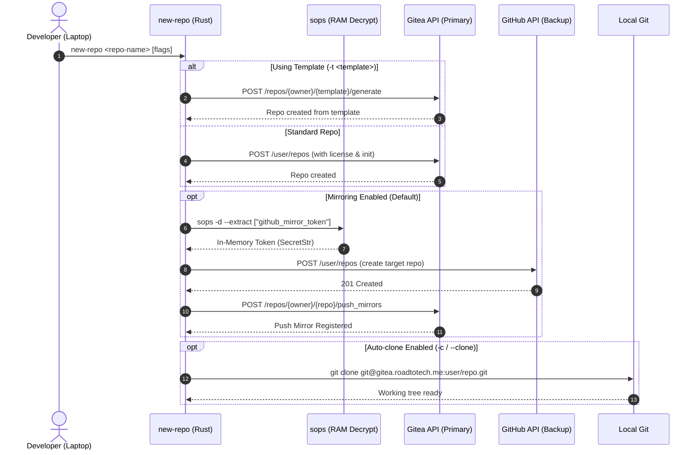

# 🚀 new-repo — Automated Repository Provisioning CLI

## 🎯 Overview

`new-repo` is a lightweight native Rust command-line utility designed to automate the creation of new repositories across a hybrid Git topology:
- **Primary Forge**: Self-hosted Gitea instance (`gitea.roadtotech.me`).
- **Offsite Backup Forge**: GitHub (`github.com`) via automated push mirroring.

It eliminates repetitive manual setup by providing sensible defaults (Gitea as primary, automated GitHub push mirroring, `UNLICENSE` default, private visibility) while supporting Gitea repository templates and optional standalone configurations.

---

## 🏛️ System Architecture & Workflow

---

## 🔒 Security Model

1. **In-Memory Token Handling**: The GitHub Personal Access Token (`github_mirror_token`) is decrypted strictly in-memory from `secrets.yaml` using `sops`.
2. **Zero Command-Line Leaks**: Secrets are transmitted exclusively via native HTTPS request headers (`Authorization: token ...`), preventing token visibility in `/proc/$PID/cmdline` or system process listings (`ps`).
3. **Memory Hygiene**: Secret buffers are scrubbed from memory after use.

---

## 📑 Project Documents & Plans

- [**Repository Provisioning CLI Plan**](plans/provisioning-cli-plan.md) — Comprehensive functional specification, trait architecture, API contracts, and implementation milestones.
- **Local Implementation Tree**: [`/home/kiskaadee/Projects/active/new-repo`](file:///home/kiskaadee/Projects/active/new-repo)
