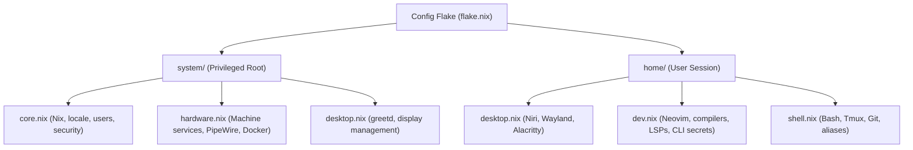

# ❄️ NixOS Fleet & Declarative System Configuration

## 🎯 Project Overview
This project documents the architecture, flake hierarchy, host specializations, module designs, and operational maintenance for the workstation NixOS configuration managed in `~/Config`.

Following the architectural decoupling of the homelab infrastructure into `Core`, `Config` functions as a dedicated standalone configuration for the mobile workstation (`laptop`), structured cleanly around system-level machine concerns (`system/`) and user-session domains (`home/`).

---

## 🏛️ System Topology & Workstation Model

| Host / Scope | Role | Environment | Key Subsystems |
| :--- | :--- | :--- | :--- |
| **`laptop`** (`Config`) | Mobile Dev Workstation | Graphical Wayland | Niri, Waybar, Alacritty, DevShells, Git/SSH keys, local LLM/GUI clients, CLI secrets tooling |
| **`server`** (`Core`) | 24/7 Homelab Host | Headless Server | Docker daemon, Traefik, Socket-Proxy, `homelab-gitops`, SOPS Age secrets, Dynu DDNS |

---

## 📑 Plans & Execution Roadmaps

1. 🟢 [**Decoupling Homelab Server & Standalone Workstation Architecture**](plans/server-decoupling-and-standalone-workstation.md) `[Completed]`
   - Architectural blueprint and phased plan for removing `hosts/server/` from `Config`, eliminating the "multi-host tax", and re-aligning the repository as a dedicated Niri workstation.
2. 🟢 [**Secrets Management Architecture & Workstation Boundary Refinement**](plans/secrets-architecture-and-workstation-cleanup.md) `[Completed]`
   - Clean removal of `sops-nix` host stubs from `Config`, operator authoring vs runtime consumer key architecture, compositor cleanup, and filesystem decoupling.
3. 🟡 [**Adopting Official channels.nixos.org Tarballs**](plans/channel-tarball-migration-plan.md) `[Active]`
   - Transitioning from GitHub-hosted Nixpkgs flake inputs to official `channels.nixos.org` zstd-compressed archives.
   - Flake registry pinning and evaluation speedup analysis.
4. 🟢 [**Decommission Legacy Desktop Derivation**](plans/decommission-desktop-derivation.md) `[Completed]`
   - Pruned `hosts/desktop/` and `nixosConfigurations.desktop` to standardize on a 2-host fleet (`server` and `laptop`).
5. 🟢 [**SOPS Secrets Restructuring & Multi-User Authelia Support**](plans/sops-restructuring-plan.md) `[Completed]`
   - Migrated flat SOPS secrets to service-scoped namespaces and added declarative Nix user database rendering.
6. 🟢 [**DMS Runtime Ownership & Workstation Operations Manual**](plans/dms-reproducibility-and-docs-plan.md) `[Completed]`
   - Documented DMS session invariants, runtime mutation boundaries, containerized reproducibility, and operational workflows.

---

## 📑 Guides & Reference Documentation

1. [**Standalone Workstation Architecture & Secrets Decoupling Walkthrough**](guides/standalone-workstation-walkthrough.md)
   - Workstation refactor execution, Niri compositor cleanup, filesystem path decoupling, and verification results.
2. [**Transitioning to Official channels.nixos.org Tarballs Walkthrough**](guides/channel-tarball-migration-walkthrough.md)
   - Flake input migration, base registry pinning, and dry-build verification.
3. [**Decommissioning the Legacy Desktop Derivation Walkthrough**](guides/desktop-decommission-walkthrough.md)
   - Host removal validation, architecture doc sync, and dry builds.
4. [**SOPS Secrets Restructuring & Multi-User Authelia Walkthrough**](guides/sops-restructuring-walkthrough.md)
   - Secret hierarchy re-encryption, template generation, and host dry-build verification.
5. [**DMS Desktop Bootstrap & Container Reproducibility Validation**](guides/dms-bootstrap-and-reproducibility-validation.md)
   - Containerized flake check, one-time bootstrap behavior, and runtime mutation model verification.
6. [**Terminal Workspace Subsystem Architecture & Navigation**](guides/terminal-workspace-subsystem.md)
   - Niri compositor window bindings, Alacritty terminal integration, and `tmux-sessionizer` (`ts`) workspace switching.
7. [**Integrated Linters & Quality Checks in Nix Flake Check**](guides/nix-flake-check-linters.md)
   - CI static analysis and linting (`ruff-lint`, `statix`, `deadnix`, `nixfmt`, `luacheck`) declared in `flake.nix`.

---

## 🏛️ Architectural Discussions & Records

* [Discussion: NixOS Monorepo vs. Multi-Repo Architecture for Homelab & Workstations](../homelab/discussions/nixos-monorepo-vs-multirepo.md)
* [Discussion: Decoupling `nixos-config` and `homelab-core`](../homelab/discussions/nixos-monorepo-decoupling.md)

---

## 🔗 Related Projects & Locations
* **Local Flake Repository**: `~/Config`
* **Homelab Services Project**: [Homelab & Infrastructure Planning](../homelab/README.md)

