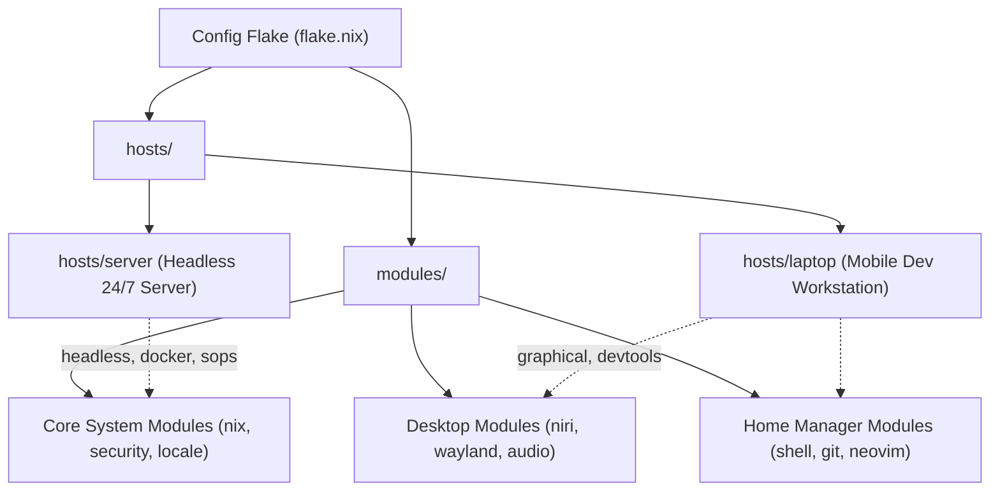

# ❄️ NixOS Fleet & Declarative System Configuration

## 🎯 Project Overview
This project documents the architecture, flake hierarchy, host specializations, module designs, and operational maintenance for the multi-machine NixOS fleet managed in [`/home/kiskaadee/Config`](file:///home/kiskaadee/Config).

The fleet operates under a unified Nix Flake repository supporting declarative system rebuilds, user-space management via Home Manager, and encrypted secrets via SOPS-nix.

---

## 🏛️ System Topology & Host Matrix

| Host | Role | Environment | Key Subsystems |
| :--- | :--- | :--- | :--- |
| **`server`** | 24/7 Homelab Host | Headless Server | Docker daemon, Traefik, Socket-Proxy, `homelab-gitops`, SOPS Age secrets, Dynu DDNS |
| **`laptop`** | Primary Workstation | Graphical Wayland | Niri / Hyprland, Waybar, Alacritty, DevShells, Git/SSH keys, local LLM/GUI clients |

---

## 📑 Plans & Execution Roadmaps

1. 🟡 [**Decoupling Homelab Server & Standalone Workstation Architecture**](plans/server-decoupling-and-standalone-workstation.md) `[Active]`
   - Architectural blueprint and phased plan for removing `hosts/server/` from `Config`, eliminating the "multi-host tax", and re-aligning the repository as a dedicated Niri workstation.
2. 🟡 [**Adopting Official channels.nixos.org Tarballs**](plans/channel-tarball-migration-plan.md) `[Active]`
   - Transitioning from GitHub-hosted Nixpkgs flake inputs to official `channels.nixos.org` zstd-compressed archives.
   - Flake registry pinning and evaluation speedup analysis.
3. 🟢 [**Decommission Legacy Desktop Derivation**](plans/decommission-desktop-derivation.md) `[Completed]`
   - Pruned `hosts/desktop/` and `nixosConfigurations.desktop` to standardize on a 2-host fleet (`server` and `laptop`).
4. 🟢 [**SOPS Secrets Restructuring & Multi-User Authelia Support**](plans/sops-restructuring-plan.md) `[Completed]`
   - Migrated flat SOPS secrets to service-scoped namespaces and added declarative Nix user database rendering.

---

## 📑 Guides & Reference Documentation

1. [**Transitioning to Official channels.nixos.org Tarballs Walkthrough**](guides/channel-tarball-migration-walkthrough.md)
   - Flake input migration, base registry pinning, and dry-build verification.
2. [**Decommissioning the Legacy Desktop Derivation Walkthrough**](guides/desktop-decommission-walkthrough.md)
   - Host removal validation, architecture doc sync, and dry builds.
3. [**SOPS Secrets Restructuring & Multi-User Authelia Walkthrough**](guides/sops-restructuring-walkthrough.md)
   - Secret hierarchy re-encryption, template generation, and host dry-build verification.

---

## 🏛️ Architectural Discussions & Records

* [Discussion: NixOS Monorepo vs. Multi-Repo Architecture for Homelab & Workstations](../homelab/discussions/nixos-monorepo-vs-multirepo.md)
* [Discussion: Decoupling `nixos-config` and `homelab-core`](../homelab/discussions/nixos-monorepo-decoupling.md)

---

## 🔗 Related Projects & Locations
* **Local Flake Repository**: [`/home/kiskaadee/Config`](file:///home/kiskaadee/Config)
* **Homelab Services Project**: [Homelab & Infrastructure Planning](../homelab/README.md)

