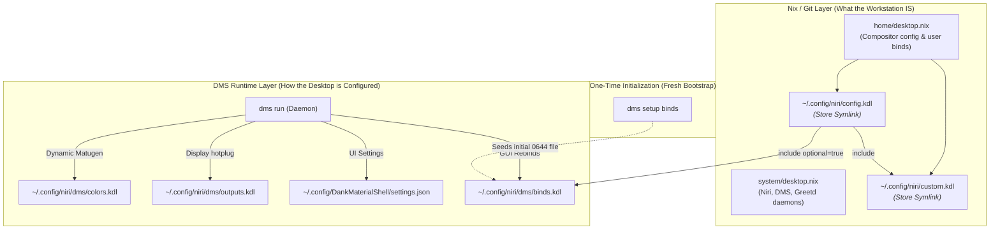

# Architecture Plan: DMS Runtime Ownership & Workstation Operations Manual

## 1. Executive Diagnostic: The DMS Ownership & Mutation Model

The initial inclination to solve the "absent Niri bindings" problem by symlinking `dms/binds.kdl` and `settings.json` into `/nix/store` via Home Manager would reproduce a critical architectural failure mode: **fighting the application's runtime mutation model**.

### The Failure Mode of Store-Symlinking Mutable State
DMS is not a static window manager configuration; it is a live shell environment with a Quickshell UI and a CLI control daemon. It actively writes to `$HOME/.config` when:
1. Connecting or rearranging monitors (`outputs.kdl`).
2. Generating Material You themes from wallpapers (`colors.kdl`).
3. Updating gaps, blur, corner radius, or widget layouts via GUI (`layout.kdl`, `alttab.kdl`, `settings.json`).
4. Rebinding shortcuts in the DMS Settings UI (`binds.kdl`).

If Home Manager symlinks these files to the read-only Nix store:
- User actions in the GUI (e.g., rearranging displays on an external monitor) fail with `EACCES` or break symlinks.
- Any subsequent `nixos-rebuild switch` forcibly stomps runtime changes.
- The system pretends to be declarative while undermining the user's interactive workflow.



---

## 2. State Ownership & Responsibility Matrix

| Scope / File | Authority | Managed in Git? | Mutability | Rationale |
| :--- | :--- | :--- | :--- | :--- |
| `system/desktop.nix` | NixOS Root | Yes | Immutable | Declares system daemons, PAM, Greetd, DMS package, fontconfig. |
| `home/config/niri/config.kdl` | Home Manager | Yes | Immutable | Compositor foundation: touchpad rules, gesture rules, includes. |
| `home/config/niri/custom.kdl` | Home Manager | Yes | Immutable | Workstation operator shortcuts (`Mod+Return` terminal, `Mod+B` browser, scripts). |
| `~/.config/niri/dms/binds.kdl` | DMS Runtime | **No** (Seeded) | Mutable (`0644`) | DMS default keybindings. Initialized via `dms setup binds`; mutable by user/GUI. |
| `~/.config/DankMaterialShell/settings.json` | DMS Runtime | **No** | Mutable | Live panel layout, widget configuration, and theme preferences. |
| `~/.config/niri/dms/outputs.kdl` | DMS Runtime | **No** | Dynamic | Generated by DMS upon monitor connection/re-arrangement. |
| `~/.config/niri/dms/colors.kdl` | DMS Runtime | **No** | Dynamic | Generated by Matugen on wallpaper change. |
| `~/.config/niri/dms/layout.kdl` | DMS Runtime | **No** | Dynamic | Generated by DMS from corner radius and gap settings. |

---

## 3. The Workstation Operational Manual (`docs/`)

We will author an operational manual organized by the questions an operator asks when configuring, maintaining, or recovering the system:

```text
docs/
├── getting-started.md      # "How do I get this running?" (Bare-metal install to running desktop)
├── adding-software.md      # "Where does a new application go?" (Decision tree, package vs module)
├── configuration.md        # "How do I change something?" (Workflow: edit, test, switch, dotfiles)
├── system-lifecycle.md     # "What happens when I rebuild?" (Eval, build, generations, rollbacks, GC)
├── desktop.md              # "How does the Niri + DMS stack work?" (Ownership boundary, shortcuts, init)
├── secrets.md              # "How are secrets handled?" (Operator CLI workstation vs Core consumer)
├── networking.md           # "How does network access work?" (OpenSSH client profiles, WiFi, Tailscale)
└── reference/
    ├── shell.md            # Bash, Starship, custom modular shell scripts
    ├── tmux.md             # Tmux keybindings, layout, workflow
    ├── neovim.md           # Neovim architecture, LSP, treesitter, plugins
    └── antigravity.md      # AI agent environment, guidelines, and tool integration
```

### Detailed Document Specifications

#### 1. `docs/getting-started.md`
- **Bare-metal Recovery Protocol**:
  1. Boot minimal NixOS ISO.
  2. Partitioning, filesystem formatting, and mounting.
  3. Generating `system/hardware-configuration.nix`.
  4. Cloning `Config` to `~/Config`.
  5. Dry build validation: `nix build .#nixosConfigurations.laptop.config.system.build.toplevel --no-link`.
  6. System installation: `nixos-install --flake .#laptop`.
  7. Reboot and initial login via `dank-greeter`.
- **Desktop Initialization Phase**:
  - Run `dms setup binds` to seed the mutable DMS keybinding baseline.
  - Verification of spotlight, clipboard, and task manager overlays.
- **Operator Secrets Bootstrap**:
  - Restoring `~/.config/sops/age/keys.txt` to re-enable authoring access to `Core`.

#### 2. `docs/adding-software.md`
- **Package Placement Flowchart**:
  ```text
  Is it a kernel module, hardware driver, or root systemd daemon?
     ├── YES ──> system/core.nix or system/hardware.nix
     └── NO
          │
  Is it a GUI application or desktop utility?
     ├── YES ──> home/desktop.nix
     └── NO
          │
  Is it a compiler, LSP, language runtime, or dev tool?
     ├── YES ──> home/dev.nix
     └── NO  ──> home/shell.nix (CLI tools, shell integration)
  ```
- **Declaration Styles**: When to use `home.packages = with pkgs; [...]` vs `programs.<name>.enable = true` vs NixOS service modules.
- **Handling Unfree Packages**: Scoping unfree packages in `flake.nix`.

#### 3. `docs/configuration.md`
- **Standard Modification Workflow**:
  ```text
  Identify Domain -> Edit Module -> nix flake check -> nix build ... --no-link -> nixos-rebuild test -> switch -> git commit
  ```
- **Dotfile Management**: Managing configuration via `home.file` vs `xdg.configFile` vs runtime mutable directories.
- **The "Build, Never Switch" Boundary**: Why agents build dryly and users trigger activation.

#### 4. `docs/system-lifecycle.md`
- **The Lifecycle Pipeline**:
  - Evaluation (`flake.nix`) -> Derivation computation (`/nix/store/*.drv`) -> Build closure -> System profile link -> Activation scripts (PAM, users, systemd) -> Home Manager activation (dotfiles symlinks, user units).
- **Command Matrix**: `build` vs `test` vs `switch` vs `boot`.
- **Generations & Rollback**: Bootloader rollback, `nixos-rebuild --rollback`, checking generations.
- **Maintenance**: Safe garbage collection (`nix-collect-garbage -d`), boot generation pruning, flake input locking (`nix flake update`).

#### 5. `docs/desktop.md`
- **The Compositor & Shell Architecture**:
  - Niri as the Wayland scrollable-tiling compositor.
  - DankMaterialShell as the companion panel, app launcher, notification server, and quicksettings UI.
  - Greetd and DankGreeter display manager configuration.
- **The Ownership Boundary**: Full documentation of declarative Git state vs DMS mutable runtime state.
- **Master Shortcut Reference**: Unified table combining Niri core shortcuts, custom user binds (`custom.kdl`), and DMS IPC actions (`binds.kdl`).

#### 6. `docs/secrets.md`
- **Workstation vs Homelab Secrets Split**:
  - Laptop is the **Authoring Cockpit**: Owns `sops`, `age`, and `rbw` CLI tools in `home/dev.nix`; holds `~/.config/sops/age/keys.txt`.
  - Server is the **Headless Consumer**: Owns host SSH private key (`/etc/ssh/ssh_host_ed25519_key`); decrypts secrets at boot via `sops-nix` in `Core`.
- Step-by-step guide for rotating and authoring secrets for `Core` from the laptop.

#### 7. `docs/networking.md`
- NetworkManager configuration and CLI operations (`nmcli`).
- Workstation OpenSSH client profiles (`server-local`, `server-remote`, `gitea.roadtotech.me`).
- Local OpenSSH daemon for LAN remote access (and why it $\neq$ server infrastructure).

#### 8. `docs/reference/`
- Specialized manuals migrated and streamlined:
  - `docs/reference/shell.md`: Bash configuration, Starship prompt, modular scripts in `home/shell/`.
  - `docs/reference/tmux.md`: Streamlined tmux configuration and session commands.
  - `docs/reference/neovim.md`: Neovim architecture, keybindings, LSP configs, and Treesitter.
  - `docs/reference/antigravity.md`: Antigravity guidelines, rules, and workspace integration.

---

## 4. Execution Steps

1. **Retain Clean Repository Boundary**:
   - Do **NOT** symlink `settings.json` or `binds.kdl` to `/nix/store`.
   - Preserve `home/config/niri/config.kdl` and `home/config/niri/custom.kdl` as the declarative core.
2. **Author the Operational Manual**:
   - Create `docs/getting-started.md`.
   - Create `docs/adding-software.md`.
   - Create `docs/configuration.md`.
   - Create `docs/system-lifecycle.md`.
   - Create `docs/desktop.md`.
   - Create `docs/secrets.md` (renaming/refining `secrets-management.md`).
   - Create `docs/networking.md`.
   - Create `docs/reference/` directory and populate `shell.md`, `tmux.md`, `neovim.md`, and `antigravity.md`.
   - Clean up obsolete files (`package-and-secrets.md`, `development-environments.md`, `system-maintenance.md`).
3. **Align Repository Index**:
   - Update `Config/README.md` to link directly into the new operational documentation structure.
4. **Validate**:
   - Run `nix flake check` and dry build (`nix build .#nixosConfigurations.laptop.config.system.build.toplevel --no-link`).
   - Sync notes and guides into `~/Brain`.
