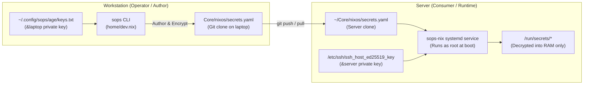

# Plan: Secrets Management Architecture & Workstation Boundary Refinement

## 1. Executive Summary & Diagnostic

The failure encountered when running:
```bash
ssh server-remote "sops ~/Core/nixos/secrets.yaml"
```
is **expected and secure by design**. It highlights the fundamental GitOps distinction between **Secret Authoring** and **Secret Consumption**.



### Why It Failed on the Server
1. **The Server is a Consumer, Not an Author**: The server only possesses its host SSH private key (`/etc/ssh/ssh_host_ed25519_key`). This key is owned by `root:root` with permissions `0600`.
2. When SSHing as `kiskaadee` and running `sops`, the unprivileged user has no access to `/etc/ssh/ssh_host_ed25519_key` and has no `~/.config/sops/age/keys.txt`.
3. Systemd, running as root during system activation, is what reads `/etc/ssh/ssh_host_ed25519_key` to decrypt secrets into `/run/secrets/` for Docker and Traefik.
4. **Editing secrets locally on the workstation is the intended, standard GitOps workflow.** The workstation holds `~/.config/sops/age/keys.txt` (`&laptop`), allowing decryption, editing, and encryption of `Core/nixos/secrets.yaml` before pushing.

---

## 2. Industry Analysis: Is SOPS Good for a Homelab?

| Secret Management Pattern | How It Works | Suitability for Homelab | Verdict |
| :--- | :--- | :--- | :--- |
| **SOPS + age (GitOps)** | Ciphertext stored in Git; host SSH keys decrypt at boot; operator age key edits on laptop. | **Ideal**. Zero recurring costs, 100% reproducible from Git, offline-capable, native `sops-nix` integration. | **Industry Standard for NixOS & Kubernetes homelabs** |
| **HashiCorp Vault / OpenBao** | Centralized secrets daemon; dynamic leasing; token authentication. | **Poor**. High operational overhead, heavy resource footprint, chicken-and-egg unsealing problem on reboot. | Overkill for a single-server setup |
| **SaaS Secret Managers (Doppler / 1Password / Infisical)** | Secrets fetched over HTTP API at boot. | **Moderate**. Introduces an external internet dependency; boot fails if WAN is down or API is rate-limited. | Unnecessary external dependency |
| **Manual `.env` / Out-of-band Files** | Manually copying secrets onto the server via scp/rsync. | **Fragile**. Not declarative, breaks disaster recovery, easy to lose during reinstallation. | Antipattern |

**Conclusion**: **SOPS + age is the gold standard for NixOS homelabs.** It strikes the ideal balance: zero external dependencies, seamless disaster recovery from Git, and root-level automated decryption via host SSH keys.

---

## 3. What Does This Mean for `Config` (The Laptop)?

We strictly distinguish between **Secrets Tooling** and **Declarative System Secrets**:

1. **Secrets Tooling (Kept)**: The laptop is the administrative cockpit. It needs `sops`, `age`, and `rbw` installed as CLI packages in `home/dev.nix`, and the personal age key in `~/.config/sops/age/keys.txt`. This enables authoring and rotating secrets for `Core`.
2. **Declarative Host Secrets (`sops-nix` in `Config`)**:
   - The laptop declares **zero** host secrets. It does not run headless server daemons, Docker credentials, or database connection strings.
   - Retaining `sops-nix` as an imported NixOS module in `flake.nix` and keeping a stale `.sops.yaml` in `Config` creates an architectural ghost.
   - **Resolution**:
     - Remove `sops-nix` from `Config/flake.nix` and delete `Config/.sops.yaml`.
     - Keep `sops`, `age`, and `rbw` in `home/dev.nix`.
     - If the workstation ever requires declarative machine secrets in the future (e.g., enterprise VPN profiles or WiFi PSKs), `sops-nix` can be reintroduced with a single workstation-specific `.sops.yaml`.

---

## 4. Workstation Refinement Implementation

### Component A: Secrets & Flake Hygiene
- [x] **Clarify Secrets Architecture**: Document that `Core` owns homelab secrets, while `Config` owns administrative CLI tooling.
- [x] **Purge Stale Secrets Config**:
  - Removed `sops-nix` flake input from `flake.nix`.
  - Removed root `.sops.yaml` from `Config`.
  - Retained `sops`, `age`, and `rbw` in `home/dev.nix`.
  - Replaced `docs/secrets-management.md` with an operator runbook explaining how to manage `Core` secrets from the laptop.

### Component B: Compositor Cleanliness (Niri-Only)
- [x] **Remove Hyprland Residue**:
  - In `home/desktop.nix`: Deleted `systemd.user.targets.hyprland-session`.
  - In `home/scripts/record.sh`: Stripped `hyprctl` checks, leaving clean, optimized Niri logic.

### Component C: Boundary Decoupling (`$HOME/Core/scripts`)
- [x] **Eliminate Filesystem Coupling**:
  - In `home/default.nix` and `home/shell.nix`: Removed `$HOME/Core/scripts` from `sessionPath` and `PATH`.
  - Workstation path now strictly includes `$HOME/.local/bin` and `$HOME/.cargo/bin`.

### Component D: Semantic & Architectural Precision
- [x] **Precision in `architecture.md`**:
  - Refined "Git is the source of truth" to specify *reproducible configuration decisions*, acknowledging runtime state (SSH keys, machine-id, caches).
  - Documented dual-composition root (`flake.nix` -> `system/` + `home/`).
  - Updated package placement invariant around ownership and execution context (privileged machine vs interactive user environment).
  - Added explicit architectural clarification: *Workstation remote-access capabilities (OpenSSH) ≠ server infrastructure.*
- [x] **Semantic Header in `system/hardware.nix`**:
  - Re-titled module scope from "Laptop Hardware" to "Machine Services & Peripherals" (to logically house PipeWire, Docker, Bluetooth, printing).
- [x] **Documentation Sweep**:
  - Fixed stale `modules/user/terminal.nix` reference in `docs/tmux.md`.
  - Purged lingering legacy references across all docs.

---

## 5. Verification
1. `nix flake check` — Flake inputs and schemas evaluated cleanly.
2. `nix build .#nixosConfigurations.laptop.config.system.build.toplevel --no-link` — Full dry build succeeded cleanly.
3. Live rebuild test and switch completed successfully.
