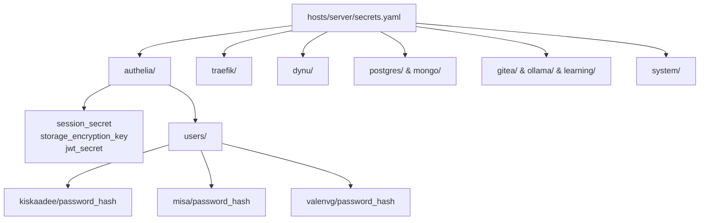

# Implementation Plan: SOPS Secrets Restructuring & Multi-User Authelia Support

Restructure the flat SOPS secrets in the NixOS host repository into service-scoped hierarchical namespaces and introduce a declarative multi-user configuration for Authelia in NixOS.

---

## Proposed Architecture: Flat to Service-First Hierarchy

Currently, `hosts/server/secrets.yaml` is a flat key-value list (`dynu_api_key`, `postgres_password`, `authelia_user_kiskaadee_password_hash`). As services and users expand, this flat space becomes difficult to audit and maintain.

We are migrating to a **Service-First Namespace** where keys naturally mirror service boundaries:



---

## User Review Required

> [!IMPORTANT]
> **SOPS Re-encryption Execution**:
> `hosts/server/secrets.yaml` is age-encrypted. The restructuring of the YAML keys must be executed via `sops hosts/server/secrets.yaml` using the configured age key (`~/.config/sops/age/keys.txt`).
> An unencrypted migration template will be provided so you can paste the new structure directly into `sops`.

> [!NOTE]
> **Authelia RBAC Scope**:
> As agreed, access control rules remain at `*.roadtotech.me: one_factor` for now. Role-based restrictions (e.g. limiting admin panels to the `admins` group) will be handled in a follow-up phase.

---

## Proposed Changes

### 1. Host NixOS Configuration (`~/Config`)

#### [MODIFY] `hosts/server/secrets.yaml`
Restructure keys from snake_case prefixes into nested service mappings:

```yaml
# ==============================================================================
# Homelab Server Secrets (SOPS-encrypted with Age)
# ==============================================================================

authelia:
  session_secret: "<EXISTING_VALUE>"
  storage_encryption_key: "<EXISTING_VALUE>"
  jwt_secret: "<EXISTING_VALUE>"  # formerly authelia_identity_validation_reset_password_jwt_secret
  users:
    kiskaadee:
      password_hash: "$argon2id$v=19$m=65536,t=3,p=4$XUewW9HLpcJq9Yu6UOHL/w$i4rwAuWOEkHQMpEYot7WcAARX7PQ0qnJ7yH8cn5HxEs"
    misa:
      password_hash: "$argon2id$v=19$m=65536,t=3,p=4$B5z3JsSuL8/+gL6sMDbYmQ$R8Sc+LM9NE1JwKHqcvFCtuMpMV6mRi6AcrkokOuxMhY"
    valenvg:
      password_hash: "$argon2id$v=19$m=65536,t=3,p=4$D+/2velTM9OCNu2stE4fLQ$L+bfW0nSQ0yq8cApibPqflgzKg0RgOYTHjtkRqUkf9s"

traefik:
  acme_email: "fcortesbio@gmail.com"

dynu:
  api_key: "<EXISTING_VALUE>"
  user: "kiskaadee"
  domain: "roadtotech.me"
  password: "<EXISTING_VALUE>"

postgres:
  user: "kiskaadee"
  password: "<EXISTING_VALUE>"
  db: "pg_sandbox"

mongo:
  root_username: "kiskaadee"
  root_password: "<EXISTING_VALUE>"

ollama:
  api_key: "<EXISTING_VALUE>"

gitea:
  runner_token: "<EXISTING_VALUE>"

learning:
  turso_db_url: "<EXISTING_VALUE>"
  turso_auth_token: "<EXISTING_VALUE>"

system:
  gh_repo_token: "<EXISTING_VALUE>"
  pdf_decrypt_password: "1144095880"
```

---

#### [MODIFY] `hosts/server/homeserver.nix`
1. Define a declarative `autheliaUsers` attribute set in Nix for user metadata.
2. Dynamically render `sops.templates."users.yml"` by mapping over `autheliaUsers`.
3. Update `sops.secrets` to reference nested keys.

```nix
{ config, lib, pkgs, ... }:

let
  # Declarative user database for Authelia
  autheliaUsers = {
    kiskaadee = {
      displayName = "kiskaadee";
      email = "fcortesbio@gmail.com";
      groups = [ "admins" "dev" ];
      passwordPlaceholder = config.sops.placeholder."authelia/users/kiskaadee/password_hash";
    };
    misa = {
      displayName = "misa";
      email = "icdf0728@gmail.com";
      groups = [ "users" ];
      passwordPlaceholder = config.sops.placeholder."authelia/users/misa/password_hash";
    };
    valenvg = {
      displayName = "valenvg";
      email = "vegavalentina069@gmail.com";
      groups = [ "users" ];
      passwordPlaceholder = config.sops.placeholder."authelia/users/valenvg/password_hash";
    };
  };

  # Helper to render the YAML user block
  renderUser = username: user: ''
      ${username}:
        displayname: "${user.displayName}"
        password: '${user.passwordPlaceholder}'
        email: "${user.email}"
        groups:
  '' + (lib.concatMapStringsSep "\n" (g: "        - ${g}") user.groups);

  renderedUsersYaml = ''
    users:
  '' + (lib.concatStringsSep "\n\n" (lib.mapAttrsToList renderUser autheliaUsers)) + "\n";
in
{
  sops.defaultSopsFile = ./secrets.yaml;
  sops.defaultSopsFormat = "yaml";

  sops.secrets = lib.genAttrs [
    "dynu/api_key"
    "traefik/acme_email"
    "authelia/session_secret"
    "authelia/storage_encryption_key"
    "authelia/jwt_secret"
    "authelia/users/kiskaadee/password_hash"
    "authelia/users/misa/password_hash"
    "authelia/users/valenvg/password_hash"
  ] (name: { owner = "kiskaadee"; });

  sops.templates."homeserver.env" = {
    owner = "kiskaadee";
    content = lib.generators.toKeyValue {} {
      DOMAIN = "roadtotech.me";
      DOCKER_API_VERSION = "1.40";
      DYNU_API_KEY = config.sops.placeholder."dynu/api_key";
      ACME_EMAIL = config.sops.placeholder."traefik/acme_email";
      AUTHELIA_SESSION_SECRET = config.sops.placeholder."authelia/session_secret";
      AUTHELIA_STORAGE_ENCRYPTION_KEY = config.sops.placeholder."authelia/storage_encryption_key";
      AUTHELIA_IDENTITY_VALIDATION_RESET_PASSWORD_JWT_SECRET = config.sops.placeholder."authelia/jwt_secret";
    };
  };

  sops.templates."users.yml" = {
    owner = "kiskaadee";
    content = renderedUsersYaml;
  };

  # Systemd services remain unchanged
  ...
}
```

---

#### [MODIFY] `hosts/server/traefik-deployments.nix`
Update secrets mapping and environment placeholders to use `service/*`:

```nix
  sops.secrets = lib.genAttrs [
    "learning/turso_db_url"
    "learning/turso_auth_token"
    "mongo/root_username"
    "mongo/root_password"
    "ollama/api_key"
    "postgres/user"
    "postgres/password"
    "postgres/db"
    "gitea/runner_token"
  ] (name: { owner = "kiskaadee"; });

  sops.templates."traefik-deployments.env" = {
    owner = "kiskaadee";
    content = lib.generators.toKeyValue {} {
      ...
      GITEA_RUNNER_TOKEN = config.sops.placeholder."gitea/runner_token";
      TURSO_DATABASE_URL = config.sops.placeholder."learning/turso_db_url";
      TURSO_AUTH_TOKEN = config.sops.placeholder."learning/turso_auth_token";
      MONGO_ROOT_USERNAME = config.sops.placeholder."mongo/root_username";
      MONGO_ROOT_PASSWORD = config.sops.placeholder."mongo/root_password";
      POSTGRES_USER = config.sops.placeholder."postgres/user";
      POSTGRES_PASSWORD = config.sops.placeholder."postgres/password";
      POSTGRES_DB = config.sops.placeholder."postgres/db";
      OLLAMA_API_KEY = config.sops.placeholder."ollama/api_key";
      ...
    };
  };
```

---

#### [MODIFY] `hosts/server/dynu.nix`
Update DDNS secret keys:

```nix
  sops.secrets."dynu/user" = { };
  sops.secrets."dynu/domain" = { };
  sops.secrets."dynu/password" = { };
  sops.secrets."system/pdf_decrypt_password" = {
    owner = "kiskaadee";
  };

  sops.templates."ddclient.conf" = {
    content = builtins.replaceStrings
      [ "@dynu_user@" "@dynu_password@" "@dynu_domain@" ]
      [
        config.sops.placeholder."dynu/user"
        config.sops.placeholder."dynu/password"
        config.sops.placeholder."dynu/domain"
      ]
      (builtins.readFile ./ddclient.conf);
  };
```

---

## Verification Plan

### Phase 1: NixOS Flake Evaluation & Secret Decryption
1. **Nix syntax & evaluation test**:
   ```bash
   nixos-rebuild dry-build --flake /home/kiskaadee/Config#server
   ```
2. **Switch/Test Activation**:
   ```bash
   sudo nixos-rebuild switch --flake /home/kiskaadee/Config#server
   ```
3. **Verify Rendered Files**:
   - Check rendered environment:
     ```bash
     head -n 10 /run/secrets/homeserver.env
     ```
   - Check generated Authelia users database:
     ```bash
     cat /run/secrets/users.yml
     ```
     Verify all 3 users (`kiskaadee`, `misa`, `valenvg`) are present with valid Argon2id hash strings.

### Phase 2: Runtime Service Verification
1. **Restart Authelia to pick up new `users.yml`**:
   ```bash
   appctl restart authelia
   ```
2. **Login Verification**:
   - Verify `kiskaadee` login at `https://auth.roadtotech.me`.
   - Verify `misa` login at `https://auth.roadtotech.me`.
   - Verify `valenvg` login at `https://auth.roadtotech.me`.
3. **Verify other services**:
   - Run `appctl status --core` to verify all services remain healthy.
