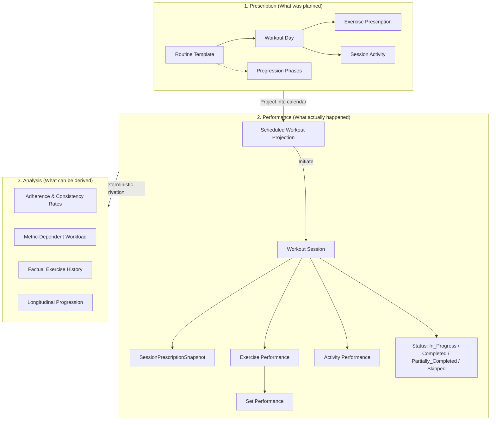

# 🏋️ Praxis

> *Praxis* (from Greek/Latin for *"the practical application of a plan"*) is a self-hosted workout execution and habit-tracking platform designed for homelab deployment.

Unlike conventional fitness apps that conflate planned routines with actual performance or impose punitive streak mechanics, Praxis is built around a strict **Three-Layer Temporal Model** and a clean hexagonal architecture.

---

## 🏛️ Overview & System Topology

Praxis is architected around a strict separation of concerns across three temporal layers:

1. **Prescription Layer (What was planned)**:
   - Reusable `Routine` templates defining weekly schedules (`Monday`–`Sunday`), target exercises, reps/ranges, weights, durations, activities (warm-ups, cardio), and calendar-week progression phases.
2. **Performance Layer (What actually happened)**:
   - Concrete `WorkoutSession` instances created upon initiation. Each session freezes an immutable `SessionPrescriptionSnapshot` while providing total runtime autonomy to log sets, adjust weights/reps, swap exercises, or add unscheduled movements without mutating the routine template.
3. **Analysis Layer (What can be derived)**:
   - Factual, deterministic observations (adherence rates, workload volumes, progression curves) derived purely from historical session logs rather than mutable counters.

### Core Domain Invariants

- **Snapshot Immutability**: When a session is initiated, its prescribed targets are frozen. Future modifications to routines never alter past or in-progress workouts.
- **Session Autonomy**: The routine is a guide, not a tyrant. Users can adjust sets/reps on the fly, substitute movements, or record ad-hoc workouts.
- **Substituted History Isolation**: Substituted exercises contribute strictly to the history of the *performed* movement, leaving the originally planned exercise clean while preserving the substitution audit trail.
- **Factual Adherence**: Consistency is measured via distribution rates (`Completed`, `Partially_Completed`, `Skipped`, and `Set Adherence Rate`) rather than fragile binary streaks.
- **Decoupled Identity**: Business logic depends only on internal `UserId`. External authentication (Authelia forward-auth headers, LLDAP) is isolated behind an `AuthProvider` port.

---

## 📍 Source Code & Locations

| Target | Location / URL | Description |
| :--- | :--- | :--- |
| **Git Repository** | [GitHub (praxis)](https://github.com/kiskaadee/praxis) | Canonical source repository on GitHub |
| **Clone (SSH)** | `git@github.com:kiskaadee/praxis.git` | Developer clone URL using SSH |
| **Workstation Path** | `~/Projects/active/praxis` | Active development checkout on local workstation |
| **Deployment Target** | Homelab Micro-Server | Dockerized application stack integrated with Traefik & Authelia SSO |

---

## 💬 Open Discussions

*Currently no open discussions.* Architectural evaluations regarding domain boundaries, snapshot mutability semantics, and metric models have been consolidated into the active specifications below.

---

## 🚧 Work in Progress (Active Plans)

Implementation roadmaps and specifications currently active (`status: active`):

1. 🟡 [**Praxis Software Requirements Specification (SRS) v1.0.2**](praxis-srs-v1.0.2.md) `[Active]`
   - Baseline requirements defining the Three-Layer Temporal Model, multi-modal logging, session snapshot lifecycle, set-intent completion policies, and factual adherence metrics.
2. 🟡 [**Praxis Domain Model & OOP Design Specification v1.0.1**](praxis-domain-model-v1.0.1.md) `[Active]`
   - Approved domain aggregates (`Routine`, `WorkoutSession`, `Exercise`), value objects, behavioral contracts, state transition matrices, and hexagonal port interfaces (`AuthProvider`, SQL repositories).

---

## 🛠️ Canonical Guides & Runbooks

*Operational runbooks and developer setup guides will be established during the implementation phase.*

---

## 🏛️ Completed Milestones & Resolved Discussions

Archived baseline drafts preserved for historical reference and comparison:

- [Praxis Software Requirements Specification v1.0.0 (Archived Baseline)](praxis-srs.md) — Initial draft prior to snapshot mutability refinement and activity formalization.
- [Praxis Domain Model & OOP Design Specification v1.0.0 (Archived Baseline)](praxis-domain-model.md) — Initial domain model draft prior to exercise aggregate root promotion and snapshot consolidation.
