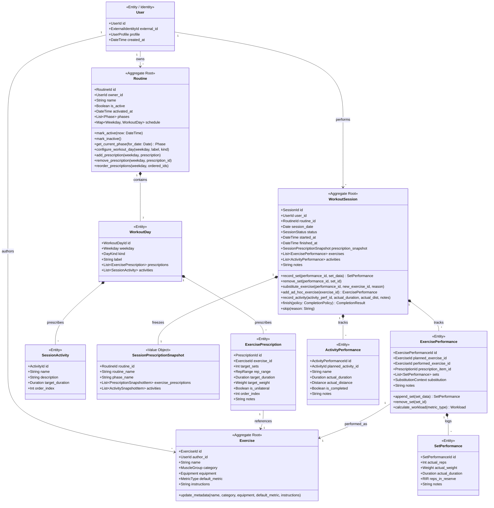
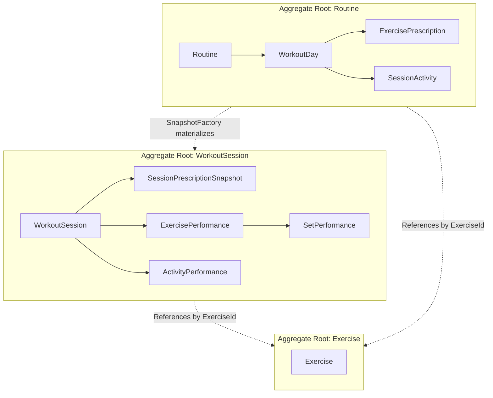
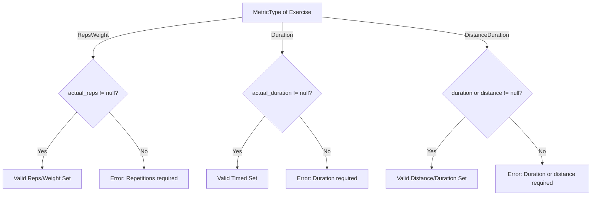
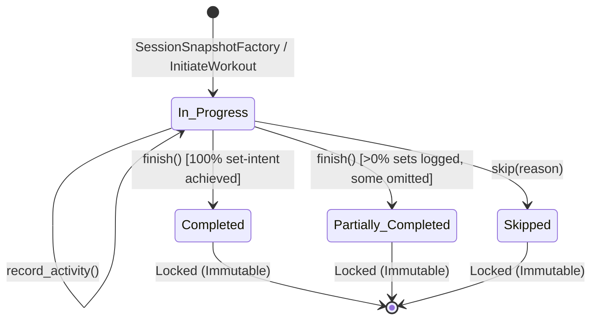
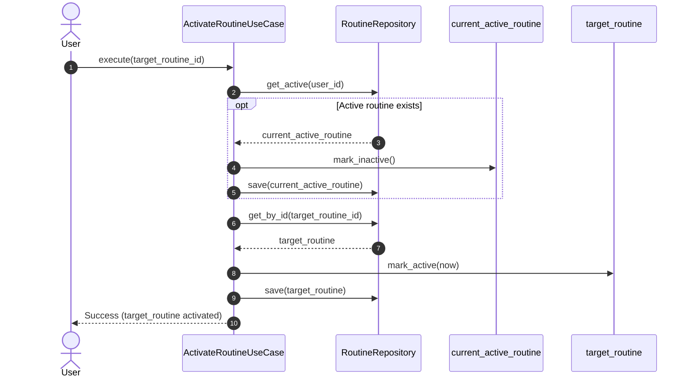
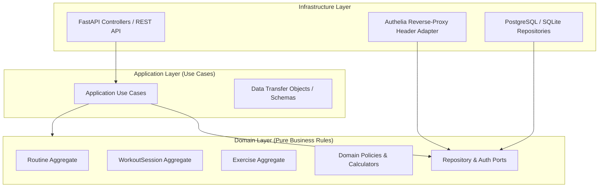

# Praxis — Domain Model & OOP Design Specification

**Document Version:** 1.0.1  
**Date:** 2026-09-24  
**Status:** Approved Domain Design Baseline  
**Previous Version:** [praxis-domain-model.md](praxis-domain-model.md)  
**SRS Baseline:** [praxis-srs-v1.0.2.md](praxis-srs-v1.0.2.md)

---

> [!NOTE]
> ### Summary of Changes from v1.0.0
> 1. **Snapshot vs. Execution Mutability**: Clarified that `WorkoutSession` contains an immutable `SessionPrescriptionSnapshot` frozen upon initiation, while its execution performance state remains mutable until explicitly finalized (`Completed`, `Partially_Completed`, `Skipped`), at which point the entire session locks.
> 2. **Unified Prescription Snapshot**: Grouped frozen prescriptions and activities under a single session-level `SessionPrescriptionSnapshot` value object rather than scattering snapshot copies across individual performances.
> 3. **`Exercise` Promoted to Aggregate Root**: Recognized `Exercise` as an independent Aggregate Root with its own lifecycle, referenced by ID from prescriptions and performances.
> 4. **`User` Clarified as Ownership Entity**: Modeled `User` as an identity and profile entity, avoiding an oversized aggregate that contains all routines and sessions.
> 5. **`SessionActivity` & `ActivityPerformance` Entities**: Formally modeled non-set activities (warm-ups, cardio) across both the prescription layer (`SessionActivity`) and execution layer (`ActivityPerformance`).
> 6. **`DayKind` Cleanup**: Removed `Active Recovery` from `DayKind` (`Workout`, `Rest`, `Unscheduled`). Active recovery is represented as an activity or ad-hoc session.
> 7. **Phase Progression Model**: Broadened `Phase` from a narrow integer set modifier to a declarative specification supporting prescription overrides over defined week windows.
> 8. **Single-Active-Routine Invariant Placement**: Transferred the single-active-routine rule from `Routine` aggregate invariant to an Application Policy orchestrated by `ActivateRoutineUseCase`.
> 9. **Naming & Substitution Clarification**: Renamed to `planned_exercise_id` and `performed_exercise_id`. Established invariant: performance of substituted exercises contributes strictly to the `performed_exercise_id`'s historical log.
> 10. **Targeted Method Encapsulation**: Refactored `session.record_set(performance_id, set_data)` and `session.remove_set(performance_id, set_id)` to target performances and sets by ID.
> 11. **Metric Validation on `SetPerformance`**: Added metric type validation enforcing required fields (e.g., reps for weightlifting, duration for timed planks) to prevent nonsensical data combinations.
> 12. **Effort Scoping**: Scoped effort tracking strictly to optional `RIR` for MVP; deferred RPE.
> 13. **Milestone Scoping (1RM Deferred)**: Moved 1RM/PR estimation out of the core MVP calculation layer into Milestone 2, keeping MVP focused on factual history, metric-dependent workload, and adherence.
> 14. **Domain Behavioral Contracts**: Added explicit pre/post-conditions and state transition matrices for each aggregate.

---

## 1. Domain Topology & Class Diagram

Praxis enforces strict separation across the three temporal layers (**Prescription**, **Performance**, **Analysis**) while maintaining decoupled aggregate boundaries:

---

## 2. Classification: Entities vs. Value Objects

### 2.1. Value Objects

| Value Object | Structural Fields | Invariants & Validation Rules |
| :--- | :--- | :--- |
| `UserId` | `UUID / String` | Immutable non-empty opaque string. |
| `ExerciseId` | `UUID / String` | Unique identifier for canonical exercise movements. |
| `RoutineId` | `UUID / String` | Unique identifier for routine templates. |
| `SessionId` | `UUID / String` | Unique identifier for workout sessions. |
| `Weekday` | `Enum: Monday .. Sunday` | ISO-8601 integer representation (1–7). |
| `DayKind` | `Enum: Workout, Rest, Unscheduled` | Primary calendar classification. |
| `MetricType` | `Enum: RepsWeight, Duration, DistanceDuration` | Governs measurement and validation rules. |
| `RepRange` | `min_reps: Int, max_reps: Int` | `1 <= min_reps <= max_reps <= 200`. For fixed reps, `min_reps == max_reps`. |
| `Weight` | `value: Decimal, unit: Unit (KG, LBS)` | `value >= 0.0`. Implements lossless `.to_kg()` conversion. |
| `Duration` | `seconds: Int` | `seconds >= 0`. Whole-second granularity. |
| `Distance` | `meters: Decimal` | `meters >= 0.0`. |
| `RIR` | `value: Int` | `0 <= value <= 5` (Reps In Reserve). |
| `Phase` | `name: String, start_week: Int, end_week: Optional[Int], target_sets_override: Optional[Int]` | `start_week >= 1`. If `end_week` present, `start_week <= end_week`. |
| `SessionPrescriptionSnapshot` | Frozen copy of prescriptions, activities, and phase metadata | Fully immutable value object materialised at session initiation. |
| `PrescriptionSnapshotItem` | `prescription_id, exercise_id, exercise_name, target_sets, rep_range, target_duration, target_weight, order_index` | Immutable representation of a single prescribed movement. |
| `ActivitySnapshotItem` | `activity_id, name, description, target_duration, order_index` | Immutable representation of a prescribed session activity. |
| `SubstitutionContext` | `original_exercise_id: ExerciseId, reason: String, substituted_at: DateTime` | Immutable audit trail of an on-the-fly exercise change. |

### 2.2. Entities & Aggregate Roots

1. **`Exercise` (Aggregate Root)**: Canonical movement definition with name, muscle group, equipment, default metric hint, and instructional cues.
2. **`Routine` (Aggregate Root)**: Reusable schedule template containing 7 `WorkoutDay` entities and progression `Phase` definitions.
3. **`WorkoutSession` (Aggregate Root)**: Historical training occurrence containing a frozen prescription snapshot and executing child entities (`ExercisePerformance`, `ActivityPerformance`, `SetPerformance`).
4. **`User` (Identity Entity)**: System boundary actor owning user preferences and domain references.

---

## 3. Aggregate Boundaries & Encapsulation Rules

### Boundary Rule 1: `Routine` Aggregate
- Encapsulates `WorkoutDay`, `ExercisePrescription`, `SessionActivity`, and `Phase`.
- Prescriptions cannot be modified from outside without passing through `Routine` methods.
- Has **zero knowledge** of past or active `WorkoutSession` instances.
- Does not enforce global uniqueness of the active routine; activation state is modified via `mark_active()` and orchestrated by `ActivateRoutineUseCase`.

### Boundary Rule 2: `WorkoutSession` Aggregate
- Encapsulates `SessionPrescriptionSnapshot`, `ExercisePerformance`, `SetPerformance`, and `ActivityPerformance`.
- All modifications to performance state (recording sets, removing sets, swapping exercises, checking off activities) must be executed through methods on `WorkoutSession`.
- **Targeted Operations**: Sets are recorded against a specific `ExercisePerformanceId`, preventing ambiguity between planned and substituted exercises.
- **Set Identity Invariant**: Sets possess a unique `SetPerformanceId`. Removing a set operates on `set_id`; display order numbers are derived dynamically from sequence position.

### Boundary Rule 3: `Exercise` Aggregate
- Independent aggregate root. Modifying an exercise's instructions or category never mutates existing prescriptions or historical performances (which store snapshot names and IDs).

---

## 4. Metric Validation on `SetPerformance`

To prevent data corruption (e.g. logging 70kg on a timed Plank), `SetPerformance` creation is governed by a **Metric Validation Policy**:

---

## 5. Domain Behavioral Contracts & State Machines

### 5.1. `WorkoutSession` Lifecycle State Machine

### 5.2. Behavioral Contracts

#### `WorkoutSession.record_set`
- **Signature**: `record_set(performance_id: ExercisePerformanceId, set_data: SetData) -> SetPerformance`
- **Preconditions**:
  - `self.status == SessionStatus.In_Progress` (error if finalized).
  - `performance_id` exists within `self.exercises`.
  - `set_data` satisfies `MetricValidationPolicy` for the exercise's `MetricType`.
- **Postconditions**:
  - New `SetPerformance` instance appended to matching `ExercisePerformance.sets`.
  - Returns created `SetPerformance`.

#### `WorkoutSession.remove_set`
- **Signature**: `remove_set(performance_id: ExercisePerformanceId, set_id: SetPerformanceId) -> None`
- **Preconditions**:
  - `self.status == SessionStatus.In_Progress`.
  - `set_id` exists in `performance_id`.
- **Postconditions**:
  - `SetPerformance` matching `set_id` is removed.

#### `WorkoutSession.substitute_exercise`
- **Signature**: `substitute_exercise(performance_id: ExercisePerformanceId, new_exercise_id: ExerciseId, reason: String) -> None`
- **Preconditions**:
  - `self.status == SessionStatus.In_Progress`.
  - `performance_id.sets` is empty (substitution must occur before logging sets on that performance).
- **Postconditions**:
  - `performance.performed_exercise_id = new_exercise_id`.
  - `performance.substitution = SubstitutionContext(original_exercise_id, reason, now)`.

#### `WorkoutSession.finish`
- **Signature**: `finish(completion_policy: CompletionPolicy, override_status: Optional[SessionStatus] = None) -> CompletionResult`
- **Preconditions**:
  - `self.status == SessionStatus.In_Progress`.
- **Postconditions**:
  - If `override_status` is provided: `self.status = override_status`.
  - Else: `self.status = completion_policy.evaluate(self).suggested_status`.
  - `self.finished_at = now`.
  - Session becomes locked against further mutation.

#### `WorkoutSession.skip`
- **Signature**: `skip(reason: String) -> None`
- **Preconditions**:
  - `self.status == SessionStatus.In_Progress` and no sets have been logged.
- **Postconditions**:
  - `self.status = SessionStatus.Skipped`.
  - `self.finished_at = now`.
  - `self.notes = reason`.

---

## 6. Domain Policies & Derivations

### 6.1. `SessionSnapshotFactory`
Materializes a `WorkoutSession` from a scheduled `WorkoutDay`:
1. Determines elapsed weeks since routine activation:
   $$\text{week\_index} = \left\lfloor \frac{\text{session\_date} - \text{routine.activated\_at.date}}{7} \right\rfloor + 1$$
2. Queries `routine.get_current_phase(session_date)` to resolve active phase and target set overrides (e.g. 3 sets vs 4 sets).
3. Freezes `SessionPrescriptionSnapshot` containing all prescribed exercises and activities.
4. Generates an initial `ExercisePerformance` entity for each prescribed exercise, setting both `planned_exercise_id` and `performed_exercise_id` to the prescribed exercise ID.
5. Generates an initial `ActivityPerformance` for each prescribed activity.
6. Returns `WorkoutSession` in `In_Progress` status.

### 6.2. `CompletionPolicy` (Set-Intent Evaluation)
Evaluates whether a session achieved full or partial completion:
- **Exercise Complete**: Evaluated as complete if $\text{count}(\text{valid sets logged}) \ge \text{target sets from snapshot}$.
- **Suggested Status**:
  - If $100\%$ of prescribed exercises are complete $\rightarrow$ `Completed`.
  - If $>0$ sets logged but $<100\%$ prescribed exercises complete $\rightarrow$ `Partially_Completed`.

### 6.3. `WorkloadCalculator`
Calculates metric-dependent physical workload:
- **Weighted Volume**: $\sum_{i} (\text{actual\_reps}_i \times \text{actual\_weight}_i\text{.to\_kg()})$
- **Duration Workload**: $\sum_{i} \text{actual\_duration}_i\text{.seconds}$
- **Distance Workload**: $\sum_{i} \text{actual\_distance}_i\text{.meters}$

### 6.4. `AdherenceCalculator`
Calculates objective habit consistency over a window $[T_{\text{start}}, T_{\text{end}}]$:
$$\text{Scheduled Count} = N_{\text{scheduled}}$$
$$\text{Completion Rate} = \frac{N_{\text{completed}}}{N_{\text{scheduled}}}$$
$$\text{Partial Rate} = \frac{N_{\text{partially\_completed}}}{N_{\text{scheduled}}}$$
$$\text{Skip Rate} = \frac{N_{\text{skipped}}}{N_{\text{scheduled}}}$$
$$\text{Set Adherence Rate} = \frac{\sum \text{Sets Performed}}{\sum \text{Sets Prescribed}}$$

---

## 7. Application Use Cases (Interactors)

### Complete Use Case Inventory

1. **`CreateRoutineUseCase(user_id, name, schedule_spec, phases)`**: Creates new `Routine` aggregate.
2. **`ActivateRoutineUseCase(user_id, routine_id)`**: Enforces the single-active-routine policy by deactivating the current active routine before activating the target routine.
3. **`InitiateWorkoutUseCase(user_id, date)`**: Calls `SessionSnapshotFactory` and saves new `WorkoutSession`.
4. **`RecordSetUseCase(user_id, session_id, performance_id, set_data)`**: Appends validated set to performance.
5. **`RemoveSetUseCase(user_id, session_id, performance_id, set_id)`**: Removes set by identity.
6. **`SubstituteExerciseUseCase(user_id, session_id, performance_id, new_exercise_id, reason)`**: Records substitution.
7. **`AddAdHocExerciseUseCase(user_id, session_id, exercise_id)`**: Appends unscheduled exercise to active session.
8. **`RecordActivityUseCase(user_id, session_id, activity_perf_id, actual_duration, actual_dist, notes)`**: Logs activity completion.
9. **`FinishWorkoutUseCase(user_id, session_id, override_status=None)`**: Evaluates completion via `CompletionPolicy` and finalizes session.
10. **`SkipWorkoutUseCase(user_id, date, reason)`**: Records skipped session.
11. **`QueryWeeklyCalendarUseCase(user_id, start_date, end_date)`**: Returns projected `ScheduledWorkout` items alongside recorded `WorkoutSession` instances.
12. **`QueryExerciseHistoryUseCase(user_id, exercise_id)`**: Returns historical performances where `performed_exercise_id == exercise_id`.
13. **`CalculateAdherenceUseCase(user_id, start_date, end_date)`**: Generates factual adherence metrics.

---

## 8. Clean Architecture Dependency Graph

