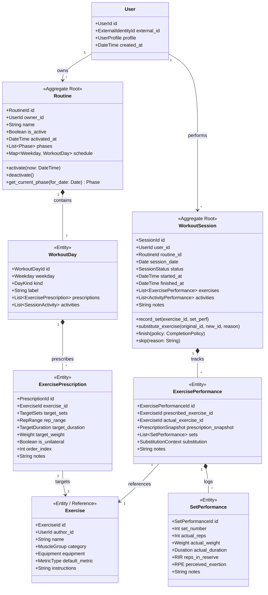
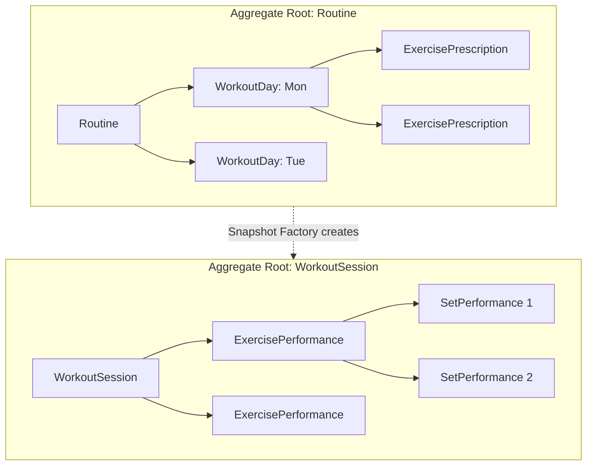
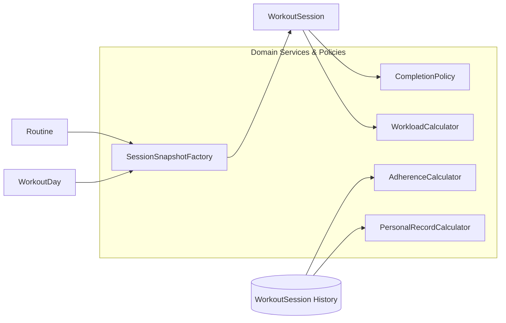
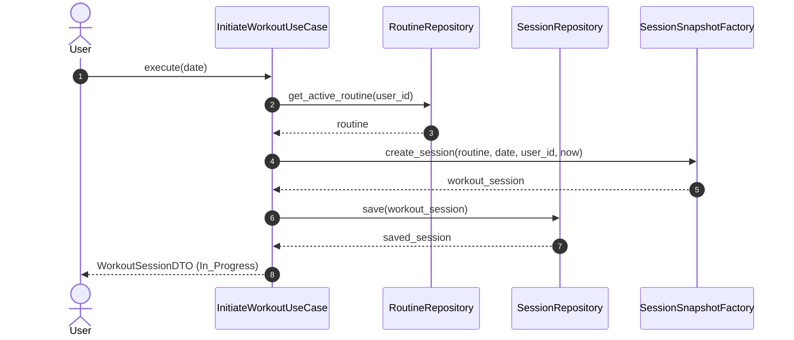
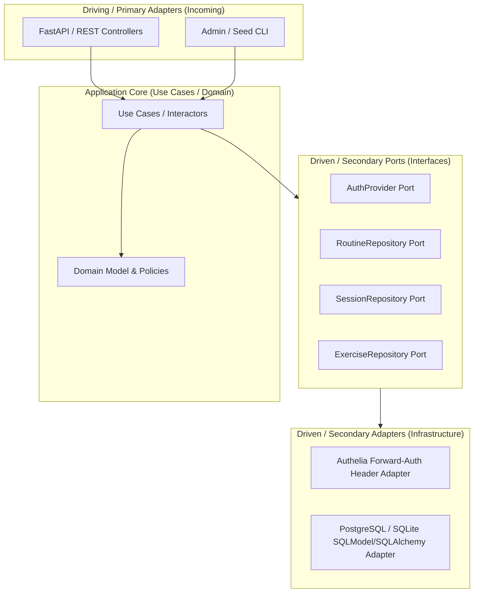

# Praxis — Domain Model & OOP Design Specification

**Document Version:** 1.0.0  
**Date:** 2026-09-24  
**Status:** Approved Domain Design Baseline  
**Prerequisite:** [praxis-srs.md](praxis-srs.md)

---

## 1. Domain Topology & Conceptual Overview

Praxis translates user intent into physical performance and derived analytical insight. The architecture strictly enforces boundaries across three temporal layers:



---

## 2. Classification: Entities vs. Value Objects

To eliminate mutable identity bugs and enforce domain integrity, elements are strictly separated into **Entities** (having unique identity, lifecycle, and mutable state governed by methods) and **Value Objects** (immutable descriptors compared purely by value, with structural validation).

### 2.1. Value Objects

| Value Object | Structural Fields | Invariants & Validation Rules |
| :--- | :--- | :--- |
| `UserId` | `UUID / String` | Non-empty, opaque string representing domain user identity. |
| `Weekday` | `Enum: Monday .. Sunday` | ISO-8601 weekday integer representation (1–7). |
| `DayKind` | `Enum: Workout, Rest, Unscheduled` | Categorizes scheduling nature of the calendar day. |
| `RepRange` | `min_reps: Int, max_reps: Int` | `1 <= min_reps <= max_reps <= 200`. If fixed reps (e.g. 12), `min_reps == max_reps`. |
| `Weight` | `value: Decimal, unit: Unit (KG, LBS)` | `value >= 0.0`. Provides explicit conversions between KG and LBS. |
| `Duration` | `seconds: Int` | `seconds >= 0`. Expressed in whole seconds. |
| `RIR` | `value: Int` | `0 <= value <= 10` (Reps In Reserve). |
| `RPE` | `value: Decimal` | `1.0 <= value <= 10.0` (Rating of Perceived Exertion). |
| `Phase` | `name: String, start_week: Int, end_week: Optional[Int], set_modifier: Int` | `start_week >= 1`. If `end_week` is present, `start_week <= end_week`. Governs prescribed set counts. |
| `PrescriptionSnapshot` | Frozen copy of prescribed sets, reps, weight, duration, cues | Completely immutable value object frozen upon session creation. |
| `SubstitutionContext` | `original_exercise_id: ExerciseId, reason: String` | Records why an exercise was swapped during live execution. |

### 2.2. Entities

- **`User`**: Root user entity owning preferences and data references.
- **`Exercise`**: Canonical catalog entry for a physical movement.
- **`Routine`**: Root aggregate managing weekly schedules and phase definitions.
- **`WorkoutDay`**: Child entity of `Routine` defining prescriptions for a given weekday.
- **`ExercisePrescription`**: Child entity of `WorkoutDay` prescribing targets for an exercise.
- **`WorkoutSession`**: Root aggregate representing a concrete training event.
- **`ExercisePerformance`**: Child entity of `WorkoutSession` capturing logged work for one exercise.
- **`SetPerformance`**: Child entity of `ExercisePerformance` capturing an individual set's execution metrics.

---

## 3. Aggregate Boundaries & Encapsulation



### Boundary Rule 1: `Routine` Aggregate
- **Root**: `Routine`.
- **Enclosed**: `WorkoutDay`, `ExercisePrescription`, `SessionActivity`, `Phase`.
- **Encapsulation Rules**:
  - External code cannot mutate `ExercisePrescription` directly; it calls methods on `Routine` (e.g., `routine.add_prescription(weekday, prescription)`).
  - `Routine` has **zero references** to `WorkoutSession` or historical performance data.
  - Modifying a `Routine` never triggers side-effects in past or in-progress `WorkoutSession` instances.

### Boundary Rule 2: `WorkoutSession` Aggregate
- **Root**: `WorkoutSession`.
- **Enclosed**: `ExercisePerformance`, `SetPerformance`, `ActivityPerformance`.
- **Encapsulation Rules**:
  - `WorkoutSession` is the sole boundary through which sets and exercise substitutions are recorded:
    - `session.record_set(exercise_id, set_data)`
    - `session.substitute_exercise(original_exercise_id, new_exercise_id, reason)`
    - `session.add_ad_hoc_exercise(exercise_id)`
    - `session.finish(completion_policy)`
  - Direct manipulation of inner `SetPerformance` instances outside the aggregate boundary is prohibited.

---

## 4. Detailed Specification of Key Objects

### 4.1. `Routine` (Aggregate Root)
1. **Identity**: `RoutineId` (UUID).
2. **State**:
   - `owner_id`: `UserId`
   - `name`: string
   - `is_active`: bool
   - `activated_at`: optional `DateTime`
   - `schedule`: dictionary mapping each `Weekday` (1..7) to a `WorkoutDay`
   - `phases`: ordered list of `Phase` value objects
3. **Invariants**:
   - A routine must contain entries for all 7 weekdays.
   - `activated_at` must be populated if and only if `is_active == True`.
   - Phases must not have overlapping week intervals.
4. **Behavior**:
   - `activate(now: DateTime)`: Sets `is_active = True`, records `activated_at = now`.
   - `deactivate()`: Sets `is_active = False`, clears `activated_at`.
   - `resolve_phase(for_date: Date) -> Phase`: Calculates elapsed weeks:
     $$\text{weeks\_elapsed} = \left\lfloor \frac{\text{for\_date} - \text{activated\_at.date}}{7} \right\rfloor + 1$$
     Returns the matching `Phase`.
   - `configure_workout_day(weekday, label, kind)`: Reconfigures a day (e.g. converting Sunday to Rest).
5. **Relationships**: Owns 7 `WorkoutDay` entities; references `UserId`.
6. **Lifecycle**: Created $\rightarrow$ Draft $\rightarrow$ Active $\leftrightarrow$ Inactive $\rightarrow$ Archived.
7. **Allowed to Mutate**: Its own schedule, days, prescriptions, and phases.
8. **Forbidden Knowledge**: Has no knowledge of `WorkoutSession`, calendar logs, or historical set recordings.

---

### 4.2. `WorkoutDay` (Entity within Routine)
1. **Identity**: `WorkoutDayId` (UUID).
2. **State**:
   - `weekday`: `Weekday`
   - `kind`: `DayKind` (`Workout`, `Rest`, `Unscheduled`)
   - `label`: string (e.g. *"Cuádriceps / Glúteo"*, *"Descanso"*)
   - `prescriptions`: list of `ExercisePrescription`
   - `activities`: list of `SessionActivity`
3. **Invariants**:
   - If `kind == Rest` or `Unscheduled`, `prescriptions` must be empty.
   - Prescription ordering indices must be unique and sequential without gaps.
4. **Behavior**:
   - `add_prescription(exercise_id, target_sets, rep_range, ...)`
   - `remove_prescription(prescription_id)`
   - `reorder_prescriptions(ordered_ids: List[PrescriptionId])`
   - `add_activity(description, duration)`
5. **Relationships**: Child of `Routine`. References `ExerciseId`.
6. **Lifecycle**: Co-terminous with parent `Routine`.

---

### 4.3. `Exercise` (Entity / Reference Data)
1. **Identity**: `ExerciseId` (UUID).
2. **State**:
   - `author_id`: optional `UserId` (null if system-seeded)
   - `name`: string (e.g. *"Sentadilla búlgara en Smith"*)
   - `category`: `MuscleGroup`
   - `equipment`: `Equipment`
   - `default_metric`: `MetricType` (`RepsWeight`, `Duration`, `DistanceDuration`)
   - `instructions`: string
3. **Invariants**:
   - `name` cannot be blank.
   - System exercises (`author_id == null`) are immutable by regular users.
4. **Behavior**:
   - `update_metadata(name, category, equipment, default_metric, instructions)` (only permitted if user is author).
5. **Forbidden Knowledge**: Has no awareness of prescriptions, workouts, or performance history.

---

### 4.4. `WorkoutSession` (Aggregate Root)
1. **Identity**: `SessionId` (UUID).
2. **State**:
   - `user_id`: `UserId`
   - `routine_id`: optional `RoutineId` (null if spontaneous/ad-hoc)
   - `session_date`: `Date`
   - `status`: `SessionStatus` (`In_Progress`, `Completed`, `Partially_Completed`, `Skipped`)
   - `started_at`: `DateTime`
   - `finished_at`: optional `DateTime`
   - `exercises`: ordered list of `ExercisePerformance`
   - `activities`: list of `ActivityPerformance`
   - `notes`: string
3. **Invariants**:
   - If `status == In_Progress`, `finished_at` must be null.
   - If `status in (Completed, Partially_Completed)`, `finished_at` must be $\ge$ `started_at`.
   - Once marked `Completed`, `Partially_Completed`, or `Skipped`, the session is locked against further set modifications.
4. **Behavior**:
   - `record_set(exercise_id, set_number, reps, weight, duration, rir, notes) -> SetPerformance`
   - `substitute_exercise(original_exercise_id, new_exercise_id, reason)`
   - `add_ad_hoc_exercise(exercise_id)`
   - `finish(completion_policy: CompletionPolicy) -> CompletionResult`: Evaluates completion, transitions status, and sets `finished_at = now`.
   - `skip(reason: String)`: Transitions status to `Skipped` and records reason.
5. **Allowed to Mutate**: Child `ExercisePerformance` and `SetPerformance` entities.
6. **Forbidden Knowledge**: Knows nothing about future routines, upcoming calendar days, or external authentication providers.

---

### 4.5. `ExercisePerformance` (Entity within WorkoutSession)
1. **Identity**: `ExercisePerformanceId` (UUID).
2. **State**:
   - `prescribed_exercise_id`: optional `ExerciseId` (null if ad-hoc addition)
   - `actual_exercise_id`: `ExerciseId`
   - `prescription_snapshot`: optional `PrescriptionSnapshot`
   - `sets`: list of `SetPerformance`
   - `substitution`: optional `SubstitutionContext`
   - `notes`: string
3. **Invariants**:
   - If substituted, `substitution` must be present and `actual_exercise_id != prescribed_exercise_id`.
   - Set numbers must be strictly sequential starting from 1.
4. **Behavior**:
   - `append_set(reps, weight, duration, rir, notes)`
   - `remove_set(set_number)`
   - `calculate_workload() -> Workload`

---

## 5. Domain Policies and Domain Services

Domain rules that coordinate across entities or encapsulate algorithmic derivations are extracted into **Domain Services & Policies**:



### 5.1. `SessionSnapshotFactory`
- **Role**: Factory domain service responsible for materializing a `WorkoutSession` from a `Routine`'s scheduled `WorkoutDay`.
- **Contract**:
  ```python
  def create_session(
      routine: Routine,
      for_date: Date,
      user_id: UserId,
      now: DateTime
  ) -> WorkoutSession
  ```
- **Rules**:
  1. Identifies the weekday for `for_date`.
  2. Queries `routine.get_current_phase(for_date)` to determine current phase modifiers (e.g. 3 sets vs 4 sets).
  3. Deep-copies prescriptions and activities into frozen `PrescriptionSnapshot` value objects inside `ExercisePerformance` entities.
  4. Returns a fresh `WorkoutSession` in `In_Progress` state.

---

### 5.2. `CompletionPolicy`
- **Role**: Implements the set-intent evaluation policy to evaluate completion status.
- **Contract**:
  ```python
  def evaluate(session: WorkoutSession) -> CompletionEvaluation:
      # Returns:
      # - suggested_status: Completed | Partially_Completed
      # - total_prescribed_sets: Int
      # - total_logged_sets: Int
      # - completed_exercise_count: Int
      # - total_prescribed_exercises: Int
  ```
- **Rules**:
  1. An exercise is complete if count of logged sets $\ge$ prescribed sets (adjusted by active phase) and sets represent attempted work.
  2. The session is `Completed` if all prescribed exercises are complete.
  3. The session is `Partially_Completed` if $>0$ sets were logged but some prescribed exercises/sets were omitted.

---

### 5.3. `WorkloadCalculator`
- **Role**: Computes metric-dependent physical workload for performances and sessions without conflating units.
- **Contract**:
  ```python
  def calculate_set_workload(set_perf: SetPerformance) -> Workload
  def calculate_session_workload(session: WorkoutSession) -> SessionWorkload
  ```
- **Calculations**:
  - **Weighted Volume (Tonnage)**: $\sum (\text{actual\_reps} \times \text{actual\_weight.to\_kg()})$
  - **Cumulative Duration**: $\sum \text{actual\_duration.seconds}$
  - **Distance**: $\sum \text{actual\_distance}$

---

### 5.4. `AdherenceCalculator`
- **Role**: Pure derivation service calculating factual consistency rates over an evaluation window.
- **Contract**:
  ```python
  def calculate_adherence(
      scheduled_count: int,
      sessions: List[WorkoutSession]
  ) -> AdherenceReport
  ```
- **Formulas**:
  - `completed_rate = count(Completed) / scheduled_count`
  - `partial_rate = count(Partially_Completed) / scheduled_count`
  - `skip_rate = count(Skipped) / scheduled_count`
  - `set_adherence = total_sets_performed / total_sets_prescribed`

---

### 5.5. `PersonalRecordCalculator`
- **Role**: Scans historical `WorkoutSession` instances to derive personal bests for a specific `ExerciseId`.
- **Derivations**:
  - **Peak Weight Lifted**: $\max(\text{actual\_weight})$ across all sets.
  - **Peak Volume in Single Set**: $\max(\text{reps} \times \text{weight})$.
  - **Estimated 1RM (Epley)**: $\max\left(\text{weight} \times \left(1 + \frac{\text{reps}}{30}\right)\right)$ for sets where $1 \le \text{reps} \le 10$.

---

## 6. Core Application Use Cases (Interactors)

Below are the primary transactional boundaries orchestrating domain entities and repositories:



### Use Case Inventory

1. **`CreateRoutine(user_id, name, schedule_spec, phases)`**: Instantiates and persists a new `Routine`.
2. **`ActivateRoutine(user_id, routine_id)`**: Deactivates any currently active routine for the user and activates the specified routine.
3. **`InitiateWorkout(user_id, date)`**: Finds active routine, invokes `SessionSnapshotFactory`, and persists the new in-progress `WorkoutSession`.
4. **`RecordSet(user_id, session_id, exercise_id, set_data)`**: Loads `WorkoutSession`, appends set via `session.record_set(...)`, and saves.
5. **`SubstituteExercise(user_id, session_id, original_id, new_id, reason)`**: Records substitution on the active session without altering `Routine`.
6. **`FinishWorkout(user_id, session_id, override_status=None)`**: Evaluates completion via `CompletionPolicy`, marks session finished, and persists.
7. **`SkipWorkout(user_id, date, reason)`**: Creates or marks a session as `Skipped`.
8. **`QueryWeeklyCalendar(user_id, start_date, end_date)`**: Merges active routine's projected `ScheduledWorkout` items with recorded `WorkoutSession` instances for the calendar grid.
9. **`QueryExerciseProgression(user_id, exercise_id)`**: Loads history for `exercise_id`, computes workload and PR trends via domain services, and returns time-series data.
10. **`CalculateAdherenceReport(user_id, window_start, window_end)`**: Runs `AdherenceCalculator` over the specified historical date range.

---

## 7. Ports & Adapters Architecture (Hexagonal)



### Port Definitions:
- `AuthProvider`: Resolves external identity headers (`Remote-User`, `Remote-Email`) into a domain `UserId`.
- `RoutineRepository`: `save(routine)`, `get_by_id(id)`, `get_active(user_id)`.
- `WorkoutSessionRepository`: `save(session)`, `get_by_id(id)`, `find_by_user_and_date(user_id, date)`, `find_history_by_exercise(user_id, exercise_id)`.
- `ExerciseRepository`: `save(exercise)`, `get_by_id(id)`, `list_catalog(user_id)`.
