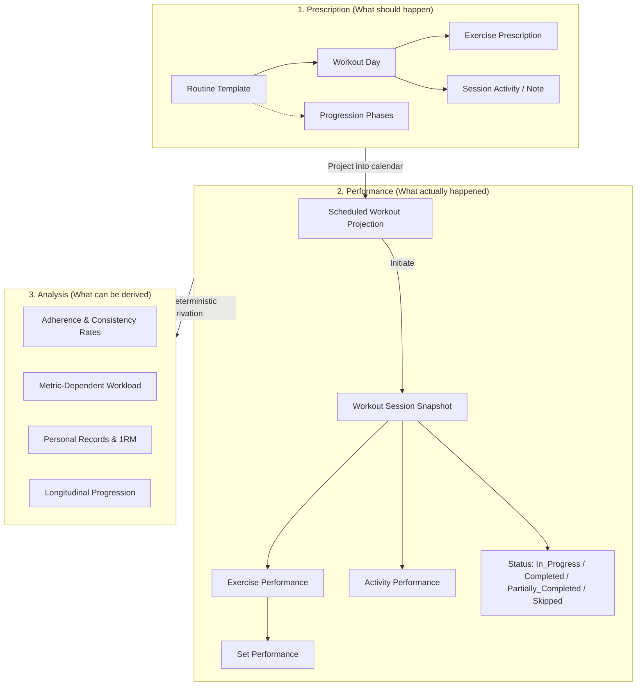

# Software Requirements Specification (SRS)
## Project: Praxis — Personal Workout & Habit Tracking Platform

**Version:** 1.0.0-draft  
**Date:** 2026-09-24  
**Status:** Draft Baseline  

---

## 1. Executive Summary & Domain Philosophy

**Praxis** (from the Greek/Latin for *"the practical application of a plan"*) is a self-hosted workout execution and habit tracking system designed to run in a homelab environment.

Unlike typical fitness trackers that conflate what was planned with what was performed, Praxis is architected around a strict **Three-Layer Temporal Model**:

---

## 2. Core Domain Glossary

| Term | Definition |
| :--- | :--- |
| **User** | Internal domain actor owning routines, exercise customizations, and workout history. |
| **Routine** | Reusable weekly schedule template specifying which weekdays have workouts, rest, or unscheduled days. |
| **Phase** | Temporal cycle within a routine (e.g., Weeks 1–2 vs. Week 3+) that governs progression rules such as prescribed set volumes based on elapsed calendar weeks since routine activation. |
| **Exercise** | Canonical movement definition with category, target muscle group, equipment, and default measurement type hint. |
| **Exercise Prescription** | Plan for an exercise on a workout day: target sets, target reps/duration, target weight/effort, order, and notes. |
| **Session Activity** | Non-set prescribed instruction or movement (e.g., articular warm-up, post-workout cardio, mobility). |
| **Scheduled Workout** | Projection of a routine's workout day onto a specific calendar date before physical initiation. |
| **Workout Session** | Concrete historical occurrence of physical training on a calendar date. Created upon initiation as an immutable snapshot of the prescribed work. |
| **Exercise Performance** | Concrete execution of an exercise within a session, containing one or more logged sets and optional substitution context. |
| **Set Performance** | Concrete logged set recording actual repetitions, actual weight, duration, RIR/effort, and set notes. |
| **Adherence** | Set of factual metrics tracking scheduled sessions vs completed, partial, and skipped sessions over an evaluation window. |
| **Workload** | Metric-dependent measure of physical work performed (weighted volume $\sum \text{reps} \times \text{weight}$, cumulative duration in seconds, or distance). |

---

## 3. Fundamental Domain Invariants

1. **Snapshot Immutability**: Historical `WorkoutSession` records and their contained performances are immutable with respect to future changes in `Routine` templates. Editing a routine never alters past or in-progress sessions.
2. **Session Autonomy**: During an active workout session, a user has total autonomy to deviate from prescribed sets, reps, and weights, swap exercises, add unscheduled exercises, or omit exercises without mutating the parent `Routine`.
3. **Decoupled Identity**: The core domain depends only on an internal `User` identifier and profile. External identity provider specifics (LLDAP, Authelia, OAuth2) are isolated behind an `AuthProvider` port.
4. **Single Active Routine Driving Schedule**: A user may curate an arbitrary library of routines, but at any given date, at most one routine is marked `Active` to generate scheduled workout projections on the calendar.
5. **Derived Analysis Invariant**: Progress metrics (workload, adherence, estimated 1RM, personal records) are never stored as mutable counters; they are purely derived functions of immutable historical `WorkoutSession` records.
6. **Separation of Schedule and Session**: A `ScheduledWorkout` is a projected calendar event. A `WorkoutSession` comes into existence only upon explicit initiation or ad-hoc workout creation.

---

## 4. Detailed Functional Requirements

### 4.1. Identity & External Authentication (Ports & Adapters)
- **FR-AUTH-1**: The backend shall decouple authentication from core business logic via an `IdentityAdapter` / `AuthProvider` interface.
- **FR-AUTH-2**: The system shall ship with a reverse-proxy header adapter (consuming headers such as `Remote-User`, `Remote-Email`, `Remote-Name` passed by Authelia/Nginx/Traefik).
- **FR-AUTH-3**: The system shall automatically provision or sync an internal `User` profile upon receiving a valid authenticated request from an external identity.
- **FR-AUTH-4**: The domain model shall be agnostic to credential storage; no passwords, hashes, or SSO credentials shall be persisted in the Praxis domain database.

### 4.2. Exercise Catalog Management
- **FR-EX-1**: The system shall ship with a pre-seeded catalog of standard exercises, covering all exercises from the reference training program.
- **FR-EX-2**: Users shall be able to create custom exercises and edit their own custom definitions.
- **FR-EX-3**: Each exercise shall specify:
  - `name`: string
  - `category` / `muscle_group`: (e.g., *Cuádriceps, Glúteo, Espalda, Hombro, Isquiotibiales, Pecho, Brazos, Core, Cardio*)
  - `equipment`: (e.g., *Smith machine, Dumbbell, Barbell, Cable/Machine, Band, Bodyweight*)
  - `default_metric_type`: default hint (*Reps-Weight*, *Duration*, *Distance-Duration*)
  - `instructions` / `cues`: optional text

### 4.3. Routine & Phase Management
- **FR-RT-1**: Users can create, clone, rename, archive, and delete multiple routines.
- **FR-RT-2**: Exactly one routine can be set as `Active` per user at any given time.
- **FR-RT-3**: A routine defines a 7-day weekly schedule (`Monday` through `Sunday`). Each weekday can be assigned as:
  - `Workout Day`
  - `Rest Day`
  - `Unscheduled Day`
- **FR-RT-4**: A Workout Day within a routine contains an ordered list of:
  - **Exercise Prescriptions**: Target sets, target repetitions (or rep ranges, e.g. 10–12), optional target weight, optional unilateral indicator (`each leg / cada pie`), order index, and prescription notes.
  - **Session Activities / Instructions**: General instructions (e.g., *"Articular warm-up before session"* or *"15–20 min stationary bike or elliptical at moderate pace"*).
- **FR-RT-5 (Progression Phases)**: Routines support declarative phases (e.g., Phase 1: Weeks 1–2 prescribing 3 sets; Phase 2: Week 3+ prescribing 4 sets). The active phase is determined deterministically by elapsed calendar weeks from the routine's activation date:
  $$\text{Week Index} = \left\lfloor \frac{\text{Date} - \text{ActivationDate}}{7} \right\rfloor + 1$$

### 4.4. Calendar & Scheduling
- **FR-CAL-1**: The system shall provide an API for a weekly calendar view displaying projected `ScheduledWorkout` items alongside actual `WorkoutSession` instances across Monday–Sunday.
- **FR-CAL-2**: The calendar shall distinguish between `Scheduled Workout Day`, `Rest Day`, `Active Recovery`, and `Unscheduled Day`.
- **FR-CAL-3**: The calendar shall display historical weeks with immutable records of past performance.

### 4.5. Workout Execution & Runtime Logging
- **FR-LOG-1 (Snapshot on Initiation)**: When a user initiates a workout for a calendar day, Praxis generates a `WorkoutSession` snapshot copying the prescribed exercises, sets, target values, and activities.
- **FR-LOG-2 (Set-Level Performance)**: For each exercise, the user can log:
  - Set sequence number (1, 2, 3...)
  - Actual repetitions completed
  - Actual weight used (in user's preferred unit: kg or lbs)
  - Actual duration in seconds (for timed sets like Planks)
  - RIR (Reps in Reserve) or RPE (optional)
  - Set-level notes
- **FR-LOG-3 (Runtime Session Flexibility)**:
  - Users can append ad-hoc sets or remove prescribed sets.
  - Users can reorder exercises during execution.
  - Users can substitute an exercise on the fly with another exercise from the library, preserving the substitution event for auditing.
  - Users can add completely unscheduled exercises to the active session.
- **FR-LOG-4 (Ad-Hoc / Rest Day Logging)**: Users can initiate and log an ad-hoc session or active recovery (e.g., Sunday cycling) on any day without a prior scheduled prescription.
- **FR-LOG-5 (Session Notes & Deviations)**: Users can record session-level notes (e.g. *"Gym was crowded, had to swap Smith machine for dumbbells"* or *"Fatigued, stopped 1 set early"*).

### 4.6. Session Completion Semantics & Habit Adherence
- **FR-STAT-1**: A `WorkoutSession` transitions through lifecycle states:
  - `In_Progress` (user has initiated session and/or logged sets)
  - `Completed` (all prescribed exercises logged with full set intent)
  - `Partially_Completed` (session finished with at least one set logged, but some prescribed exercises/sets omitted)
  - `Skipped` (explicitly marked skipped by user or flagged when scheduled date has passed without initiation)
- **FR-STAT-2 (Set-Intent Completion Evaluation)**: An exercise is evaluated as complete when all prescribed sets have been attempted with honest effort (logging reps within target range or completing full sets short of failure with RIR/notes).
- **FR-STAT-3 (Smart Completion Suggestion)**: When the user calls "Finish Workout", the system evaluates logged work:
  - If 100% of prescribed sets/exercises completed $\rightarrow$ suggests `Completed`.
  - If $>0\%$ completed $\rightarrow$ suggests `Partially_Completed` with summary of completed vs omitted work.
  - User can confirm or override the final state.
- **FR-STAT-4 (Factual Adherence Metrics)**: Rather than an arbitrary weighted score, adherence is reported as factual distribution rates over a selected evaluation window:
  - `Completed Sessions Rate`: $N_{\text{completed}} / N_{\text{scheduled}}$
  - `Partial Sessions Rate`: $N_{\text{partial}} / N_{\text{scheduled}}$
  - `Skipped Sessions Rate`: $N_{\text{skipped}} / N_{\text{scheduled}}$
  - `Set Adherence Rate`: Total Sets Performed / Total Sets Prescribed

### 4.7. Progression & Performance Analytics
- **FR-ANL-1 (Exercise History)**: For any exercise, the user can query past performances (chronological history of weights, reps, sets, and workload).
- **FR-ANL-2 (Metric-Dependent Workload)**: For each session and per exercise, compute appropriate workload:
  - Weighted Repetitions: $\text{Volume} = \sum (\text{reps} \times \text{weight})$
  - Timed Exercises: $\text{Duration} = \sum \text{seconds}$
  - Distance: $\text{Distance} = \sum \text{kilometers/meters}$
- **FR-ANL-3 (Personal Records & Estimated 1RM)**: The system shall calculate personal bests per exercise:
  - Max Weight Lifted
  - Max Volume in a Single Session
  - Estimated 1RM using Brzycki or Epley formula:
    $$\text{1RM}_{\text{Epley}} = w \times \left(1 + \frac{r}{30}\right)$$
- **FR-ANL-4 (Trend Analytics)**: The system provides query endpoints for time-series trend analysis (weekly workload by muscle group, adherence rates by month, progression curves for core lifts).

---

## 5. Non-Functional & Architectural Requirements

- **NFR-ARCH-1 (API-First & Decoupled Frontend)**: The backend shall expose a clean, comprehensive REST/OpenAPI specification. The frontend is decoupled.
- **NFR-ARCH-2 (Clean / Hexagonal Architecture)**: Domain entities (`User`, `Routine`, `WorkoutSession`, `Exercise`) contain pure business rules with zero dependencies on database ORMs or web frameworks.
- **NFR-ARCH-3 (Self-Hosted / Containerized)**: Deployable as a single Docker container or Docker Compose service with minimal resource footprint (< 256MB RAM idle) suited for homelab micro-servers.
- **NFR-ARCH-4 (Zero External Cloud Reliance)**: Runs entirely on local infrastructure with SQLite or PostgreSQL; no third-party telemetry, proprietary clouds, or external API dependencies.
- **NFR-ARCH-5 (Data Portability)**: Users can export their entire history, routines, and exercises as JSON / CSV at any time.
