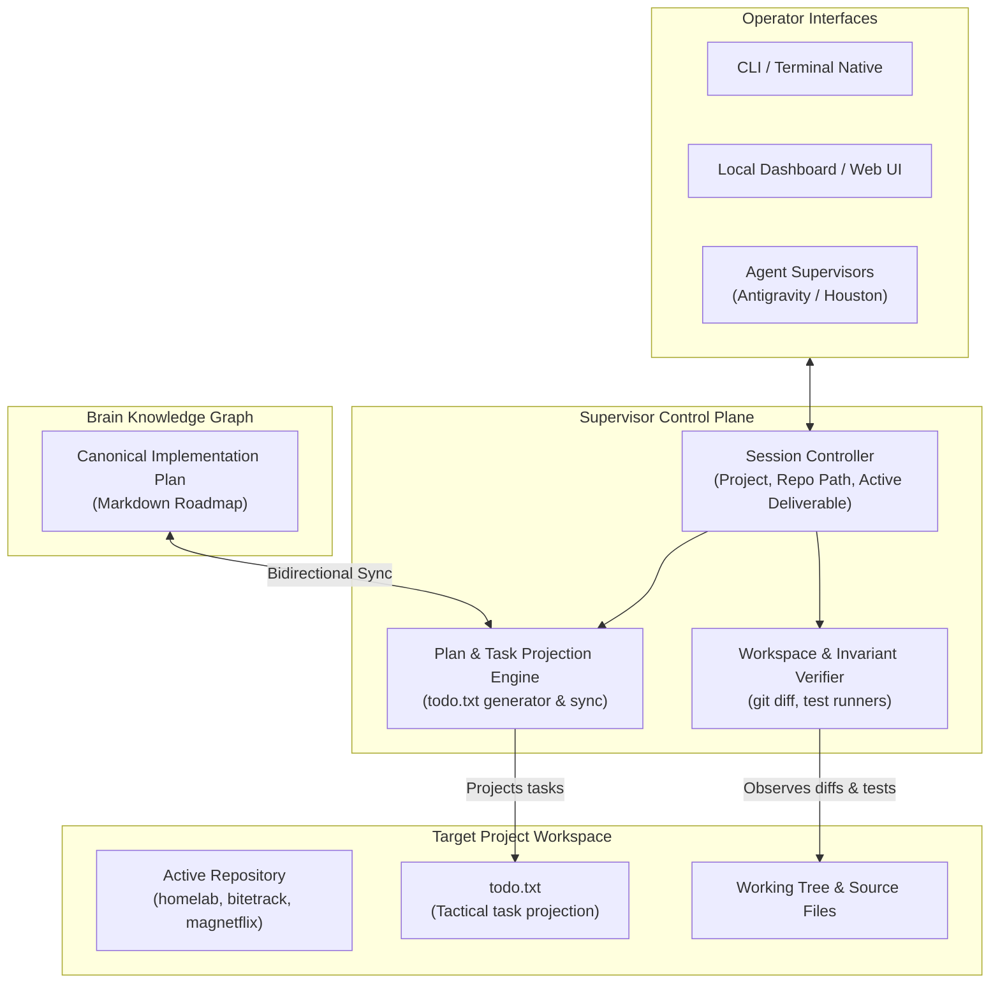

# 🛰️ Personal Engineering Progress & Implementation Supervisor

The **Supervisor** project encompasses the architecture, specifications, tools, and workflows for a project-agnostic engineering progress tracking and supervisory system.

The system bridges high-level architectural specifications in the Brain with ground-level code changes across any local repository, operating as a non-intrusive navigator, invariant verifier, and progress tracker.

---

## 🏛️ System Topology & Architecture

### Core Architecture Layers:
1. **Session & Focus Controller**: Tracks the active work session (target project, workspace directory, canonical plan, active deliverable, cadence, and deadlines).
2. **Plan & Task Projection Engine**: Translates canonical Brain markdown plans into compact, low-friction `todo.txt` tasks at the root of the active workspace, with bidirectional status sync.
3. **Workspace & Invariant Verifier**: Observes uncommitted git diffs, runs project-specific test invariants, and categorizes findings into Verified, In-Progress, or Violation states without generating unsolicited code.
4. **Operator Interfaces**: Surfaces progress feeds, invariant checks, and conversational queries through local dashboard views and agent tools.

---

## 📍 Source Code & Locations

| Target | Location / URL | Description |
| :--- | :--- | :--- |
| **Brain Plans** | [`projects/supervisor/plans/`](plans/) | Authoritative specifications and architectural designs |
| **Agent Customizations** | `~/.gemini/config/skills/` / `.agents/skills/` | Skill definitions and supervisor heuristics |
| **Active Target Repos** | `/home/kiskaadee/Projects/active/` | Monitored repositories (Core, MagNetFlix, nekoweb, etc.) |

---

## 💬 Open Discussions

Architectural inquiries and problem statements currently under evaluation that have **not yet produced an active implementation plan**:

* *(No unresolved discussions currently open)*

---

## 🚧 Work in Progress (Active Plans)

Implementation roadmaps currently in progress (`status: active`) that are actively being executed or scheduled for deployment:

1. 🟡 [**Personal Engineering Progress & Implementation Supervisor Specification**](plans/supervisor-system-specification.md) `[Active]`
   - Foundational requirements specification defining the problem, global goals, functional/non-functional requirements, and system boundaries.

---

## 🛠️ Canonical Guides & Runbooks

Operational procedures and step-by-step SOPs:

* *(Operational guides will be documented as the tool is implemented)*

---

## 🏛️ Completed Milestones & Resolved Discussions

Archived and foundational documentation for completed milestones:

* *(None yet; initial project bootstrap)*
