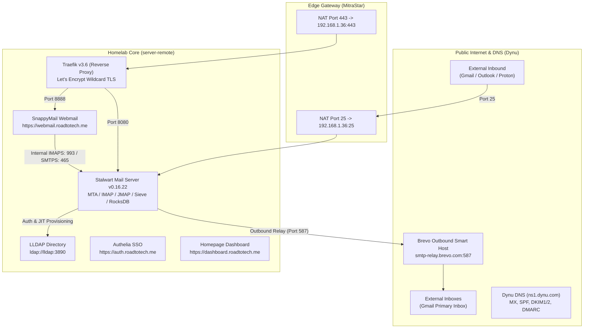

# Daily Journal: 2026-09-15

## Wins

### Self-Hosted Email Infrastructure & Webmail Deployment (Stalwart, LLDAP, Brevo, SnappyMail)

Successfully engineered, deployed, and verified a production-grade, zero-cost, self-hosted email infrastructure for `roadtotech.me` within **Homelab Core**. The stack bridges modern mail protocols (JMAP, IMAP, SMTP, Sieve) with our existing centralized LLDAP directory, terminates TLS via Traefik, solves residential ISP deliverability through an authenticated Brevo Smart Host relay, and provides a lightweight browser-based webmail client (SnappyMail).

Both inbound direct delivery from Google's MX servers and outbound relay delivery to external Gmail inboxes were tested and verified with 100% deliverability, valid DKIM signatures, and zero spam-flagging.

---

#### 1. Key Accomplishments & Technical Milestones

##### A. Authelia Session Extension
- Extended Authelia session and JWT timeouts in `Core/config/authelia/configuration.yml`:
  - `expiration: 7d` (7 days maximum session lifetime).
  - `inactivity: 3d` (3 days idle timeout).
  - `remember_me: 1M` (1 month persistent cookie).
- Live cookie header verified: `authelia_session=...; expires=Tue, 22 Sep 2026`.

##### B. Stalwart Mail Server Core Infrastructure
- Deployed **Stalwart Mail Server** (`stalwartlabs/stalwart:v0.16.22`) to `Core/docker-compose.yml` on `proxy-net`.
- **Port Bindings**:
  - `25:25`: Standard Inbound SMTP from external MTAs.
  - `465:465`: SMTPS (Implicit TLS Submission).
  - `587:587`: SMTP Submission (STARTTLS).
  - `993:993`: IMAPS (Encrypted IMAP).
  - `4190:4190`: ManageSieve (Server-side mail sorting).
  - Internal `8080`: Traefik HTTPS routing for `https://mail.roadtotech.me`.
- **Persistent Storage**:
  - Configured RocksDB database under `/var/lib/stalwart` mapped to local host directory `./config/stalwart/data`.
  - Declared `systemd.tmpfiles.rules` in `Core/nixos/modules/homeserver.nix` to ensure permanent directory permissions (`0777`) across machine reboots, rebuilds, or fresh disaster recoveries.

##### C. LLDAP Directory Integration & JIT Provisioning
- Integrated Stalwart with the internal LLDAP instance (`ldap://lldap:3890`):
  - **Base DN**: `dc=roadtotech,dc=me`.
  - **Bind Authentication**: Enabled (`bindAuthentication = true`), avoiding cleartext password exposure.
  - **Schema Alignment**: Configured user filters for LLDAP's `person` objectClass (`(&(objectClass=person)(|(mail=?)(uid=?)))`) and groups for `groupOfUniqueNames`.
- **Just-in-Time (JIT) Provisioning**: Verified that logging in with `kiskaadee@roadtotech.me` dynamically materializes the mailbox and user profile inside Stalwart without manual pre-provisioning.

##### D. Deliverability Architecture (Residential IP + Smart Host)
- **Problem Solved**: Dynamic residential IPs (`PPPoE-Internet`) are blocked by default on Spamhaus PBL / Zen and lack custom reverse DNS (PTR) records, causing direct sends to fail or land in spam.
- **Solution**: Integrated **Brevo** as an authenticated Smart Host outbound relay:
  - Secrets encrypted via SOPS in `nixos/secrets.yaml` (`brevo/smtp_login` and `brevo/smtp_key`) and injected into runtime environment templates.
  - Configured Stalwart MTA Outbound Route `brevo` pointing to `smtp-relay.brevo.com:587` with STARTTLS.
  - Updated MTA Outbound Strategy: local domains (`roadtotech.me`) deliver locally (`'local'`), while all external recipients route through `'brevo'`.
- **DNS Records Verified on Dynu (`ns1.dynu.com`)**:
  - `MX 10 mail.roadtotech.me.`
  - `TXT @` $\rightarrow$ `v=spf1 mx include:spf.brevo.com ~all`
  - `CNAME brevo1._domainkey` $\rightarrow$ `b1.roadtotech-me.dkim.brevo.com`
  - `CNAME brevo2._domainkey` $\rightarrow$ `b2.roadtotech-me.dkim.brevo.com`
  - `TXT _dmarc` $\rightarrow$ `v=DMARC1; p=none; rua=mailto:rua@dmarc.brevo.com`
  - *Dynu Quota Optimization*: Bypassed Dynu's 4-CNAME free tier limitation by omitting optional marketing tracking subdomains (`send`, `r.send`), keeping all authentication records intact.

##### E. Webmail Client (SnappyMail) Deployment
- Deployed **SnappyMail** (`v2.38.2`) as a lightweight (~30MB RAM) companion in `Core/docker-compose.yml` exposed at `https://webmail.roadtotech.me`.
- Pre-configured `roadtotech.me.json` domain profile to communicate internally with `stalwart:993` (IMAP) and `stalwart:465` (SMTP).
- Added service tiles for both **Stalwart Mail** and **Webmail** to the Homepage dashboard at `https://dashboard.roadtotech.me`.

---

#### 2. Verification & Live Testing Results

1. **Inbound Email**:
   - Sent test email from external Gmail account (`fcortesbio@gmail.com`) to `kiskaadee@roadtotech.me`.
   - Router forwarded Port 25 $\rightarrow$ `192.168.1.36:25`.
   - Stalwart accepted message, validated recipient, and delivered directly to local mailbox (`queueName = "local"`).
   - Message appeared in SnappyMail inbox.
2. **Outbound Email**:
   - Composed reply from `kiskaadee@roadtotech.me` in SnappyMail to `fcortesbio@gmail.com`.
   - Stalwart routed message through `smtp-relay.brevo.com:587`.
   - Arrived in Gmail primary inbox within minutes.
   - Header inspection confirmed:
     - `signed-by: roadtotech.me` (DKIM valid)
     - `mailed-by: ha.d.sender-sib.com` (Brevo authenticated)
     - `security: Standard encryption (TLS)`
     - Zero spam flags.

---

#### 3. Operational Settings Reference

| Service / Interface | URL / Endpoint | Port(s) | Credentials / Auth |
| :--- | :--- | :--- | :--- |
| **Webmail** | `https://webmail.roadtotech.me` | 443 (HTTPS) | LLDAP Email (`kiskaadee@roadtotech.me`) + LLDAP Password |
| **Stalwart Admin** | `https://mail.roadtotech.me/account` | 443 (HTTPS) | Admin Account / Recovery Admin (`admin`) |
| **Inbound SMTP** | `mail.roadtotech.me` | 25 (TCP) | Unauthenticated / Opportunistic STARTTLS |
| **Client IMAP** | `mail.roadtotech.me` | 993 (TCP) | SSL/TLS, LLDAP credentials or App Password |
| **Client SMTP** | `mail.roadtotech.me` | 587 (TCP) | STARTTLS, LLDAP credentials or App Password |
| **Outbound Relay** | `smtp-relay.brevo.com` | 587 (TCP) | Authenticated Brevo SMTP Login & Key |

---

## Next Objectives

1. **Authelia Live Password Reset Integration**:
   - Update `Core/config/authelia/configuration.yml` to replace `notifier: filesystem` with `notifier: smtp` (`submission://stalwart:587`), enabling instant password reset emails for all LLDAP users.
2. **Gitea Mailer Configuration**:
   - Configure `[mailer]` in Gitea (`Sites/homelab-gitea/`) to send commit, issue, and review notifications from `git@roadtotech.me`.
3. **Automated System Alerts**:
   - Configure Diun (Docker image updates) and backup health scripts to dispatch summary digests to `admin@roadtotech.me`.
4. **Client Autoconfig (RFC 6186 / Mozilla ISPDB)**:
   - Add standard DNS SRV records (`_imaps._tcp.roadtotech.me`, `_submission._tcp.roadtotech.me`) and Autoconfig XML endpoints for zero-touch Thunderbird and Apple Mail setup.
